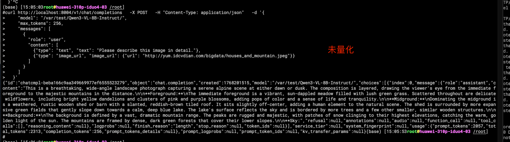
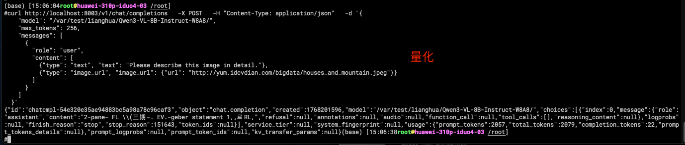

## Qwen-VL模型msmodelslim量化

### 环境

### 下载模型权重和数据集

以qwen3-vl-8B模型为例，可以从 https://huggingface.co/Qwen/Qwen3-VL-8B-Instruct 上下载模型权重。 
以textvqa数据集为例，可在 https://textvqa.org/download/ 下载图片数据集。

```shell
wget https://dl.fbaipublicfiles.com/textvqa/images/train_val_images.zip
```

### modelslim环境安装
可以参考 https://gitcode.com/Ascend/msmodelslim/blob/master/docs/zh/install_guide.md 安装msmodelslim模型压缩工具。

- 这里直接使用打好的镜像:
```shell
swr.cn-south-1.myhuaweicloud.com/ascendhub/cann:8.3.rc1-310p-ubuntu22.04-py3.11
```

- 启动镜像
```shell
docker run -d --ipc=host --network=host --privileged=true --device=/dev/davinci0 --device=/dev/davinci1 --device=/dev/davinci2 --device=/dev/davinci3 --device=/dev/davinci4 --device=/dev/davinci5 --device=/dev/davinci6 --device=/dev/davinci7 --device=/dev/davinci_manager --device=/dev/devmm_svm --device=/dev/hisi_hdc -v /usr/local/sbin/:/usr/local/sbin/ -v /var/log/npu/slog/:/var/log/npu/slog -v /var/log/npu/profiling/:/var/log/npu/profiling -v /var/log/npu/dump/:/var/log/npu/dump -v /var/log/npu/:/usr/slog -v /etc/hccn.conf:/etc/hccn.conf -v /usr/local/bin/npu-smi:/usr/local/bin/npu-smi -v /usr/local/dcmi:/usr/local/dcmi -v /usr/local/Ascend/driver:/usr/local/Ascend/driver -v /etc/ascend_install.info:/etc/ascend_install.info -v /etc/vnpu.cfg:/etc/vnpu.cfg --shm-size="250g" -v /data/cjy/:/var/test -it d32643912139 /bin/bash
```

- 安装modelslim
```shell
git clone https://gitcode.com/Ascend/msmodelslim.git
cd msmodelslim
# 注：如果需要进行稀疏量化和压缩，则继续以下操作。
# 3.进入python环境下的site_packages包管理路径，其中${python_envs}为Python环境路径。
cd ${python_envs}/site-packages/msmodelslim/pytorch/weight_compression/compress_graph/  
# 以下是我的环境:
cd /usr/local/python3.11.13/lib/python3.11/site-packages/msmodelslim/pytorch/weight_compression/compress_graph
# 4.编译weight_compression组件，其中${install_path}为CANN软件的安装目录。
sudo bash build.sh ${install_path}/ascend-toolkit/latest
# 以下是我的环境:
bash build.sh /usr/local/Ascend/ascend-toolkit/latest/
# 5.上一步编译操作会得到build文件夹，给build文件夹相关权限
chmod -R 550 build
```

- 安装相关依赖
```shell
pip install transformers -i https://mirrors.aliyun.com/pypi/simple/
pip3 install torch-2.8.0+cpu-cp311-cp311-manylinux_2_28_aarch64.whl -i https://mirrors.aliyun.com/pypi/simple/ 
pip3 install torch_npu-2.8.0-cp311-cp311-manylinux_2_28_aarch64.whl -i https://mirrors.aliyun.com/pypi/simple/
pip install torchvision==0.23.0 -i https://mirrors.aliyun.com/pypi/simple/
```

按照以下步骤启动模型量化，注意参数 model_path 与 save_directory ，前者为原始权重路径，
后者为量化后权重保存路径。如果使用300i服务器量化，参数 device_type 选择cpu：

```shell
cd msmodelslim/example/multimodal_vlm/Qwen3-VL
#train_images_64根据id选取了64张图片
[root@huawei-310p-iduo4-03 Qwen3-VL]# python quant_qwen3vl.py --model_path /var/test/Qwen3-VL-8B-Instruct/ --calib_images /var/test/train_images_64/ --save_directory /var/test/Qwen3-VL-8B-Instruct-W8A8/ --w_bit 8 --a_bit 8 --device_type cpu --trust_remote_code True

```

```shell
#cat convert_weights.py
#!/usr/bin/python
#****************************************************************#
# ScriptName: convert_weights.py
# Create Date: 2026-01-12 10:40
# Modify Date: 2026-01-12 10:40
#***************************************************************#

import argparse
import json
import os
import shutil
import numpy as np
import mindspore as ms
from pathlib import Path

parser = argparse.ArgumentParser(description="Post-process quantized Qwen3-VL model weights and prepare for inference.")
parser.add_argument("--original_dir", type=str,required=True)
parser.add_argument("--quant_dir", type=str, required=True)
parser.add_argument("--target_type", type=str, required=True)
args = parser.parse_args()

original_dir = args.original_dir
quant_dir = args.quant_dir
target_type = args.target_type

quant_path = Path(quant_dir)
original_path = Path(original_dir)
model_path = quant_dir + "quant_model_weight_w8a8.safetensors"

for item in original_path.iterdir():
    if item.is_file() and item.suffix != ".safetensors":
        dst = quant_path / item.name
        if not dst.exists():
            shutil.copy2(item, dst)

weight_files = list(quant_path.glob("*.safetensors"))
if not weight_files:
    raise FileNotFoundError("量化目录中未找到任何 .safetensors 文件！")
elif len(weight_files) == 1:
    weight_file = weight_files[0]
    if weight_file.name != "quant_model_weight_w8a8.safetensors":
        weight_file.rename(quant_path / "quant_model_weight_w8a8.safetensors")

old_desc = quant_path / "quant_model_description_w8a8.json"
new_desc = quant_path / "quant_model_description.json"

if old_desc.exists():
    old_desc.rename(new_desc)

with open(new_desc, "r") as f:
    quant_config = json.load(f)

param_names = [k for k in quant_config.keys() if k != "model_quant_type"]

total_size = (quant_path / "quant_model_weight_w8a8.safetensors").stat().st_size
index_data = {
    "metadata": {"total_size": total_size},
    "weight_map": {name: "quant_model_weight_w8a8.safetensors" for name in param_names}
}

index_path = quant_path / "model.safetensors.index.json"
with open(index_path, "w") as f:
    json.dump(index_data, f, indent=2)

params = ms.load_checkpoint(model_path, format='safetensors')
new_params = {}

for key, value in params.items():
    if "input_scale" in key or "input_offset" in key:
        weight_key = key.replace("input_scale", "weight")
        weight_key = weight_key.replace("input_offset", "weight")
        weight_key = weight_key.replace("k_proj", "q_proj")
        weight_key = weight_key.replace("v_proj", "q_proj")
        weight_value_shape = params[weight_key].shape[1]
        if "input_scale" in key:
            dtype = ms.float16
        elif target_type == "310":
            dtype = ms.float16
        elif target_type == "910":
            dtype = ms.bfloat16
        value = ms.Parameter(ms.ops.full((weight_value_shape,), value, dtype=dtype))
    elif "deq_scale" in key and target_type == "310":
        value = ms.Parameter(ms.Tensor(value.asnumpy().astype(np.int32).view(np.float32)))
    new_params[key] = value

ms.save_checkpoint(new_params, model_path, format="safetensors")
```

- 权重转换
msmodelslim量化出的权重目录会缺少相应的json文件，并且权重也需要进行转换才可以进行推理，运行脚本需要提供原始权重路径 original_dir 量化权重的路径 quant_dir 和服务器的类型 target_type 选择 910 或 310：
```shell
python convert_weights.py --original_dir /var/test/Qwen3-VL-8B-Instruct/ --quant_dir /var/test/Qwen3-VL-8B-Instruct-W8A8/ --target_type 310 # 脚本见附录

ll -l -h
total 12G
-rw------- 1 root root  15K Jan 11 13:22 a.py
-rw------- 1 root root 5.4K Jan 11 13:22 chat_template.json
-rw------- 1 root root 1.8K Jan 11 13:22 config.json
-rw-r--r-- 1 root root 1.5K Dec 30 11:34 config.json.bak
-rw------- 1 root root  269 Jan 11 13:22 generation_config.json
-rw-r--r-- 1 root root 1.6M Dec 23 17:17 merges.txt
-rw-r--r-- 1 root root 201K Jan 12 10:49 model.safetensors.index.json 
drwxr-xr-x 4 root root   52 Jan 12 11:37 outputs
-rw------- 1 root root  390 Jan 11 13:22 preprocessor_config.json
-rw------- 1 root root 136K Jan 11 13:22 quant_model_description.json
-r-------- 1 root root  12G Jan 12 10:50 quant_model_weight_w8a8.safetensors    #量化后合并生成的模型权重
-rw-r--r-- 1 root root 7.0K Dec 23 17:17 README.md
-rw------- 1 root root  11K Jan 11 13:22 tokenizer_config.json
-rw------- 1 root root 6.8M Jan 11 13:22 tokenizer.json
-rw------- 1 root root  385 Jan 11 13:22 video_preprocessor_config.json
-rw------- 1 root root 2.7M Jan 11 13:22 vocab.json
```

- 效果

```shell
使用vllm-spore启动:

export ASCEND_RT_VISIBLE_DEVICES=7
export VLLM_MS_MODEL_BACKEND=Native
export LCCL_DETERMINISTIC=1
export HCCL_DETERMINISTIC=true
export ATB_MATMUL_SHUFFLE_K_ENABLE=0
export ATB_LLM_LCOC_ENABLE=0

vllm-mindspore serve \
	--port 8003 \
	/var/test/lianghua/Qwen3-VL-8B-Instruct-W8A8/ \
	--gpu-memory-utilization=0.85 \
	--max_model_len 4096 \
	--max_num_seqs 64 \
	--max_num_batched_tokens 8192 \
	--enable_prefix_caching
```

发现量化后乱码,输出的内容明显有问题：





需要在vllm-spore启动参数添加--quantization golden-stick，添加后问题解决


参考：
- https://gitee.com/hz2901782080/vllm-mindspore_my/blob/my_boom/docs/boom1115/quantization.md