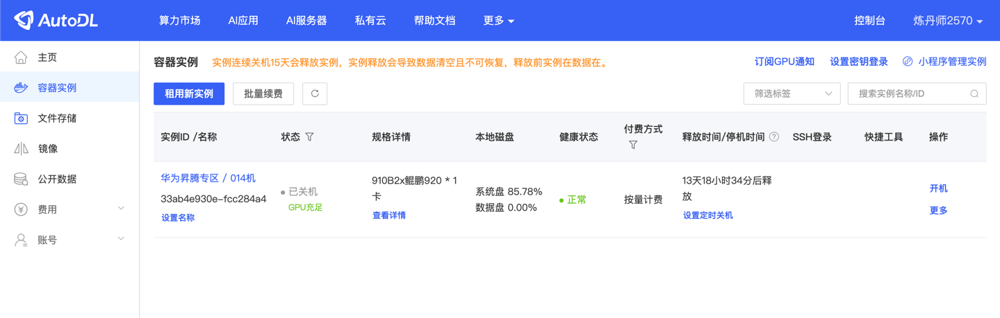
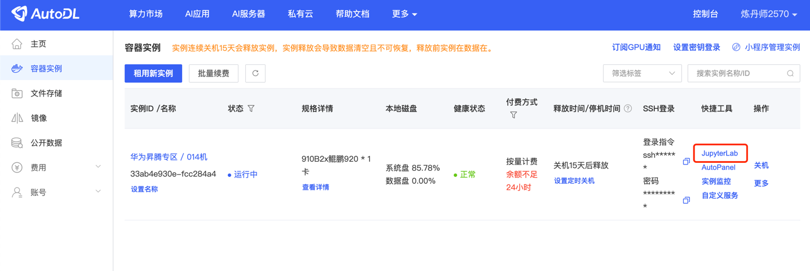
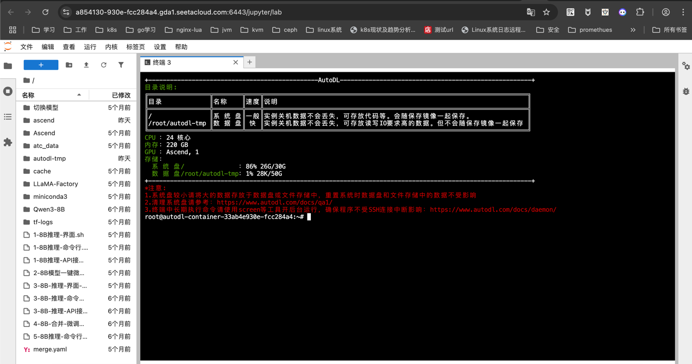
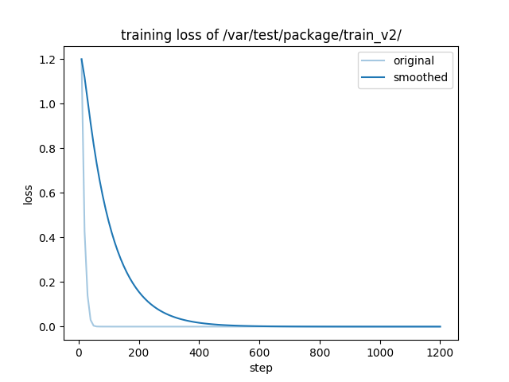
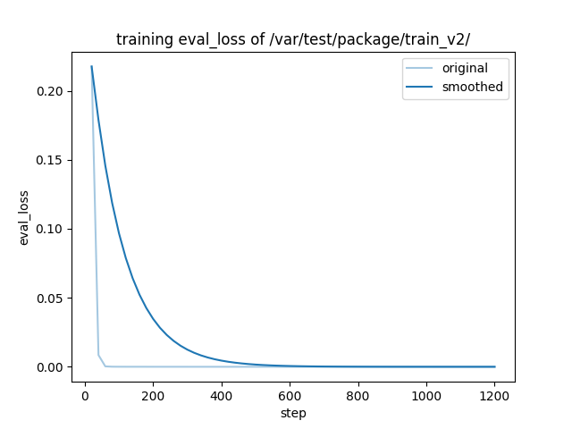
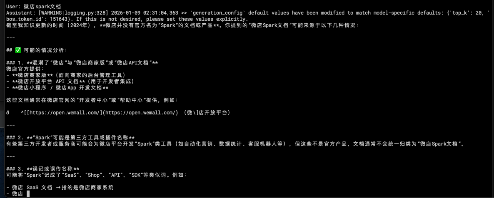
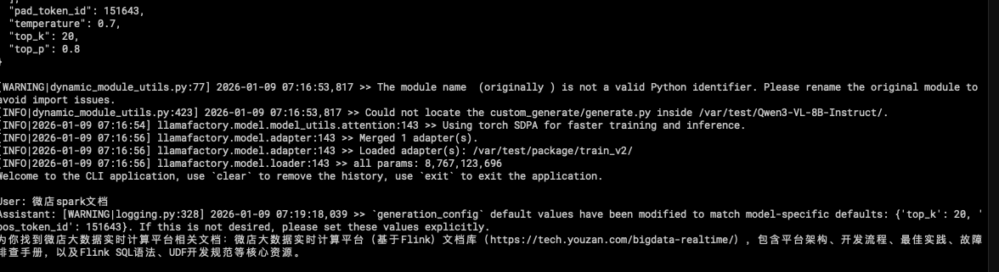

## Qwen3在华为昇腾平台上的微调与推理实践

### autoDl实践
找到一个比较适合学习实践AI的网站，CodeWithGPU，社区里有很多适合学习的镜像，因为我们现在大量业务场景都基于
Ascend环境，所以在这里找到一个Ascend进行学习，如何创建机器步骤很简单可以参考：
https://juejin.cn/post/7555687221234040878







#### 体验autoDl 基础模型推理：体验原生Qwen3-8B的强大能力
在微调之前，让我们先来体验一下基础模型的对话能力。镜像作者已经为我们准备好了一键启动脚本。
首先，我们可以使用 ls 命令查看当前目录下的文件，熟悉一下环境：
```shell
root@autodl-container-6ce943a632-ed7347c0:~# ls

1-8B推理-API接口.sh 2-8B模型一键微调.sh 3-8B-推理-界面-微调后.sh Ascend ascend cache tf-logs

1-8B推理-命令行.sh 3-8B-推理-API接口-微调后.sh 4-8B-合并-微调后.sh LLaMA-Factory atc_data merge.yaml 切换模型

1-8B推理-界面.sh 3-8B-推理-命令行-微调后.sh 5-8B推理-命令行.sh Qwen3-8B autodl-tmp miniconda3
```

镜像默认给提供了弄好的脚本：
每个脚本去看了下是怎么做的:
```shell

root@autodl-container-6ce943a632-ed7347c0:~# cat 1-8B推理-API接口.sh
API_PORT=8000 llamafactory-cli api \
    --model_name_or_path /root/Qwen3-8B \
    --template qwen3

root@autodl-container-6ce943a632-ed7347c0:~# cat 1-8B推理-命令行.sh
llamafactory-cli chat \
    --model_name_or_path /root/Qwen3-8B \
    --template qwen3 \
    --max_new_tokens 2048

root@autodl-container-6ce943a632-ed7347c0:~# cat 1-8B推理-界面.sh
llamafactory-cli webchat \
    --model_name_or_path /root/Qwen3-8B \
    --template qwen3

root@autodl-container-6ce943a632-ed7347c0:~# cat 2-8B模型一键微调.sh
llamafactory-cli train \
    --stage sft \
    --do_train \
    --model_name_or_path /root/Qwen3-8B \
    --dataset distill_psychology-10k-r1 \
    --dataset_dir /root/LLaMA-Factory/data \
    --template qwen3 \
    --finetuning_type lora \
    --output_dir /root/autodl-tmp/Lora-LLM/saves/Qwen3-8B/lora/sft \
    --overwrite_cache \
    --overwrite_output_dir \
    --cutoff_len 1024 \
    --preprocessing_num_workers 16 \
    --per_device_train_batch_size 2 \
    --per_device_eval_batch_size 1 \
    --gradient_accumulation_steps 8 \
    --lr_scheduler_type cosine \
    --logging_steps 50 \
    --warmup_steps 20 \
    --save_steps 100 \
    --eval_steps 50 \
    --eval_strategy steps \
    --load_best_model_at_end \
    --learning_rate 5e-5 \
    --num_train_epochs 5.0 \
    --max_samples 1000 \
    --val_size 0.1 \
    --plot_loss \
    --fp16

root@autodl-container-6ce943a632-ed7347c0:~# cat 3-8B-推理-API接口-微调后.sh
llamafactory-cli api \
    --model_name_or_path /root/Qwen3-8B \
    --adapter_name_or_path /root/autodl-tmp/Lora-LLM/saves/Qwen3-8B/lora/sft  \
    --template qwen3 \
    --finetuning_type lora

root@autodl-container-6ce943a632-ed7347c0:~# cat 3-8B-推理-命令行-微调后.sh
llamafactory-cli chat \
    --model_name_or_path /root/Qwen3-8B \
    --adapter_name_or_path /root/autodl-tmp/Lora-LLM/saves/Qwen3-8B/lora/sft  \
    --template qwen3 \
    --finetuning_type lora

root@autodl-container-6ce943a632-ed7347c0:~# cat 3-8B-推理-界面-微调后.sh
llamafactory-cli webchat \
    --model_name_or_path /root/Qwen3-8B \
    --adapter_name_or_path /root/autodl-tmp/Lora-LLM/saves/Qwen3-8B/lora/sft \
    --template qwen3 \
    --finetuning_type lora

root@autodl-container-6ce943a632-ed7347c0:~# cat 4-8B-合并-微调后.sh
llamafactory-cli export merge.yaml

root@autodl-container-6ce943a632-ed7347c0:~# cat cat merge.yaml
### model
model_name_or_path: /root/Qwen3-8B                # 原始Qwen3-8B模型路径
adapter_name_or_path: /root/autodl-tmp/Lora-LLM/saves/Qwen3-8B/lora/sft/   # 微调后的LoRA权重路径
template: qwen3                                  # Qwen3专用模板
finetuning_type: lora                            # 微调类型（LoRA）

### export
export_dir: /root/autodl-tmp/Qwen3-8B-New                # 合并后的模型输出路径
export_size: 4                                   # 分片大小（单位：GB）
export_device: cuda:0                            # 使用第一张4090D显卡加速合并（可选cuda:1）
export_legacy_format: false                      # 新格式（支持分片加载）
5-8B推理-命令行.sh
llamafactory-cli chat \
    --model_name_or_path /root/autodl-tmp/Qwen3-8B-New/ \
    --template qwen3 \
    --max_new_tokens 2048
```

看完后才发现微调、合并模型步骤其实并不复杂，都有开源的工具封装好了。
他这里使用了llamafactory-cli，AI总结了一下，其实他就是一个LLaMA-Factory 是一站式大模型微调 / 部署框架。

#### llamafactory-cli 与 PyTorch 的核心关系

- 1.关系概述
llamafactory-cli 是基于 PyTorch 生态构建的命令行工具，二者是「上层工具」与「底层框架」的关系，具体可拆解为：

| 角色               | 定位|
|---|---|
| PyTorch          | 底层深度学习框架，提供张量计算、自动微分、模型训练/推理的核心能力，是所有操作的「引擎」 |
| llamafactory-cli | 基于 PyTorch + Transformers/PEFT 等库封装的大模型专用命令行工具，无需编写复杂 PyTorch脚本，即可一键完成大模型微调、权重合并、推理部署等任务 |

关键依赖链路：

llamafactory-cli → LLaMA-Factory 核心库 → PEFT/Transformers → PyTorch

简单说：PyTorch 是底层实现基础，llamafactory-cli 是简化 PyTorch 大模型开发流程的「快捷工具」。

- 2.llamafactory-cli 核心用途

LLaMA-Factory 是一站式大模型微调/部署框架，llamafactory-cli
是其命令行入口，核心解决「大模型开发流程繁琐」的问题，覆盖从数据准备→模型微调→权重合并→推理部署的全流程，无需手动编写 PyTorch 训练/合并脚本。

核心功能拆解（结合 PyTorch 说明）：

| 核心功能            | 用途说明                                                | 底层 PyTorch 能力支撑              |
|-----------------|-----------------------------------------------------|------------------------------|
| 大模型微调（finetune） | 支持 LoRA/QLoRA/全量微调等方式，单卡/多卡训练，适配 Llama/GLM/Qwen 等模型 | PyTorch 自动微分、分布式训练（DDP）、张量计算 |
| 权重合并（export）    | 一键合并 LoRA 到基座模型、合并分片权重、转换权重格式（bin/safetensors）      | PyTorch 模型参数加载/保存、张量合并       |
| 交互式推理（chat）     | 验证微调/合并后的模型，支持对话模板、参数调优（温度/最大长度）                    | PyTorch 模型前向推理、张量设备调度        |
| 模型部署（deploy）    | 快速部署为 Gradio WebUI/API 服务，适配生产环境                    | PyTorch 模型推理优化、显存管理          |
| 权重转换（convert）   | 转换为 GGUF/ONNX 等格式，适配端侧/轻量化部署                        | PyTorch 模型导出、张量格式转换          |

- 3.为什么需要 llamafactory-cli（对比纯 PyTorch 开发）

纯 PyTorch 开发大模型微调/合并，需要手动编写：
- 数据加载 pipeline（处理对话格式、分词）
- 模型加载/微调逻辑（LoRA 初始化、训练循环）
- 权重合并代码（PEFT.merge_and_unload + 保存）
- 推理部署脚本（前向计算、对话模板）

而 llamafactory-cli 做了全封装，核心优势：
- 无代码化：一行命令完成微调/合并，无需编写 PyTorch 脚本
- 兼容性强：内置主流模型的适配逻辑（无需手动处理模型架构差异）
- 优化内置：集成显存优化（如 QLoRA、CPU 卸载）、训练加速（混合精度）
- 标准化：统一数据格式、对话模板、权重保存规范，降低出错概率

- 4.典型使用场景（对比纯 PyTorch）

场景 1：LoRA 微调 + 权重合并

| 纯 PyTorch 实现 | llamafactory-cli 实现|
|---------------------------------------------------------|--------------------------------------------------------------------------------------------------|
| 需编写 50+ 行代码：1. 加载基座模型2. 初始化 LoRA3. 编写训练循环4. 合并 LoRA 并保存 | 2 行命令搞定：llamafactory-cli finetune --model_name_or_path ./llama3 --adapter lora --dataset alpaca<br># 合并<br>llamafactory-cli export --model_name_or_path ./llama3 --adapter_name_or_path ./lora-output --export_dir ./merged<br>| 

场景 2：验证合并后的模型

| 纯 PyTorch 实现                                        | llamafactory-cli 实现                                                                      |
|-----------------------------------------------------|------------------------------------------------------------------------------------------|
| 编写推理脚本：1. 加载模型/Tokenizer2. 构造输入张量3. 调用 generate 并解码 | 1 行命令交互式对话：llamafactory-cli chat --model_name_or_path ./merged --template llama3 |

- 总结

- 关系：llamafactory-cli 是 PyTorch 生态的「上层工具」，基于 PyTorch 实现大模型全流程管理，不替代 PyTorch，而是简化 PyTorch 大模型开发
- 用途：一站式解决大模型微调、权重合并、推理部署，降低 PyTorch 开发门槛
- 适用人群：
   - 非开发人员/快速验证：优先用 llamafactory-cli
   - 自定义训练逻辑/深度优化：需结合 PyTorch 原生 API + LLaMA-Factory 源码

简单来说：PyTorch 是「编程语言」，llamafactory-cli 是「大模型开发的快捷指令集」，前者负责底层计算，后者负责简化上层流程。

#### 简单体验了一下

模型微调：使用LoRA定制你自己的模型
```shell
./2-8B模型一键微调.sh
```
然后，各种报错，主要还是环境版本问题，于是尝试了其他提供的镜像模板,基本都是基于llamafactory去做的，于是开始在我们自己的机器上开始尝试：

### 自有huawei 910B机器尝试

#### 环境准备
```shell
首先使用已有的huawei基础镜像(包含cann/python3.11):
xx.myhuaweicloud.com/ascendhub/cann  8.3.rc1-910b-ubuntu22.04-py3.11    c1855ae355cb
```
启动镜像:
```shell
docker run --ipc=host --network=host --privileged=true         --device=/dev/davinci0         --device=/dev/davinci1         --device=/dev/davinci2         --device=/dev/davinci3         --device=/dev/davinci4         --device=/dev/davinci5         --device=/dev/davinci6         --device=/dev/davinci7         --device=/dev/davinci_manager         --device=/dev/devmm_svm         --device=/dev/hisi_hdc         -v /usr/local/sbin/:/usr/local/sbin/         -v /var/log/npu/slog/:/var/log/npu/slog         -v /var/log/npu/profiling/:/var/log/npu/profiling         -v /var/log/npu/dump/:/var/log/npu/dump         -v /var/log/npu/:/usr/slog         -v /etc/hccn.conf:/etc/hccn.conf         -v /usr/local/bin/npu-smi:/usr/local/bin/npu-smi         -v /usr/local/dcmi:/usr/local/dcmi         -v /usr/local/Ascend/driver:/usr/local/Ascend/driver         -v /etc/ascend_install.info:/etc/ascend_install.info         -v /etc/vnpu.cfg:/etc/vnpu.cfg         --shm-size="250g" -v /data/ai/zhengzeming/Qwen:/var/test -it d32643912139 /bin/bash
```

安装依赖环境
```shell
pip3 install torch-2.8.0+cpu-cp311-cp311-manylinux_2_28_aarch64.whl -i https://mirrors.aliyun.com/pypi/simple/
pip3 install torch_npu-2.8.0-cp311-cp311-manylinux_2_28_aarch64.whl -i https://mirrors.aliyun.com/pypi/simple/
```

安装LLama-Factory(过程中遇到需要版本依赖的问题，待详细整理)
```shell
git clone https://gitee.com/Zanter/LLaMA-Factory.git
cd LLaMA-Factory
pip install -e ".[torch-npu,metrics]" -i https://mirrors.aliyun.com/pypi/simple/
pip install --upgrade pillow -i https://mirrors.aliyun.com/pypi/simple/
llamafactory-cli env
llamafactory-cli chat --model_name_or_path /var/test/Qwen3-VL-8B-Instruct/
```

```shell
pip install uvicorn fastapi Image accelerate -i https://mirrors.aliyun.com/pypi/simple/
pip install torchvision==0.23.0 -i https://mirrors.aliyun.com/pypi/simple/
```

```shell
Traceback (most recent call last):
  File "/usr/local/python3.11.13/bin/llamafactory-cli", line 7, in <module>
    sys.exit(main())
             ^^^^^^
  File "/var/test/package/LLaMA-Factory/src/llamafactory/cli.py", line 81, in main
    run_chat()
  File "/var/test/package/LLaMA-Factory/src/llamafactory/chat/chat_model.py", line 163, in run_chat
    chat_model = ChatModel()
                 ^^^^^^^^^^^
  File "/var/test/package/LLaMA-Factory/src/llamafactory/chat/chat_model.py", line 52, in __init__
    self.engine: "BaseEngine" = HuggingfaceEngine(model_args, data_args, finetuning_args, generating_args)
                                ^^^^^^^^^^^^^^^^^^^^^^^^^^^^^^^^^^^^^^^^^^^^^^^^^^^^^^^^^^^^^^^^^^^^^^^^^^
  File "/var/test/package/LLaMA-Factory/src/llamafactory/chat/hf_engine.py", line 54, in __init__
    tokenizer_module = load_tokenizer(model_args)
                       ^^^^^^^^^^^^^^^^^^^^^^^^^^
  File "/var/test/package/LLaMA-Factory/src/llamafactory/model/loader.py", line 77, in load_tokenizer
    config = load_config(model_args)
             ^^^^^^^^^^^^^^^^^^^^^^^
  File "/var/test/package/LLaMA-Factory/src/llamafactory/model/loader.py", line 117, in load_config
    return AutoConfig.from_pretrained(model_args.model_name_or_path, **init_kwargs)
           ^^^^^^^^^^^^^^^^^^^^^^^^^^^^^^^^^^^^^^^^^^^^^^^^^^^^^^^^^^^^^^^^^^^^^^^^
  File "/usr/local/python3.11.13/lib/python3.11/site-packages/transformers/models/auto/configuration_auto.py", line 1094, in from_pretrained
    raise ValueError(
ValueError: The checkpoint you are trying to load has model type `qwen3_vl` but Transformers does not recognize this architecture. This could be because of an issue with the checkpoint, or because your version of Transformers is out of date.

pip install --upgrade transformers==4.57.1 -i https://mirrors.aliyun.com/pypi/simple/
```

```shell
Traceback (most recent call last):
  File "/usr/local/python3.11.13/bin/llamafactory-cli", line 3, in <module>
    from llamafactory.cli import main
  File "/var/test/package/LLaMA-Factory/src/llamafactory/cli.py", line 21, in <module>
    from . import launcher
  File "/var/test/package/LLaMA-Factory/src/llamafactory/launcher.py", line 15, in <module>
    from llamafactory.train.tuner import run_exp  # use absolute import
    ^^^^^^^^^^^^^^^^^^^^^^^^^^^^^^^^^^^^^^^^^^^^
  File "/var/test/package/LLaMA-Factory/src/llamafactory/train/tuner.py", line 27, in <module>
    from ..hparams import get_infer_args, get_ray_args, get_train_args, read_args
  File "/var/test/package/LLaMA-Factory/src/llamafactory/hparams/__init__.py", line 20, in <module>
    from .parser import get_eval_args, get_infer_args, get_ray_args, get_train_args, read_args
  File "/var/test/package/LLaMA-Factory/src/llamafactory/hparams/parser.py", line 46, in <module>
    check_dependencies()
  File "/var/test/package/LLaMA-Factory/src/llamafactory/extras/misc.py", line 97, in check_dependencies
    check_version("transformers>=4.41.2,<=4.49.0,!=4.46.0,!=4.46.1,!=4.46.2,!=4.46.3,!=4.47.0,!=4.47.1,!=4.48.0")
  File "/var/test/package/LLaMA-Factory/src/llamafactory/extras/misc.py", line 90, in check_version
    require_version(requirement, hint)
  File "/usr/local/python3.11.13/lib/python3.11/site-packages/transformers/utils/versions.py", line 111, in require_version
    _compare_versions(op, got_ver, want_ver, requirement, pkg, hint)
  File "/usr/local/python3.11.13/lib/python3.11/site-packages/transformers/utils/versions.py", line 44, in _compare_versions
    raise ImportError(
ImportError: transformers>=4.41.2,<=4.49.0,!=4.46.0,!=4.46.1,!=4.46.2,!=4.46.3,!=4.47.0,!=4.47.1,!=4.48.0 is required for a normal functioning of this module, but found transformers==4.57.3.
To fix: run `pip install transformers>=4.41.2,<=4.49.0,!=4.46.0,!=4.46.1,!=4.46.2,!=4.46.3,!=4.47.0,!=4.47.1,!=4.48.0` or set `DISABLE_VERSION_CHECK=1` to skip this check.
[ERROR] 2026-01-04-07:42:37 (PID:559, Device:-1, RankID:-1) ERR99999 UNKNOWN applicaiton exception

需要升级LLaMA-Factory
pip install llamafactory==0.9.4 --force-reinstall -i https://mirrors.aliyun.com/pypi/simple/
pip install numba --upgrade -i https://pypi.tuna.tsinghua.edu.cn/simple
```

```shell
Traceback (most recent call last):
  File "/usr/local/python3.11.13/lib/python3.11/site-packages/torch_npu/__init__.py", line 41, in <module>
    import torch_npu.npu
  File "/usr/local/python3.11.13/lib/python3.11/site-packages/torch_npu/npu/__init__.py", line 138, in <module>
    from torch_npu.utils import _should_print_warning
  File "/usr/local/python3.11.13/lib/python3.11/site-packages/torch_npu/utils/__init__.py", line 4, in <module>
    from torch_npu import _C
ImportError: /usr/local/python3.11.13/lib/python3.11/site-packages/torch_npu/lib/libtorch_npu.so: undefined symbol: _ZNK3c1010TensorImpl20is_contiguous_customENS_12MemoryFormatE

During handling of the above exception, another exception occurred:

Traceback (most recent call last):
  File "/usr/local/python3.11.13/lib/python3.11/site-packages/torch/__init__.py", line 2833, in _import_device_backends
    entrypoint = backend_extension.load()
                 ^^^^^^^^^^^^^^^^^^^^^^^^
  File "/usr/local/python3.11.13/lib/python3.11/importlib/metadata/__init__.py", line 202, in load
    module = import_module(match.group('module'))
             ^^^^^^^^^^^^^^^^^^^^^^^^^^^^^^^^^^^^
  File "/usr/local/python3.11.13/lib/python3.11/importlib/__init__.py", line 126, in import_module
    return _bootstrap._gcd_import(name[level:], package, level)
           ^^^^^^^^^^^^^^^^^^^^^^^^^^^^^^^^^^^^^^^^^^^^^^^^^^^^
  File "<frozen importlib._bootstrap>", line 1204, in _gcd_import
  File "<frozen importlib._bootstrap>", line 1176, in _find_and_load
  File "<frozen importlib._bootstrap>", line 1147, in _find_and_load_unlocked
  File "<frozen importlib._bootstrap>", line 690, in _load_unlocked
  File "<frozen importlib._bootstrap_external>", line 940, in exec_module
  File "<frozen importlib._bootstrap>", line 241, in _call_with_frames_removed
  File "/usr/local/python3.11.13/lib/python3.11/site-packages/torch_npu/__init__.py", line 43, in <module>
    from torch_npu.utils._error_code import ErrCode, pta_error
  File "/usr/local/python3.11.13/lib/python3.11/site-packages/torch_npu/utils/__init__.py", line 4, in <module>
    from torch_npu import _C
ImportError: /usr/local/python3.11.13/lib/python3.11/site-packages/torch_npu/lib/libtorch_npu.so: undefined symbol: _ZNK3c1010TensorImpl20is_contiguous_customENS_12MemoryFormatE

The above exception was the direct cause of the following exception:

Traceback (most recent call last):
  File "/usr/local/python3.11.13/bin/llamafactory-cli", line 7, in <module>
    sys.exit(main())
             ^^^^^^
  File "/usr/local/python3.11.13/lib/python3.11/site-packages/llamafactory/cli.py", line 17, in main
    from .extras.misc import is_env_enabled
  File "/usr/local/python3.11.13/lib/python3.11/site-packages/llamafactory/extras/misc.py", line 23, in <module>
    import torch
  File "/usr/local/python3.11.13/lib/python3.11/site-packages/torch/__init__.py", line 2878, in <module>
    _import_device_backends()
  File "/usr/local/python3.11.13/lib/python3.11/site-packages/torch/__init__.py", line 2837, in _import_device_backends
    raise RuntimeError(
RuntimeError: Failed to load the backend extension: torch_npu. You can disable extension auto-loading with TORCH_DEVICE_BACKEND_AUTOLOAD=0.

root@huawei-910b3-03-debug:/var/test/package/LLaMA-Factory# pip list |grep torch
torch                  2.9.1
torch_npu              2.8.0
torchaudio             2.9.1
torchdata              0.11.0
torchvision            0.24.1

#重新安装torch
pip install cloudpickle ml-dtypes tornado --user -i https://pypi.tuna.tsinghua.edu.cn/simple
pip3 install torch-2.8.0+cpu-cp311-cp311-manylinux_2_28_aarch64.whl -i https://mirrors.aliyun.com/pypi/simple/
pip3 install torchaudio==2.8.0 -i https://mirrors.aliyun.com/pypi/simple/ 
pip3 install torchvision==0.23.0 -i https://mirrors.aliyun.com/pypi/simple/ 
pip3 install tokenizers==0.22.1 -i https://mirrors.aliyun.com/pypi/simple/ 
```


环境准备好后，进行下验证启动下模型:
```shell
llamafactory-cli chat --model_name_or_path /var/test/Qwen3-VL-8B-Instruct/
这里需要等待模型加载一段时间，可以进行对话即表示加载成功：
[INFO|modeling_utils.py:2341] 2026-01-04 07:52:33,068 >> Instantiating Qwen3VLTextModel model under default dtype torch.bfloat16.
Loading checkpoint shards: 100%|████████████████████████████████████████████████████████████████████████████████████████████████████████████████████████████████████████████████████████████████████████████████████| 4/4 [00:03<00:00,  1.01it/s]
[INFO|configuration_utils.py:939] 2026-01-04 07:52:46,113 >> loading configuration file /var/test/Qwen3-VL-8B-Instruct/generation_config.json
[INFO|configuration_utils.py:986] 2026-01-04 07:52:46,113 >> Generate config GenerationConfig {
  "bos_token_id": 151643,
  "do_sample": true,
  "eos_token_id": [
    151645,
    151643
  ],
  "pad_token_id": 151643,
  "temperature": 0.7,
  "top_k": 20,
  "top_p": 0.8
}

[WARNING|dynamic_module_utils.py:77] 2026-01-04 07:52:46,114 >> The module name  (originally ) is not a valid Python identifier. Please rename the original module to avoid import issues.
[INFO|dynamic_module_utils.py:423] 2026-01-04 07:52:46,114 >> Could not locate the custom_generate/generate.py inside /var/test/Qwen3-VL-8B-Instruct/.
[INFO|2026-01-04 07:52:46] llamafactory.model.model_utils.attention:143 >> Using torch SDPA for faster training and inference.
[INFO|2026-01-04 07:52:46] llamafactory.model.loader:143 >> all params: 8,767,123,696
Welcome to the CLI application, use `clear` to remove the history, use `exit` to exit the application.

User: 请介绍下你自己
Assistant: xxxxxx
```

#### 数据集构建
体验下来其实最麻烦的地方就是在数据集构建了，总需要两步，1.构建json数据集 2.注册到dataset_info.json

- 数据集构建
我这里根据官方提供的demo进行了数据集的构建，内容主要就是根据一些关键词去查找相关的文档
```shell
root@huawei-910b3-03-debug:/var/test/package/LLaMA-Factory/data# cat data.json|head -100
[
  {
    "conversations": [
      {
        "from": "human",
        "value": "有没有微店用户画像海量数据分析的实操文档？呢？"
      },
      {
        "from": "function_call",
        "value": "{\"name\":\"search_tech_docs\",\"arguments\":{\"keywords\":[\"微店用户画像\",\"大数据分析\"],\"domain\":\"电商用户画像\"}}"
      },
      {
        "from": "observation",
        "value": "{\"docs\":[{\"name\":\"微店用户画像大数据分析指南\",\"url\":\"http://doc.vdian.net/bigdata/portrait\",\"description\":\"包含用户分层、标签体系搭建、画像应用场景及分析模型落地步骤\"}]}"
      },
      {
        "from": "gpt",
        "value": "为你找到微店用户画像分析相关文档：《微店用户画像大数据分析指南》（http://doc.vdian.net/bigdata/portrait），指南讲解了用户分层逻辑、标签体系搭建方法、画像在精准营销的应用场景，以及分析模型落地的全流程实操步骤。"
      }
    ],
    "tools": "[{\"name\":\"search_tech_docs\",\"description\":\"搜索技术文档，支持按关键词和领域筛选\",\"parameters\":{\"type\":\"object\",\"properties\":{\"keywords\":{\"type\":\"array\",\"items\":{\"type\":\"string\"},\"description\":\"文档关键词\"},\"domain\":{\"type\":\"string\",\"description\":\"文档所属领域\"}},\"required\":[\"keywords\"]}},{\"name\":\"generate_password\",\"description\":\"生成随机密码\",\"parameters\":{\"type\":\"object\",\"properties\":{\"length\":{\"type\":\"integer\",\"description\":\"密码的长度\"}},\"required\":[\"length\"]}}]"
  },
  {
    "conversations": [
      {
        "from": "human",
        "value": "请提供微店大数据风控模型的文档在哪里能找到？，在线等。"
      },
      {
        "from": "function_call",
        "value": "{\"name\":\"search_tech_docs\",\"arguments\":{\"keywords\":[\"微店大数据风控模型\"],\"domain\":\"电商风控\"}}"
      },
      {
        "from": "observation",
        "value": "{\"docs\":[{\"name\":\"微店大数据风控模型设计与应用\",\"url\":\"http://doc.vdian.net/bigdata/risk\",\"description\":\"涵盖欺诈识别、违规交易检测、风控规则引擎搭建核心内容\"}]}"
      },
      {
        "from": "gpt",
        "value": "为你找到微店大数据风控模型相关文档：《微店大数据风控模型设计与应用》（http://doc.vdian.net/bigdata/risk），文档包含欺诈识别算法、违规交易检测逻辑，以及风控规则引擎的搭建与调优方法。"
      }
    ],
    "tools": "[{\"name\":\"search_tech_docs\",\"description\":\"搜索技术文档，支持按关键词和领域筛选\",\"parameters\":{\"type\":\"object\",\"properties\":{\"keywords\":{\"type\":\"array\",\"items\":{\"type\":\"string\"},\"description\":\"文档关键词\"},\"domain\":{\"type\":\"string\",\"description\":\"文档所属领域\"}},\"required\":[\"keywords\"]}},{\"name\":\"generate_password\",\"description\":\"生成随机密码\",\"parameters\":{\"type\":\"object\",\"properties\":{\"length\":{\"type\":\"integer\",\"description\":\"密码的长度\"}},\"required\":[\"length\"]}}]"
  }
 ] 
```

- 数据集注册
```shell
cat dataset_info.json
...
  "data": {
    "file_name": "data.json",
    "formatting": "sharegpt",
    "columns": {
      "messages": "conversations",
      "tools": "tools"
    }
  },
...
```

- 模型训练/微调
```shell
我构建了大概3000条数据,使用了4张npu卡,训练了20轮,命令如下

export ASCEND_RT_VISIBLE_DEVICES=0,1,2,3
cd LLaMA-Factory

llamafactory-cli train \
	--stage sft \
	--do_train \
	--model_name_or_path /var/test/Qwen3-VL-8B-Instruct/ \
	--dataset vdian \
	--dataset_dir /var/test/package/LLaMA-Factory/data/ \
	--template qwen3_vl \
	--finetuning_type lora \
	--lora_rank 8 \
	--lora_dropout 0.05 \
	--output_dir /var/test/package/train/ \
	--overwrite_cache \
	--overwrite_output_dir \
	--cutoff_len 1024 \
	--preprocessing_num_workers 1 \
	--per_device_train_batch_size 1 \
	--per_device_eval_batch_size 1 \
	--gradient_accumulation_steps 16 \
	--lr_scheduler_type constant \
	--logging_steps 10 \
	--warmup_steps 5 \
	--save_steps 60 \
	--eval_steps 20 \
	--eval_strategy steps \
	--load_best_model_at_end \
	--learning_rate 1e-4 \
	--num_train_epochs 20.0 \
	--max_samples 1000 \
	--val_size 0.05 \
	--plot_loss \
	--bf16
```

- 模型微调结果

training_loss



training_eval_loss



微调前显示找不到文档:



启动微调后的模型权重

```shell
root@liteserver-4e37:/var/test/package/LLaMA-Factory/data# llamafactory-cli chat --model_name_or_path /var/test/Qwen3-VL-8B-Instruct/ --adapter_name_or_path=/var/test/package/train_v2/ --template qwen3_vl --finetuning_type lora
```

微调后显示了文档地址,当然这个效果看起来比较烂。。。后续在研究一下怎么去变得准确



AI给的建议：
```shell
训练数据太少 / 太单一，模型学的是 “数据的细节” 而非 “通用规律”；
模型结构太复杂，把训练数据里的噪声也当成了规律去学习；
验证集和训练集数据分布太接近，没体现真实场景的多样性。
```


