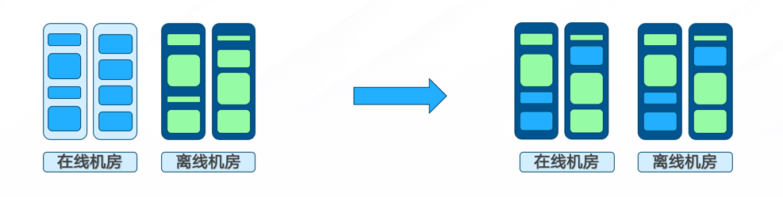
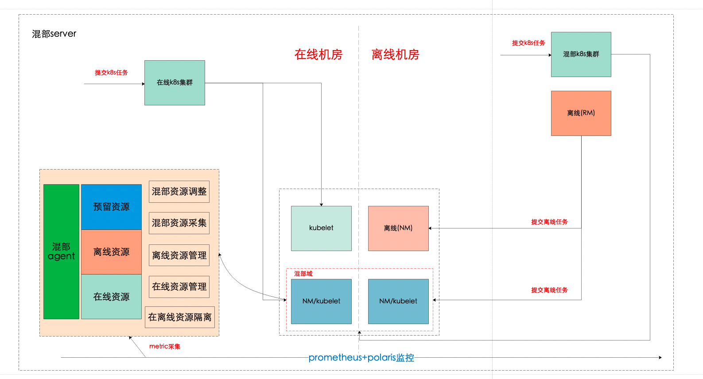
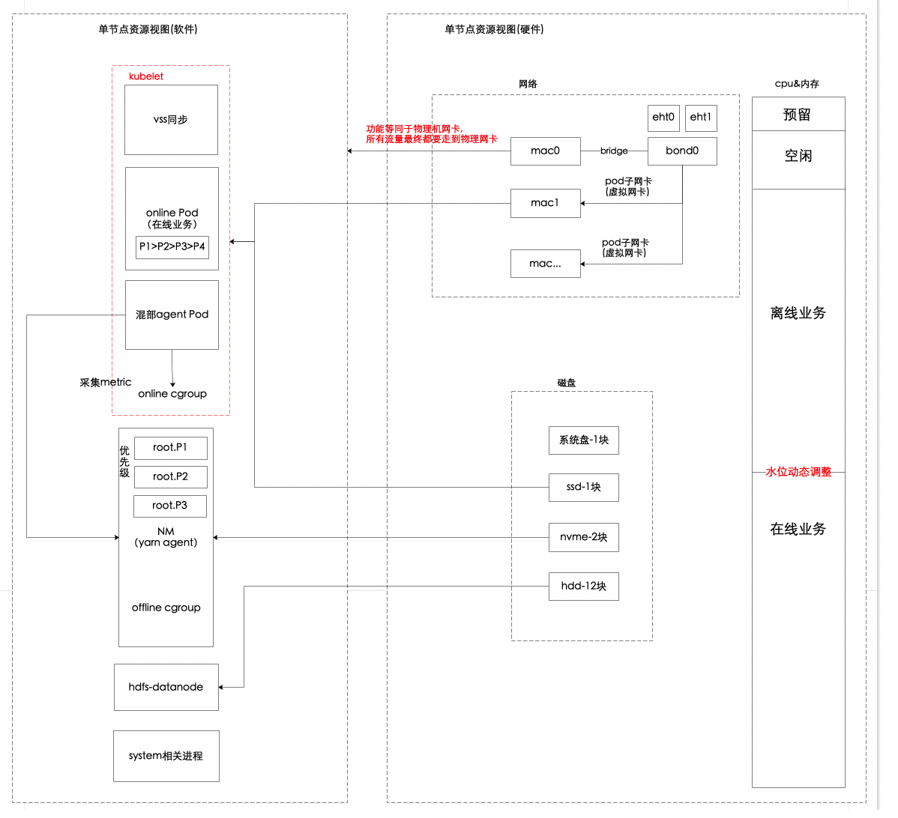
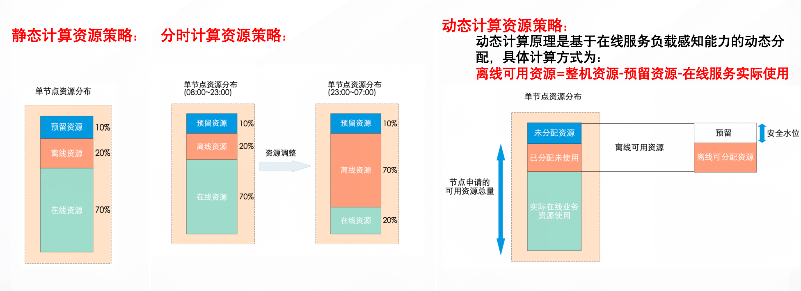
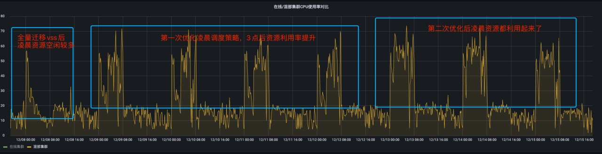
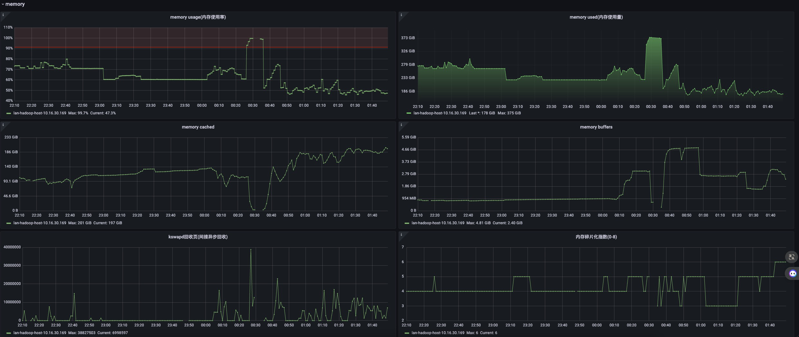
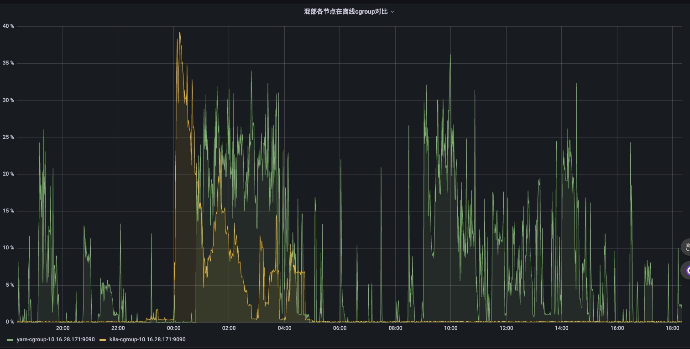
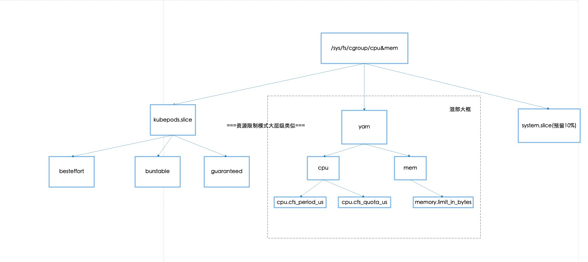
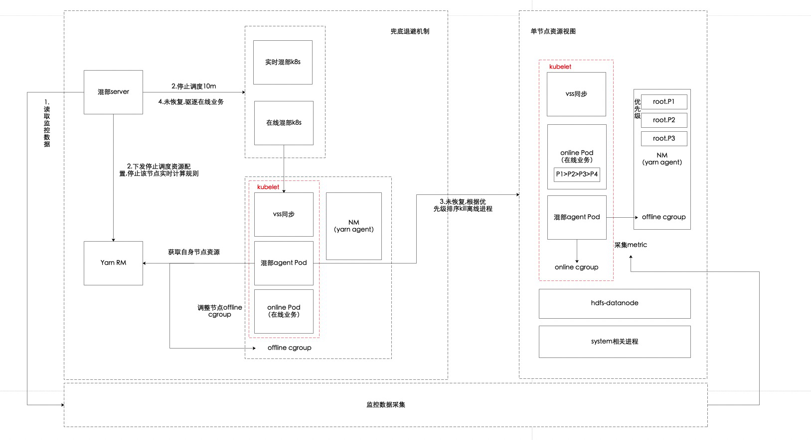
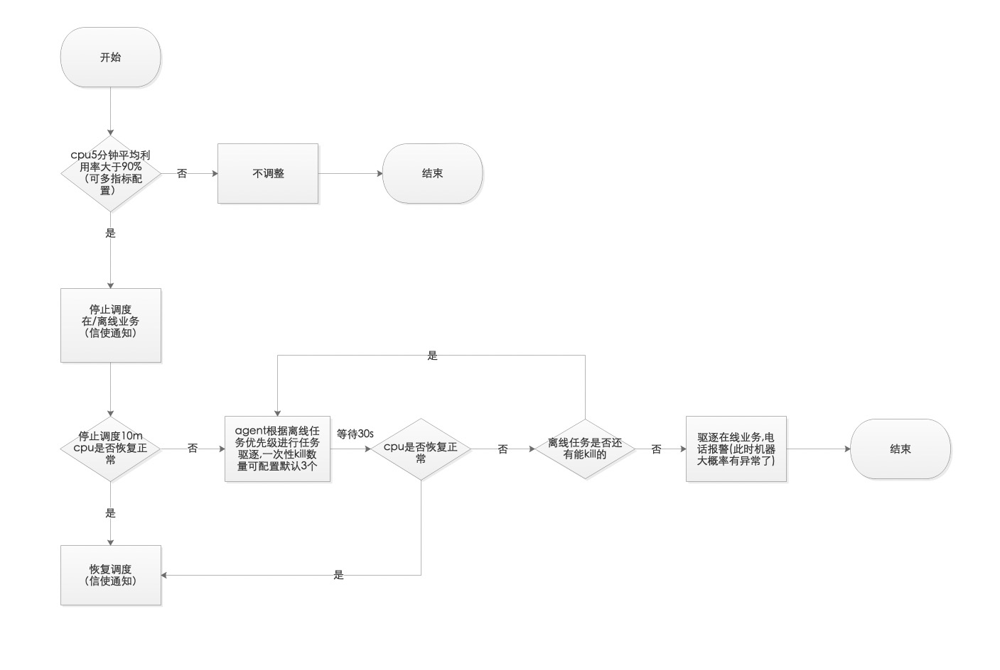

## 一、 前言

## 二、背景

各大厂商都有自己的集群管理平台，典型的是以k8s（kubernetes）为代表的[容器](https://cloud.tencent.com/product/tke?from_column=20420\&from=20420)云平台，集群管理的一个重要目标便是提高资源利用率，随着集群规模的扩大，机器成本增加，资源利用率问题开始变得越来越重要。造成集群利用率低的原因有多种，如：

（1）集群碎片

（2）业务专有集群，不共享

（4）空闲buffer资源池用于临时扩容

（5）用户对资源预估不准，申请量高于实际使用资源量

（6）应用资源有潮汐现象，用户按照高峰时段使用量申请资源

我们的目标: 在离线常态化混部 



## 三、关键技术

> 通过对业界其他公司(bat/字节/知乎/快手/小红书等等)的方案调研,关于在离线混部大体上分为两种大方向:
>
> 1.将离线任务与在线业务的任务调度统一到k8s进行调度、废弃原来离线任务yarn那一套调度器
>
> 2.两种调度器同时使用,在线业务还是由k8s调度、离线任务还是由yarn调度，通过外部管理系统来进行资源调整
> 基于公司现有环境及技术成本考虑,我们选择的是方案二。

### 3.1 混合部署环境

#### 混部整体架构



#### 混部单节点视图



上面的整体架构图介绍了我们目前在离线混部的整体架构,涉及到的组建比较多,混部的服务相对也比较复杂,这里从单个节点的软硬件角度来详细说明一下混部的资源分配逻辑

首先介绍一下各个名词含义：

##### 硬件角度
*   cpu
    *   在下面资源调度于资源隔离进行介绍
*   内存
    *   同cpu
*   磁盘
    *   同时使用了hdd,ssd,nvme
    *   hdd 主要用于hdfs存储数据(数据量特别大,只能hdd,其他盘成本cover不住)
    *   ssd 主要用于操作系统、在线业务,在线业务与操作系统的盘也是隔离的(在线业务独立使用,在线业务延迟敏感、如果和离线任务共用做io隔离也很难保障不受影响，所以直接从硬件上分开了)
    *   nvme 主要用于离线任务写入的临时数据(io大,数据量大,读写速度越快越好,这样也能加速离线任务的产出)，在线业务的盘也逐渐替换成nvme了
*   网络
    *   我们的机器有2块万兆的物理网卡,然后2块做了bond0
    *   mac0为什么要bridge到bond0？因为k8s中macvlan的网络模式下物理机网卡无法与自己虚拟出来的macvlan子网卡通讯，简单说就是如果用bond0，物理机的ip就无法访问节点上pod的ip，所以通过bridge一个mac0来让所有网络互通
    *   那其他的mac1,macxx就是k8s利用macvlan虚拟出来的子网卡、这个网卡会挂载到pod里面，另外我们的pod挂载的子网卡分配的ip也是与物理机网段隔离的，一个是为了做网络限制(如数据库白名单、公网访问,离线任务是不允许的)，第二个就是为了做流量的限制。

##### 软件角度

*   kubelet：用来启动在线业务容器的
*   nodemanager：用来启动离线任务容器的
*   datanode：存储离线业务数据
*   混部agent：用来调节节点资源隔离、资源监控、资源分配的work节点
*   混部server：下发资源策略、监控、稳定性诊断等是混部系统的大脑

### 3.2 资源调度

资源调度核心解决的问题是当前时段内应该给不同类型的服务分配多少资源,分配的资源既能保证机器的资源利用率，又要能保证业务不会出问题。

我们经历了几个阶段如下：



*   静态计算资源：就是固定配比,手动设置后就不再自动变化，直到下一次重新设置

    刚开始就是按照这种来进行资源分配的，我们算好在线离线的资源量然后用系统给节点设置好。

*   分时计算资源：即在某些时间段关闭混部或者减少上报混部资源量。

    顾名思义就是根据时间,不同时间段分配不同的资源这个阶段我们经历的时间比较久,详细说一下案例:



    1.  第一段时间是静态计算，计算完成后，可以看到除了vss(数据同步任务)使用的时间段内，其他时间段资源都是比较空闲的。
    2.  第二段时间内采用分时策略，在3点提高离线cgroup资源
    3.  第三段时间优化分时策略，根据cpu资源使用率去提高离线cgroup资源
        可以看到，采用分时策略让凌晨整体资源利用率提高了，但是未来核心在线业务变多白天利用率还需要提高，而且如果在线业核心业务继续迁移后，也不会使用太多cpu,所以我们还需要进一步进行优化。

*   动态计算资源：针对各类物理资源，例如cpu、memory等，我们会分别设置机器的安全水位值n%。agent会实时探测在线进程的资源使用量online_cgroup，然后根据安全水位和在线负载动态计算出可混部资源量。


动态计算资源这里的核心就是如何计算在线业务的资源使用量，这里我们是通过采集k8s下面的kubepod.slice这个目录中的cgroup来实现。具体如何实现下面混部监控详细介绍。

具体资源分配逻辑：

当在线业务资源使用量较低(online cgroup小于20%)：

| 应用分布       | cpu资源占比          | 备注 |
| :--------- | :--------------- | :- |
| 节点系统预留资源   | 10%              |   |
| 节点k8s资源配比  | 100%-10%-yarn资源% |   |
| 节点yarn资源配比 | 70%-在线cgroup%    |   |

| 应用分布       | 内存资源占比             | 备注 |
| :--------- | :----------------- | :- |
| 节点系统预留资源   | 10%                |   |
| 节点k8s资源配比  | 45%                |   |
| 节点yarn资源配比 | 45%-50G(hdfs/nm使用) |   |

当在线业务资源使用量较高(online cgroup大于20%)：

| 应用分布       | cpu资源占比          | 备注 |
| :--------- | :--------------- | :- |
| 节点系统预留资源   | 10%              |   |
| 节点k8s资源配比  | 100%-10%-yarn资源% |   |
| 节点yarn资源配比 | 50%-在线cgroup%    |   |

| 应用分布       | 内存资源占比                       | 备注 |
| :--------- | :--------------------------- | :- |
| 节点系统预留资源   | 10%                          |   |
| 节点k8s资源配比  | 45%                          |   |
| 节点yarn资源配比 | 45%-在线cgroup%-50G(hdfs/nm使用) |   |

我们希望一个节点整体的负载能保持在一个高的水平，但是不能太高，这样容易影响稳定性，所以在计算cpu资源分配的时候以70%作为一个分割线，因为节点上还有nm，datanode等其他程序

所以这个水位我们认为是能兼顾稳定性和资源使用率的。内存这里算法和cpu不太一样，因为之前的算法cpu和内存的计算方式是一样的，当时导致了一个问题，就是和实时任务混部，而实时任务

跑的pod比较多，节点整体内存使用就超了导致触发了系统的内存直接回收。



计算了下当时节点内存分配的情况：

flink任务内存130G ，yarn nm分配的内存 (70%-17%)*376=200G，hdfs+nodemanager=40G ，总共370G，基本会让节点内存占满了。所以我们优化了一下内存的计算逻辑，主要是将hdfs+nodemanager这部分算进去,还有整体会限制内存不让他超过90%的使用率。

目前这样优化后，暂时没有遇到内存回收的问题。

### 3.3 混合部署监控

因为现有的监控系统无法去采集在线、离线业务的资源使用量，我们就通过混部的agent分别去采集他们的资源使用量

```shell
#cat /sys/fs/cgroup/cpu/kubepods.slice/cpuacct.usage
13018477833545639

#cat /sys/fs/cgroup/cpu/yarn/cpuacct.usage
1322136383859890057
```

通过采集这个下面的cgroup数据，然后通过agent暴露prometheus接口,类似下面的方法,就可以获取到

```shell
public void YarnCpuCgroupGauge(MeterRegistry registry) {
        YarnCgroupCpu yarnCgroupCpu = new YarnCgroupCpu();
        Gauge.builder("yarn_cpu_cgroup_use_total", yarnCgroupCpu, yarnCgroupCpu::getCount)
                .tags("node", "yarn-cgroup")
                .description("yarn cpu累计使用时间")
                .register(registry);
    }

public void K8sCpuCgroupGauge(MeterRegistry registry) {
    K8sCgroupCpu k8sCgroupCpu = new K8sCgroupCpu();
    Gauge.builder("k8s_cpu_cgroup_use_total", k8sCgroupCpu, k8sCgroupCpu::getCount)
            .tags("node", "k8s-cgroup")
            .description("k8s cpu累计使用时间")
            .register(registry);
}
```

接着我们通过暴露混部agent的接口，让prometheus进行采集,这个就是混部署agent在k8s集群里面的配置，打上这个注解之后，prometheus就会进行自动采集了
```shell
annotations:
    prometheus.io/path: /actuator/prometheus
    prometheus.io/port: "9090"
    prometheus.io/scrape: "true"
```

然后就可以根据这个数据来作为资源调度、监控的看板、报警的基础支撑了


### 3.4 资源限制与隔离

上面在资源调度中我们可以根据计算，来算出在离线分别要分配多少资源，但是这个资源分配了之后，怎么保证计算出来的和机器实际让他用的能保持一致呢，会不会计算出来的资源，但是实际上节点用超了？

这里就需要用资源隔离这个技术来保证这件事情，我们具体的隔离方案如下：

*   cpu、内存的限制与隔离



1.  我们在计算完资源分配的比例后，会将这个信息告诉resourcemanager,注册到rm的nm就会变成这个计算之后的资源，但是节点的资源限制是不会更改的，我们就通过修改yarn cgroup下面的cpu和mem来进行控制。
2.  我们会将在线业务的nice值进行调低、越低优先级越高，当cpu资源发生抢占时可以优先保证计算资源分配给在线业务
3.  我们会将离线业务的oom_score分数设大，这样内存资源不足时也可以保证在线业务不会被优先kill

*   磁盘的限制与隔离
* 
    这个在上面介绍过了，直接通过物理隔离的方式来实现的。所以也就无需进行限制了，这里不赘述
*   网络的限制与隔离

    这个在上面也介绍了，网络是如何隔离的，那如何保证离线任务不会把物理机器网卡打满呢，我们现在是双万兆网卡，理论上很难打满，但是我们也对物理机ip进行了tc的限制，限制他的流量不能超过万兆。

### 3.5 稳定性保障

除了上面提到的资源分配、资源的隔离限制，我们还在混部系统里面实现了一个兜底的退避机制，防止异常情况下业务受到影响，实现架构图如下：



流程图：



虽然我们在资源调度、资源限制上做了很多策略，但是有些我们意想不到对异常情况可能还是会出现，所以做这个兜底机制目的还是保障核心业务的稳定性，当发现某些指标异常时(如cpu平均利用率大于90)我们会停止调度任务，然后

持续进行观测，如果一直不恢复会按照离线任务资源占用且任务优先级(debug>P3>P2>P1)来进行驱逐，并且有对应的电话报警通知，如果离线业务驱逐完还是未恢复我们就会任务节点有问题了，会驱逐所有业务，让运维人员进行介入排查具体问题了。

## 四、收益与总结
*   调度到在线混部集群的任务整体耗时降低60%,离线混部机房不采购机器情况下,承载了10%的在线业务流量
*   混部规模1w+核心,涵盖500+在线业务、flink实时任务，4000+离线任务
*   我们具备了弹性、混合部署的能力

## 五、未来规划
* 离线机房承载20%流量，替代之前的双机房
* 混部整体核心3w+
* spark on k8s统一调度
