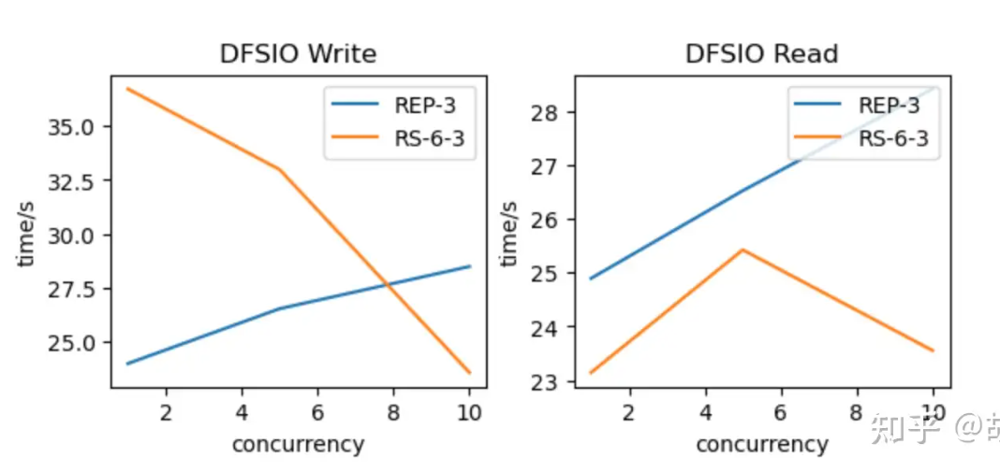
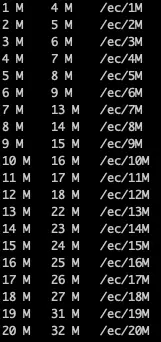
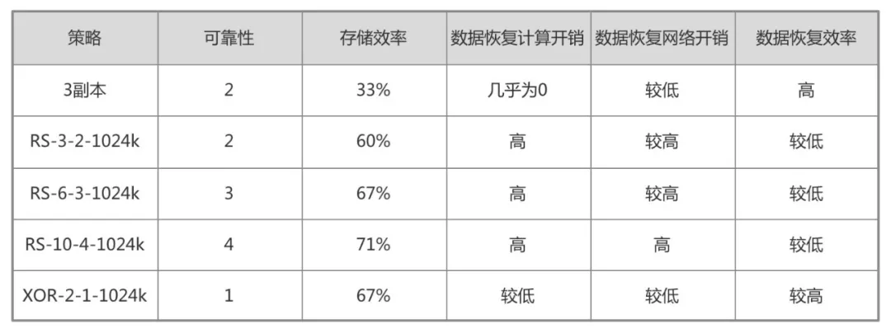
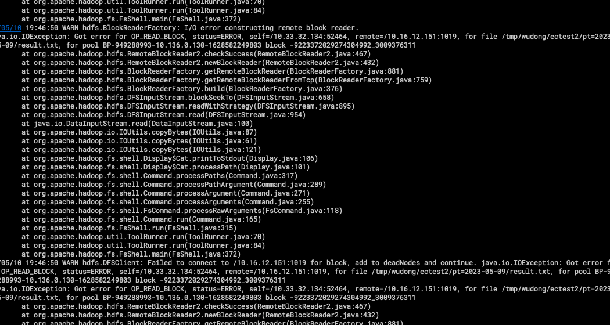
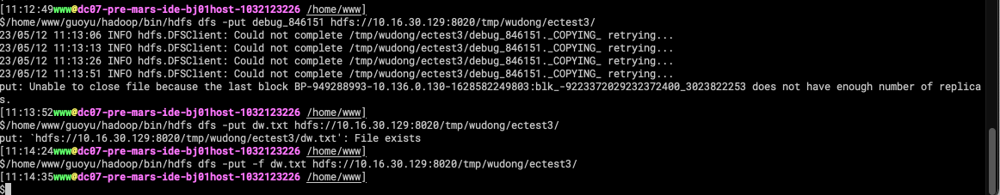
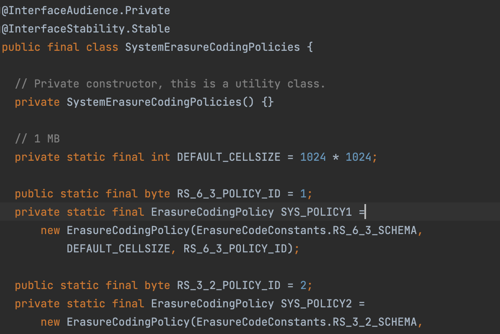
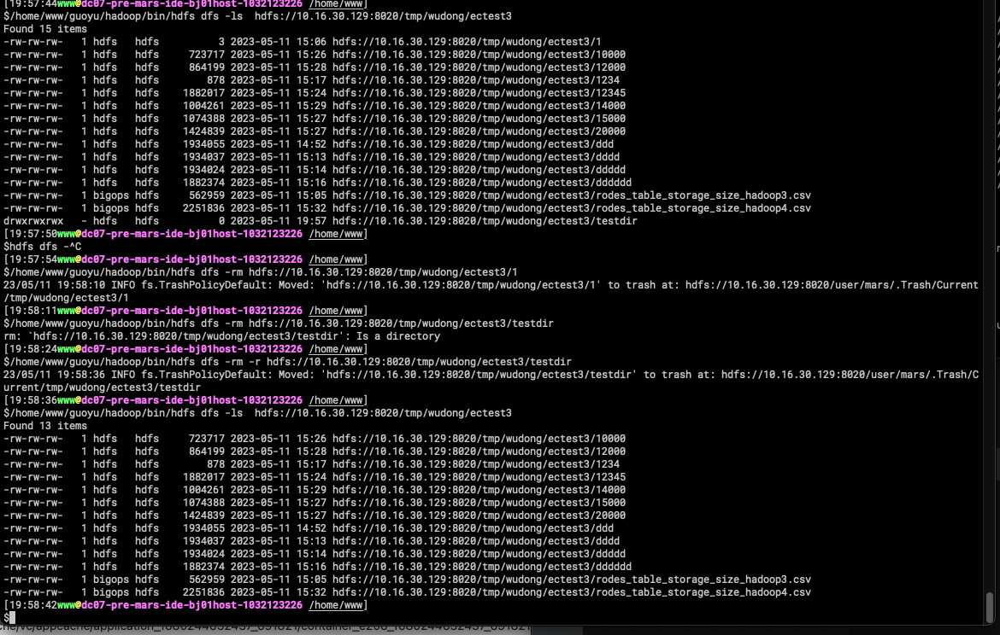
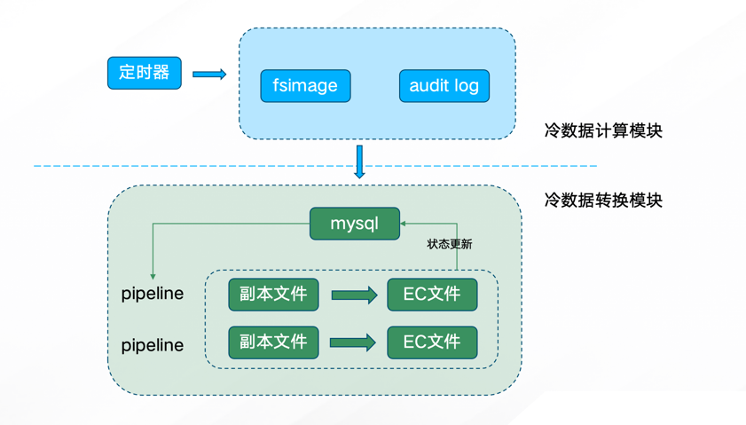

## 一、背景

随着业务的高速发展，业务产生的数据每天高速持续增长，对大多数用户来说都希望数据保留，虽然我们通过生命周期治理，限制数据存储的时间，要么就是通过业务手段去下线一些没用的数据。
随着体量的增大，即使TTL机制的运行，冷数据的存储量也越来越多，这部分数据长时间未有访问，但仍然具有一定的价值，不能随意清理，且占总体数据量的30%以上，
现有的高密存储机制虽然能一定程度上降低存储成本，但是为了进一步降本增效，我们计划用技术手段进一步节省存储成本。我们在2022年对hadoop进行了升级从hadoop2升级到了hadoop3，因为
hadoop3才开始支持EC，当然除了EC我们后面还发现了升级到hadoop3其他的好处，让我们的存储优化又上了一个台阶。本问主要介绍一下我们在EC的一些实践经验。

## 二、EC策略

在将数据转换成EC存储过程中其实根本上就是回答3个问题：

- 1.哪些数据可以转换成EC存储？
- 2.这些数据如何转成EC存储？
- 3.如何动态、周期性的分析出这些数据，并将其稳定地转成EC存储？

### 2.1 EC特性

#### 2.1.1 性能问题
EC技术节省了十分可观的存储开销，但是在使用中也存在不少问题。

一方面是性能问题，以 RS-6-3 为例，每个文件块由原来的 3 副本变成了包含 9 个 Block 的 Block Group，而且这 9 个 Block 必须分布在不同的机器，
每次读操作至少需要 6 个 Block 才能还原数据，也就是至少需要 6 个 DN 同时返回，数据才能被正常解析；而在 3 副本模式下，一个 DN 上就有完整的 Block，
只需要最多 1 个 DN 返回就可以读取，所以 EC 在生产中可能会放大 DataNode 的请求量，带来额外的负担。
另外如果数据块有损坏的情况，读取后还需要对数据做还原，这部分也需要消耗算力。

参考知乎使用 DFSIO 对 EC 的读写性能进行了测试对比：



在低并发的情况下，EC 不论读写性能都比 3 副本要差。
随着并发逐渐增加，EC 打散副本部分的优势开始体现，整体耗时会更短。
另一方面，EC 文件不支持修改，从 HDFS API 的角度看就是不支持 append 和 truncate 操作。
因此对于正在写入或者有可能被追加的目录，不应该采用 EC 编码，避免错误，该场景在 Flink 实时写入数据时较为常见。

EC的这些特性，限制我影响我们的 EC 策略偏好：我们倾向于对较冷的数据进行 EC，以减少频繁读取/刷数对集群的影响。

#### 2.1.2 小文件的问题

对于小文件来说，进行 EC 编码后，不仅不能降低存储开销，反而会增加存储开销。下图是大小为 1M-20M 的文件通过 RS-6-3-1024K 编码后的大小，仅供参考。



- 相比于按照目录粒度做 EC 编码，按照文件粒度做 EC 编码可以精确跳过小文件，只对大小符合要求的文件进行 EC 编码，这样能尽量多的节省存储。
而按照目录做 EC 编码就只能粗略地依据目录的平均大小来做。
- 其次是在新旧文件替换时，按照文件粒度做 EC 编码时，可以利用 HDFS 提供的原子 rename 接口 overwrite 原文件，可以避免很多问题，而按照目录粒度做 EC 编码时，
目录是不能像文件那样直接 overwrite，只能自己实现替换逻辑，因为此操作不是原子的，可能会出现一些异常情况，需要额外处理；
- 按文件粒度进行 EC 编码，会导致一个目录内既有 EC 文件又有非 EC 文件，管理起来比较混乱，尤其是对 Hive 的分区表；
- 按目录粒度进行 EC 编码可以直接使用 distcp 工具来拷贝文件，而按照文件粒度 EC 不再适合使用 distcp，因为每个文件一个 distcp 任务对 Yarn 的压力太大，因此需要另外开发文件重写工具。

最后我们选择了按照目录粒度来做 EC，因为我们想直接用 distcp 工具拷贝文件，并且不想引入额外的复杂度。

#### 2.1.3 EC策略选择
通过 hdfs ec -listPolicies 命令可以列出已经实现的 EC 策略。各个策略的一些特性如表 1 所示。



综合考虑，我们内部只开启了 RS-6-3-1024k 策略。考虑到 EC 策略目录的规范性，目前只支持管理员设置 EC 策略。

#### 2.1.4 hadoop2/3版本客户端支持情况

hadoop2的客户端,不支持大于1M大小的文件读写

hadoop2客户端读大于1MB的EC文件:不支持



hadoop2客户端写大于1MB的EC文件:不支持



小于1m,可以正常读写:



原因：ec的最小cell单元是1M，如RS-6-3-1024k这个策略，代表每个块由6个数据块，3个校验块构成，每个cell的大小是1024K)

删除文件，目录均正常：



hadoop3的客户端兼容。

综上，针对使用hadoop2客户端的一些应用、任务需要推进升级(因为我们在升级hadoop3的时候已经都改造过了,只有一些老的应用服务推进业务升级就好了)。

### 2.2 哪些数据可以转换成EC存储

根据上面的EC特性

#### 如何定义冷数据?

我们统计了一下任务中的sql,99%以上的任务中使用的任务pt分区都是在365天以内，另外我们的任务最大调度周期是一个月。

所以我们定义的冷数据条件是：

* 1.叶子目录(即最后一层目录，目录下只有文件)修改时间大于365天。
* 2.近30天没有任何读写请求。

另外根据EC的特性，太小的文件反而会占用更大的空间。所以我们增加了文件大小的过滤：
* 3.目录大小大于1G，目录文件平均大小大于6M

#### 如何获取冷数据列表?

- 1.我们每天通过一个任务将fs image文件进行解析，并将解析结果导入到hive表。fsimage中包含了目录/文件/修改时间/大小等信息。
- 2.我们通过采集hdfs audit log将日志数据按照一定格式也存入到hive表。

这样我们通过这两个表进行关联，就可以获取到所有需要进行EC的数据列表。最终我们通过一个sql获取这部分数据

至于具体的实现代码，有需要的同学可以联系我～

### 2.3 这些数据如何转成EC存储
核心逻辑分为以下几步：

- 1.创建存储EC的临时目录/ectemp,创建副本备份目录/replicationbak
```shell
hdfs dfs mkdir /ectemp
hdfs dfs mkdir /replicationbak
```

- 2.在ectemp下创建待转ec的目录,另外要保证权限与之前的目录保持抑制
```shell
hdfs ec -setPolicy -path /ectemp/xxdir -policy RS-6-3-1024k
```

- 3.通过distcp将需要转换的目录，cp到/ectemp下面
```shell
distcp /$src /ectemp/$src
```

4.将原来的副本模式的数据 copy到/relicationbak下
```shell
mv /$src /relicationbak/$src
```

5.将/ectemp的EC数据 mv到原目录
```shell
mv /ectemp/$src /$src
```

6.校验完成后，delete掉副本的数据
```shell
del /replicationbak/$src
```

至于具体的实现代码，有需要的同学可以联系我～

### 2.4 如何动态、周期性的分析出这些数据，并将其稳定地转成EC存储

转 EC 存储流程如下（自研系统将自动化完成所有过程）：



周期性地（每天）从 fsimage 表中计算出需要转 EC 的叶子目录
每个目录的转 EC、替换原文件操作记为一次 pipeline。多个 pipeline 并行操作进行转 EC
每个目录的转 EC 状态记为该目录的生命周期 lifecycle，生命周期有变化时更新到 mysql

## 三、EC及HDFS相关的的BUG梳理

| Bug (critical)                                                                                                                        | 影响                                                                                                                                                                                                                                                                                                                                                           | issue                                                                                                                                                                                                                                                             | 分析&复现                                                                                                                                                                                                                                                                                                                           |
| :------------------------------------------------------------------------------------------------------------------------------------ | :----------------------------------------------------------------------------------------------------------------------------------------------------------------------------------------------------------------------------------------------------------------------------------------------------------------------------------------------------------- | :---------------------------------------------------------------------------------------------------------------------------------------------------------------------------------------------------------------------------------------------------------------- | :------------------------------------------------------------------------------------------------------------------------------------------------------------------------------------------------------------------------------------------------------------------------------------------------------------------------------ |
| Fix thread safety of EC decoding during concurrent preads                                                                             |                                                                                                                                                                                                                                                                                                                                                              | [HDFS-16422](https://issues.apache.org/jira/browse/HDFS-16422)                                                                                                                                                                                                    | hdfs-clint                                                                                                                                                                                                                                                                                                                      |
| EC: hdfs client hangs due to exception during addBlock                                                                                | 导致hdfs客户端hang住                                                                                                                                                                                                                                                                                                                                               | [HDFS-15398](https://issues.apache.org/jira/browse/HDFS-15398)                                                                                                                                                                                                    |                                                                                                                                                                                                                                                                                                                                 |
| EC: Block gets marked as CORRUPT in case of failover and pipeline recovery                                                            |                                                                                                                                                                                                                                                                                                                                                              | [HDFS-15170](https://issues.apache.org/jira/browse/HDFS-15170)                                                                                                                                                                                                    |                                                                                                                                                                                                                                                                                                                                 |
| \[Hadoop 3] Both NameNodes can crash simultaneously due to the short JN socket timeout                                                | 导致主备namenode宕机                                                                                                                                                                                                                                                                                                                                               | [HDFS-15719](https://issues.apache.org/jira/browse/HDFS-15719)                                                                                                                                                                                                    | 默认socket超时时间过短（10s）可能导致大的edit log传输超时，导致namenode宕机，修改后为60s，guoyu(hadoop2.6.0-CDH-5.13)上该值为200s                                                                                                                                                                                                                                  |
| CORRUPT replica mismatch between namenodes after failover                                                                             | ha切换后，新的namenode不会立刻删除Corrupt block，导致的CORRUPT replica不一致问题                                                                                                                                                                                                                                                                                                  | [HDFS-15187](https://issues.apache.org/jira/browse/HDFS-15187)                                                                                                                                                                                                    |                                                                                                                                                                                                                                                                                                                                 |
| Multiple CloseOp shared block instance causes the standby namenode to crash when rolling editlog                                      | standby namenode宕机                                                                                                                                                                                                                                                                                                                                           | [HDFS-15175](https://issues.apache.org/jira/browse/HDFS-15175)                                                                                                                                                                                                    |                                                                                                                                                                                                                                                                                                                                 |
| Avoid deleting unique data blocks when deleting redundancy striped blocks                                                             | ec数据损坏                                                                                                                                                                                                                                                                                                                                                       | [HDFS-16420](https://issues.apache.org/jira/browse/HDFS-16420)									[HDFS-15186](https://issues.apache.org/jira/browse/HDFS-15186)									[HDFS-14768](https://issues.apache.org/jira/browse/HDFS-14768)	                                                     | 该 BUG 的根本原因是，当前 NameNode 在判断某些 block 块是否有多余 replica 副本，并进而删除这些多余的 replica 副本的算法逻辑有问题，会误删某些使用了纠删码策略的文件的 EC block 块。 比如在 NameNode 发生了 fail over 之后不久，就运行了 hdfs balancer 负载均衡操作, 或者 recommission 重新上线了原先退役的某些 datanodes 节点，都有可能会造成某些 EC block 在同一个 rack 机架上有多个副本，即 over-replicated。此时由于上述 BUG，某些 EC BLOCK 的多余的副本和原始的副本，都有可能会被错误删除。 |
| Erasure Coding: Blocks are over-replicated while EC decommissioning                                                                   | 部分block over-replicated                                                                                                                                                                                                                                                                                                                                      | [HDFS-14847](https://issues.apache.org/jira/browse/HDFS-14847)								[HDFS-14920](https://issues.apache.org/jira/browse/HDFS-14920) 									[HDFS-14946](https://issues.apache.org/jira/browse/HDFS-14946)					                                                 |                                                                                                                                                                                                                                                                                                                                 |
| Exception ’ Invalid event: TA\_TOO\_MANY\_FETCH\_FAILURE at SUCCESS\_FINISHING\_CONTAINER’ cause job error                            | shuffle获取数据失败->SUCCESS\_FINISHING\_CONTAINER状态的container异常->mr任务失败                                                                                                                                                                                                                                                                                           | [MAPREDUCE-7240](https://issues.apache.org/jira/browse/MAPREDUCE-7240)                                                                                                                                                                                            |                                                                                                                                                                                                                                                                                                                                 |
| Invalid event TA\_TOO\_MANY\_FETCH\_FAILURE at SUCCESS\_CONTAINER\_CLEANUP causes job failure                                         | shuffle获取数据失败->SUCCESS\_CONTAINER\_CLEANUP状态的container异常->mr任务失败                                                                                                                                                                                                                                                                                             | [MAPREDUCE-7249](https://issues.apache.org/jira/browse/MAPREDUCE-7249)                                                                                                                                                                                            |                                                                                                                                                                                                                                                                                                                                 |
| Standby Namenode never come out of safemode when EC files are being written.                                                          | 大量的ec文件写入时，standby namenode 在重启后可能无法退出safemode，应使用StripedID而不是BlockID（对应stripe group）去做EC block report上报数统计                                                                                                                                                                                                                                                  | [HDFS-14687](https://issues.apache.org/jira/browse/HDFS-14687)                                                                                                                                                                                                    |                                                                                                                                                                                                                                                                                                                                 |
| NullPointerException happens in NamenodeWebHdfs                                                                                       |                                                                                                                                                                                                                                                                                                                                                              | [HDFS-14216](https://issues.apache.org/jira/browse/HDFS-14216)                                                                                                                                                                                                    |                                                                                                                                                                                                                                                                                                                                 |
|                                                                                                                                       | Erasure Coding : The number of Under-Replicated Blocks never reduced                                                                                                                                                                                                                                                                                         | <https://issues.apache.org/jira/browse/HDFS-14754>                                                                                                                                                                                                                |                                                                                                                                                                                                                                                                                                                                 |
|                                                                                                                                       | **【EC】**DN 下线导致 EC 块无限复制                                                                                                                                                                                                                                                                                                                                     | [HDFS-14849](https://issues.apache.org/jira/browse/HDFS-14849)                                                                                                                                                                                                    |                                                                                                                                                                                                                                                                                                                                 |
|                                                                                                                                       | **【namenode启动时长**】线上1.4k节点规模集群的HDFS原本NN启动后2亿多块上报不到一小时就完成，在Hadoop2.7升级到3.1后，发现上报的时间需要4个小时左右，严重影响线上                                                                                                                                                                                                                                                            | [HDFS-14366](https://issues.apache.org/jira/browse/HDFS-14366) [HDFS-14859](https://issues.apache.org/jira/browse/HDFS-14859) [HDFS-14632](https://issues.apache.org/jira/browse/HDFS-14632)							[HDFS-14171](https://issues.apache.org/jira/browse/HDFS-14171) |                                                                                                                                                                                                                                                                                                                                 |
|                                                                                                                                       | 新版本的NN删除对我们来说，算是我们踩得比较大的一个坑。新版本的HDFS对DN的块存储结构做了优化，用新的结构FoldedTreeSet取代原本的LightWeightGSet（详见HDFS-9260）。前者在内存利用率上会跟高，但是对应地它不利于块的update，也就是我们的删除块操作这种方式。本来NN在删除大的文件目录时，会出现严重的响应延时问题，加上这个改动，这种延时的表现就更加明显了。感兴趣的同学，可以关注HDFS-13671（Namenode deletes large dir slowly caused by FoldedTreeSet#removeAndGet）。这个我们调整了FoldedTreeSet的碎片阈值参数。还有一个小的优化点，是可配置化了删除操作的批量间隔时间。 | [HDFS-13831](https://issues.apache.org/jira/browse/HDFS-13831)									 将dfs.namenode.block.deletion.increment（default 1000）降低为100													 [HDFS-13671](https://issues.apache.org/jira/browse/HDFS-13671)                                                    |                                                                                                                                                                                                                                                                                                                                 |
|  对于GetBlocks来说，既然这个call只会被Balancer用到，那就不存在这个call会被client调用到的情况。那么我们可以单独将这个请求操作重定向到Standby NameNode上执行，Active NameNode就完全不会受到此操作的影响了。  | GetBlocks操作 ，这个发生在Balancer做大量块数据平衡的时候，会造成周期性的NN RPC队列的尖峰毛刺现象。						                                                                                                                                                                                                                                                                                          | [HDFS-13183](https://issues.apache.org/jira/browse/HDFS-13183)                                                                                                                                                                                                    |                                                                                                                                                                                                                                                                                                                                 |
| Concat on a same files deleting the file                                                                                              |                                                                                                                                                                                                                                                                                                                                                              | [HDFS-15286](https://issues.apache.org/jira/browse/HDFS-15286)                                                                                                                                                                                                    |                                                                                                                                                                                                                                                                                                                                 |
| Concat on INodeRefernce fails with illegal state exception                                                                            |                                                                                                                                                                                                                                                                                                                                                              | [HDFS-15276](https://issues.apache.org/jira/browse/HDFS-15276)                                                                                                                                                                                                    |                                                                                                                                                                                                                                                                                                                                 |
| node节点busy问题                                                                                                                          | 该参数没有考虑机器core数，高core机器很容易被判定为高load机器，96core机器load大于19就不可用了dfs.namenode.redundancy.considerLoad.factor                                                                                                                                                                                                                                                        | [HDFS-15556](https://issues.apache.org/jira/browse/HDFS-15556)                                                                                                                                                                                                    |                                                                                                                                                                                                                                                                                                                                 |
|                                                                                                                                       | **DN 重构 EC 块有脏数据问题**                                                                                                                                                                                                                                                                                                                                         | [HDFS-15240](https://issues.apache.org/jira/browse/HDFS-15240)                                                                                                                                                                                                    |                                                                                                                                                                                                                                                                                                                                 |


## 参考文档

- b站 https://www.nxrte.com/jishu/16742.html         
- 知乎 https://zhuanlan.zhihu.com/p/603169942       
- 滴滴 https://www.infoq.cn/article/b3clz4xtpjoprdkqq6fq 