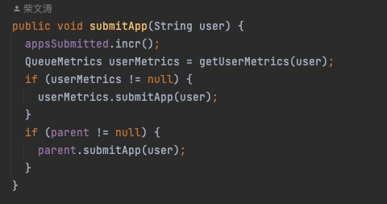
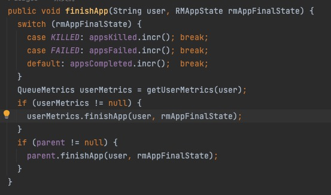
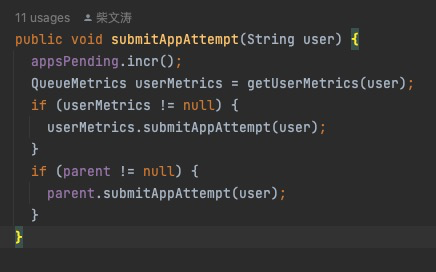
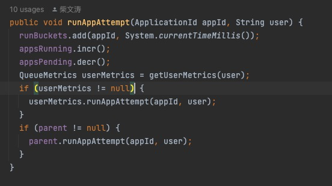
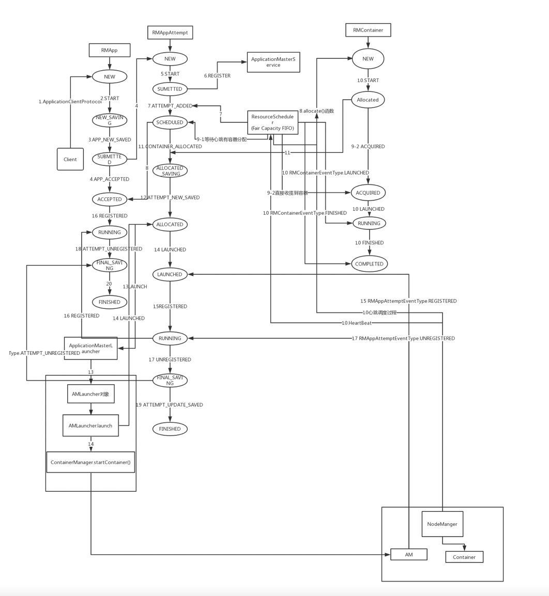

# yarn如何运行一个applicaiton

用户提交应用程序，会调用客户端的ApplicationClientProtoc#submitApplication,进而会调用服务端RMAppManager#submitApplication，此后服务端直到ApplicationMater启动，会涉及ClientRMService、RMAppManager、RMAppImpl、RMAppAttempImpl、RMNode、ResourceScheduler。\
为了简化整个分析过程，这里仅分析首次提交任务的过程中任务提交到ApplicationMater启动过程，不考虑失败重启的过程。整个过程将围绕着状态机展开。

|    | ResourceManager核心的状态机 | 状态列表                                                                                                                                                                               | ResourceManager埋点的几个监控                                                                                                                                                                                                                                                                                                                                                                                                                                               |
| :- | :-------------------- |:-----------------------------------------------------------------------------------------------------------------------------------------------------------------------------------|:---------------------------------------------------------------------------------------------------------------------------------------------------------------------------------------------------------------------------------------------------------------------------------------------------------------------------------------------------------------------------------------------------------------------------------------------------------------------|
| 1  | RMAppImpl             | *NEW*, *NEW_SAVING*, *SUBMITTED*, *ACCEPTED*, *RUNNING*, *FINAL_SAVING*, *FINISHING*, *FINISHED*, *FAILED*, *KILLING*, *KILLED*                                                    | SUBMITTED:  @Metric("# of apps submitted") MutableCounterInt appsSubmitted;						<br/><br/> FINISHED: @Metric("# of apps completed") MutableCounterInt appsCompleted;							                                         @Metric("# of apps killed") MutableCounterInt appsKilled;			  @Metric("# of apps failed") MutableCounterInt appsFailed;<br/> |
| 2  | RMAppAttemptImpl      | *NEW*, *SUBMITTED*, *SCHEDULED*, *ALLOCATED_SAVING*, *ALLOCATED*, *LAUNCHED_UNMANAGED_SAVING*, *LAUNCHED*, *RUNNING*, *FINAL_SAVING*, *FINISHING*, *FINISHED*, *FAILED*, *KILLED*, | SUBMITTED: 																						@Metric("# of pending apps") MutableGaugeInt appsPending;		在AppAttemptI RUN阶段AppPending才减1，所以在SUBMITTED--->LAUNCHED阶段都属于appPending										   <br/>                                                                                                                                                                                                                        |
| 3  | RMContainerImpl       | *NEW*, *RESERVED*, *ALLOCATED*, *ACQUIRED*, *RUNNING*, *COMPLETED*, *EXPIRED*, *RELEASED*, *KILLED*                                                                                | ALLOCATED:@Metric("# of running apps") MutableGaugeInt appsRunning;										 <br/>                                                                                                                                                                                                                                                                                                                            |

## yarn application启动流程分析

### 2. ApplicationMater启动源码分析

## 2.1 RMAppImpl状态机

### 2.1.1 创建RMApp

ClientRMService收到客户端的请求后，会调用RMAppManager#submitApplication方法，在该方法中创建了一个RMApp对象来维护这个应用程序的整个生命周期。\
该对象的实现类是RMAppImpl类，该类维护了一个Application状态机，记录一个Application可能存在的状态（RMAppState）以及导致状态间转换的事件（RMAppEvent），核心代码如下：
```java
// 代码路径：/hadoop3/hadoop-yarn-project/hadoop-yarn/hadoop-yarn-server/hadoop-yarn-server-resourcemanager/src/main/java/org/apache/hadoop/yarn/server/resourcemanager/RMAppManager.java

//创建RMApp对
RMAppImpl application = createAndPopulateNewRMApp(
     submissionContext, submitTime, user, false, -1);
 ....
//这里考虑加密方式Simple的情况
this.rmContext.getDispatcher().getEventHandler()
         .handle(new RMAppEvent(applicationId, RMAppEventType.START));
```
    
在这里会将RMAppEvent事件放入中央调度器（BlockingQueue）中等待对应的事件处理器(RMAppImpl)处理。

### 2.1.2 状态从NEW转变为NEW\_SAVING

当RMAppImpl处理器处理时，会调用RMAppImpl#handle()方法，该方法主要是调用状态机的`doTransition()`方法，跟进去会发现，该方法主要是调用状态机的hook对象的`transition()`方法。\
对于初次提交的任务，从状态机的初始化过程（如下），可以发现，是调用RMAppImpl内部类的RMAppNewlySavingTransition的transition()方法。
```java
//代码路径：/hadoop3/hadoop-yarn-project/hadoop-yarn/hadoop-yarn-server/hadoop-yarn-server-resourcemanager/src/main/java/org/apache/hadoop/yarn/server/resourcemanager/rmapp/RMAppImpl.java

......
.addTransition(RMAppState.NEW, RMAppState.NEW_SAVING,
     RMAppEventType.START, new RMAppNewlySavingTransition())
```

RMAppImpl#RMAppNewlySavingTransition#transition()方法会调用RMStateStore#storeNewApplication()。RMStateStore是插拔式组件，在不启用RM恢复机制，默认是NullRMStateStore，它不会进行任何保存工作（其他实现有MemoryRMStateStore等）。自此，RMAppState就从NEW变为了NEW\_SAVING。

### 2.1.3 状态变化过程STORE\_APP->...-> SUBMITTE

RMStateStore#storeNewApplication()会new一个RMStateStoreEventType.STORE\_APP放入到调度器中。RMAppState实现类会调用StoreAppTransition()，该方法主要是保存状态，并进一步向RMAppImpl发送一个RMAppEventType.APP\_NEW\_SAVED事件。\
RMAppImpl接收到RMAppEventType.APP\_NEW\_SAVED事件后，RMAppImpl的状态就从RMAppState.SUBMITTED.NEW\_SAVING变为RMAppState.SUBMITTED，与此同时，会生成一个AppAddedSchedulerEvent事件放入调度器的对列中等待资源调度器处理。

### 2.2 RM资源调度器

> 资源调度器是ResourceManager的一个插拔式服务组件，负责整个集群资源的管理和分配。Yarn的资源调度有三种：FIFO（First In First Out）、Capacity Scheduler、Fair Scheduler，本文以Fair Scheduler为例进行分析

FairScheduler在处理SchedulerEvent事件时，是调用其`handle()`方法，此时涉及的分支如下。

```java
//代码路径：/hadoop3/hadoop-yarn-project/hadoop-yarn/hadoop-yarn-server/hadoop-yarn-server-resourcemanager/src/main/java/org/apache/hadoop/yarn/server/resourcemanager/scheduler/fair/FairScheduler.java

case APP_ADDED:
      if (!(event instanceof AppAddedSchedulerEvent)) {
        throw new RuntimeException("Unexpected event type: " + event);
      }
      AppAddedSchedulerEvent appAddedEvent = (AppAddedSchedulerEvent) event;
      String queueName =
          resolveReservationQueueName(appAddedEvent.getQueue(),
              appAddedEvent.getApplicationId(),
              appAddedEvent.getReservationID(),
              appAddedEvent.getIsAppRecovering());
      if (queueName != null) {
        addApplication(appAddedEvent.getApplicationId(),
            queueName, appAddedEvent.getUser(),
            appAddedEvent.getIsAppRecovering());
      }
      break;
```

当任务是初次运行是，主要是调用FairScheduler#addApplication()方法。在该方法中我们过滤掉非正常情况，其核心代码如下：
```java
 //代码路径：/hadoop3/hadoop-yarn-project/hadoop-yarn/hadoop-yarn-server/hadoop-yarn-server-resourcemanager/src/main/java/org/apache/hadoop/yarn/server/resourcemanager/scheduler/fair/FairScheduler.java

// Submit to the queue
  if (!queue.hasAccess(QueueACL.SUBMIT_APPLICATIONS, userUgi) && !queue
      .hasAccess(QueueACL.ADMINISTER_QUEUE, userUgi)) {
    String msg = "User " + userUgi.getUserName()
        + " cannot submit applications to queue " + queue.getName()
        + "(requested queuename is " + queueName + ")";
    LOG.info(msg);
    rmContext.getDispatcher().getEventHandler().handle(
        new RMAppEvent(applicationId, RMAppEventType.APP_REJECTED, msg));
    return;
  }

SchedulerApplication<FSAppAttempt> application =
      new SchedulerApplication<FSAppAttempt>(queue, user);
  applications.put(applicationId, application);
  // update the metrics
  queue.getMetrics().submitApp(user);

  LOG.info("Accepted application " + applicationId + " from user: " + user
      + ", in queue: " + queue.getName()
      + ", currently num of applications: " + applications.size());
    //新的事件放入调度器中
rmContext.getDispatcher().getEventHandler().handle(
    new RMAppEvent(applicationId, RMAppEventType.APP_ACCEPTED));

```
   
## 2.3. RMAppImpl到RMAppAttemptImpl

当RMAppImpl事件处理器处理RMAppEventType.APP\_ACCEPTED事件时，RMAppImpl的状态会从RMAppState.SUBMITTED变为RMAppState.ACCEPTED，并且调用RMAppImpl#StartAppAttemptTransition#transition()方法，该方法主要是调用RMAppImpl的私有方法createAndStartNewAttempt()。
```java
//代码路径：/hadoop3/hadoop-yarn-project/hadoop-yarn/hadoop-yarn-server/hadoop-yarn-server-resourcemanager/src/main/java/org/apache/hadoop/yarn/server/resourcemanager/rmapp/RMAppImpl.java
private void
    createAndStartNewAttempt(boolean transferStateFromPreviousAttempt) {
      //创建一个RMAppAttemptImpl实例，尝试次数为1
  createNewAttempt();
  //RMAppStartAttemptEvent事件放入调度器
  handler.handle(new RMAppStartAttemptEvent(currentAttempt.getAppAttemptId(),
    transferStateFromPreviousAttempt));
}
```

## 2.4. RMAppAttemptImpl调度器

### 2.4.1 RMAppAttemptImpl状态从NEW到SUBMITTED

RMAppAttemptEvent事件的Event handler的实现类是RMAppAttemptImpl，当其接收到RMAppAttemptEventType.START事件时，它的状态就会从RMAppAttemptState.NEW变为RMAppAttemptState.SUBMITTED，并调用RMAppAttemptImpl#AttemptStartedTransition#transition()方法。

```java
//代码路径：/hadoop3/hadoop-yarn-project/hadoop-yarn/hadoop-yarn-server/hadoop-yarn-server-resourcemanager/src/main/java/org/apache/hadoop/yarn/server/resourcemanager/rmapp/attempt/RMAppAttemptImpl.java
public void transition(RMAppAttemptImpl appAttempt,
      RMAppAttemptEvent event) {

      boolean transferStateFromPreviousAttempt = false;
    if (event instanceof RMAppStartAttemptEvent) {
      transferStateFromPreviousAttempt =
          ((RMAppStartAttemptEvent) event)
            .getTransferStateFromPreviousAttempt();
    }
    appAttempt.startTime = System.currentTimeMillis();

    // Register with the ApplicationMasterService
    //向ApplicationMasterService注册
    appAttempt.masterService
        .registerAppAttempt(appAttempt.applicationAttemptId);

    if (UserGroupInformation.isSecurityEnabled()) {
      appAttempt.clientTokenMasterKey =
          appAttempt.rmContext.getClientToAMTokenSecretManager()
            .createMasterKey(appAttempt.applicationAttemptId);
    }

    // Add the applicationAttempt to the scheduler and inform the scheduler
    // whether to transfer the state from previous attempt. 
    //向资源调度器中添加SchedulerEventType.APP_ATTEMPT_ADDED事件
    appAttempt.eventHandler.handle(new AppAttemptAddedSchedulerEvent(
      appAttempt.applicationAttemptId, transferStateFromPreviousAttempt));
  }

```

### 2.4.2 FairScheduler调度器调度

与上面分析过程相同，其涉及的分支如下。

```java
//代码路径：/hadoop3/hadoop-yarn-project/hadoop-yarn/hadoop-yarn-server/hadoop-yarn-server-resourcemanager/src/main/java/org/apache/hadoop/yarn/server/resourcemanager/scheduler/fair/FairScheduler.java

case APP_ATTEMPT_ADDED:
      if (!(event instanceof AppAttemptAddedSchedulerEvent)) {
        throw new RuntimeException("Unexpected event type: " + event);
      }
      AppAttemptAddedSchedulerEvent appAttemptAddedEvent =
          (AppAttemptAddedSchedulerEvent) event;
      addApplicationAttempt(appAttemptAddedEvent.getApplicationAttemptId(),
        appAttemptAddedEvent.getTransferStateFromPreviousAttempt(),
        appAttemptAddedEvent.getIsAttemptRecovering());
      break;

```

在FairScheduler#addApplicationAttempt()方法中，其向调度器添加了RMAppAttemptEventType.ATTEMPT\_ADDED事件。

### 2.4.3 RMAppAttemptImpl调度器ATTEMPT\_ADDED到SUBMITTED

RMAppAttemptImpl调度器处理器处理RMAppAttemptEventType.ATTEMPT\_ADDED事件时，会将其状态从RMAppAttemptState.SUBMITTED变为**RMAppAttemptState.SCHEDULED**(特殊情况下，ApplicationMater由用户而非ResourceManager启动，则状态为RMAppAttemptState.LAUNCHED\_UNMANAGED\_SAVING)。同时会触发对RMAppAttemptImpl#ScheduleTransition#transition()的调用。

```java
//代码路径：/hadoop3/hadoop-yarn-project/hadoop-yarn/hadoop-yarn-server/hadoop-yarn-server-resourcemanager/src/main/java/org/apache/hadoop/yarn/server/resourcemanager/rmapp/attempt/RMAppAttemptImpl.java
public RMAppAttemptState transition(RMAppAttemptImpl appAttempt,
      RMAppAttemptEvent event) {
    ApplicationSubmissionContext subCtx = appAttempt.submissionContext;  
    //ApplicationMater由ResourceManager启动
    if (!subCtx.getUnmanagedAM()) {
      //处理AM的黑名单、资源对列信息等
      .......

      // AM resource has been checked when submission
      //为ApplicationMater分配资源
      Allocation amContainerAllocation =
          appAttempt.scheduler.allocate(
              appAttempt.applicationAttemptId,
              appAttempt.amReqs, null, EMPTY_CONTAINER_RELEASE_LIST,
              amBlacklist.getBlacklistAdditions(),
              amBlacklist.getBlacklistRemovals(),
              new ContainerUpdates());
      if (amContainerAllocation != null
          && amContainerAllocation.getContainers() != null) {
        assert (amContainerAllocation.getContainers().size() == 0);
      }
      //最终状态为多个时，此处指定返回状态为SCHEDULED
      return RMAppAttemptState.SCHEDULED;
    } else {
      // save state and then go to LAUNCHED state
      appAttempt.storeAttempt();
      return RMAppAttemptState.LAUNCHED_UNMANAGED_SAVING;
    }
  }

```

### 2.4.4 FairScheduler调度器获取分配给AM的资源

allocate()方法有多个实现，这里查看FairScheduler中的实现。

```java
//代码路径：/hadoop3/hadoop-yarn-project/hadoop-yarn/hadoop-yarn-server/hadoop-yarn-server-resourcemanager/src/main/java/org/apache/hadoop/yarn/server/resourcemanager/scheduler/fair/FairScheduler.java
 
public Allocation allocate(ApplicationAttemptId applicationAttemptId,
    List<ResourceRequest> ask, List<SchedulingRequest> schedulingRequests,
      List<ContainerId> release, List<String> blacklistAdditions,
      List<String> blacklistRemovals, ContainerUpdates updateRequests) {

    // Make sure this application exists
    FSAppAttempt application = getSchedulerApp(appAttemptId);
    if (application == null) {
      LOG.error("Calling allocate on removed or non existent application " +
          appAttemptId.getApplicationId());
      return EMPTY_ALLOCATION;
    }

  ......
  // Handle all container updates
  handleContainerUpdates(application, updateRequests);

  // Release containers
  releaseContainers(release, application);

  LeafQueue updateDemandForQueue = null;

  // Sanity check for new allocation requests
  normalizeResourceRequests(ask);

  // Normalize scheduling requests
  normalizeSchedulingRequests(schedulingRequests);

  Allocation allocation;

  // make sure we aren't stopping/removing the application
  // when the allocate comes in
  try {
    application.getWriteLock().lock();
    if (application.isStopped()) {
      return EMPTY_ALLOCATION;
    }

   ......
    application.updateBlacklist(blacklistAdditions, blacklistRemovals);
    //指定资源，getAllocation()中有AM资源的指定方式
    allocation = application.getAllocation(getResourceCalculator(),
        getClusterResource(), getMinimumResourceCapability());
  } finally {
    application.getWriteLock().unlock();
  }
  ......
  return allocation;
}

```

## 2.5. RMContainerImpl状态机

ResourceManager为应用程序的ApplicationMater分配资源后，创建一个RMContainerImpl并向它发送Start事件。

### 2.5.1 状态从NEW -> ALLOCATED

```java
...
.addTransition(RMContainerState.NEW, RMContainerState.ALLOCATED,
  RMContainerEventType.START, new ContainerStartedTransition())

```

在RMContainerImpl接收START后，会调用内部类ContainerStartedTransition的方法transition().

```java
private static final class ContainerStartedTransition extends
    BaseTransition {

  @Override
  public void transition(RMContainerImpl container, RMContainerEvent event) {
    // Notify AllocationTagsManager
    container.rmContext.getAllocationTagsManager().addContainer(
        container.getNodeId(), container.getContainerId(),
        container.getAllocationTags());

    container.eventHandler.handle(
        new RMAppAttemptEvent(container.appAttemptId,
            RMAppAttemptEventType.CONTAINER_ALLOCATED));

    publishNonAMContainerEventstoATS(container);

  }
}

```

### 2.5.2 RMAppAttemptImpl状态

在获取容器后，RMContainerImpl会将RMAppAttemptEventType.CONTAINER\_ALLOCATED事件放入到调度器中，RMContainerImpl收到CONTAINER\_ALLOCATED事件后，会触发状态机的变化如下：

```java
// Transitions from SCHEDULED State
.addTransition(RMAppAttemptState.SCHEDULED,
    EnumSet.of(RMAppAttemptState.ALLOCATED_SAVING,
      RMAppAttemptState.SCHEDULED),
    RMAppAttemptEventType.CONTAINER_ALLOCATED,
    new AMContainerAllocatedTransition())
```

在AMContainerAllocatedTransition#transition方法中，会设置AMContainer，并将其标记为已使用。在返回之前会调用`appAttempt.storeAttempt()`，该过程会向RMStateStore发送RMStateStoreEventType.STORE\_APP\_ATTEMPT（放入资源调度器中）请求记录日志。至此，RMContainerImpl的状态从SCHEDULED变为了RMAppAttemptState.ALLOCATED\_SAVING。

### 2.5.3 RMStateStore

RMStateStore接收到RMStateStoreEventType.STORE\_APP\_ATTEMPT事件后，会触发其状态机的变化。其主要是记录日志并向RMAppAttemptImpl发送请求，ATTEMPT\_NEW\_SAVED其核心代码如下：

```java
store.storeApplicationAttemptStateInternal(attemptState.getAttemptId(),
          attemptState);
  store.notifyApplicationAttempt(new RMAppAttemptEvent
         (attemptState.getAttemptId(),
         RMAppAttemptEventType.ATTEMPT_NEW_SAVED));

```

## 2.6 launcher过程

### 2.6.1 launchAttempt()方法

RMAppAttemptImpl在接收到事件后，其状态机变化如下：

```java
 // Transitions from ALLOCATED_SAVING State
    .addTransition(RMAppAttemptState.ALLOCATED_SAVING, 
        RMAppAttemptState.ALLOCATED,
        RMAppAttemptEventType.ATTEMPT_NEW_SAVED, new AttemptStoredTransition())

```

其会调用如下代码：

```java
 private static final class AttemptStoredTransition extends BaseTransition {
  @Override
  public void transition(RMAppAttemptImpl appAttempt,
                                                  RMAppAttemptEvent event) {

    appAttempt.registerClientToken();
    //登录AMMaster请求，具体细节如下
    appAttempt.launchAttempt();
  }
}
........
  private void launchAttempt(){
  launchAMStartTime = System.currentTimeMillis();
  // Send event to launch the AM Container
  //将AMLauncherEventType.LAUNCH事件放入事件对列中
  eventHandler.handle(new AMLauncherEvent(AMLauncherEventType.LAUNCH, this));
}

```

## 2.6.2 ApplicationMasterLauncher调用登录

AMLauncherEventType.LAUNCH事件放入事件对列中后，等待ApplicationMasterLauncher的线程池中线程调用。其处理方法为：

```java
@Override
public synchronized void  handle(AMLauncherEvent appEvent) {
  AMLauncherEventType event = appEvent.getType();
  RMAppAttempt application = appEvent.getAppAttempt();
  switch (event) {
  case LAUNCH:
  //登录
    launch(application);
    break;
  case CLEANUP:
    cleanup(application);
    break;
  default:
    break;
  }
}

....
private void launch(RMAppAttempt application) {
  Runnable launcher = createRunnableLauncher(application, 
      AMLauncherEventType.LAUNCH);
  //添加到
  masterEvents.add(launcher);
}

```

其中，launcher线程主要的显示逻辑：

```java
public void run() {
  switch (eventType) {
  case LAUNCH:
    try {
      LOG.info("Launching master" + application.getAppAttemptId());
      //与对应的NodeManager进行沟通启动containers
      launch();
      //向RMAppAttempImp发送RMAppAttemptEventType.LAUNCHED事件
      handler.handle(new RMAppAttemptEvent(application.getAppAttemptId(),
          RMAppAttemptEventType.LAUNCHED, System.currentTimeMillis()));
    } catch(Exception ie) {
      onAMLaunchFailed(masterContainer.getId(), ie);
    }
    break;
  case CLEANUP:
    try {
      LOG.info("Cleaning master " + application.getAppAttemptId());
      cleanup();
    } catch(IOException ie) {
      LOG.info("Error cleaning master ", ie);
    } catch (YarnException e) {
      StringBuilder sb = new StringBuilder("Container ");
      sb.append(masterContainer.getId().toString());
      sb.append(" is not handled by this NodeManager");
      if (!e.getMessage().contains(sb.toString())) {
        // Ignoring if container is already killed by Node Manager.
        LOG.info("Error cleaning master ", e);
      }
    }
    break;
  default:
    LOG.warn("Received unknown event-type " + eventType + ". Ignoring.");
    break;
  }
}

```

RMAppAttempImp收到RMAppAttemptEventType.LAUNCHED事件后，会触发向RMAppImpl发送RMAppEventType.ATTEMPT\_LAUNCHED事件,此时，RMAppAttempImp的状态从RMAppAttemptState.ALLOCATED变为RMAppAttemptState.LAUNCHED。

```java
private static class AMLaunchedTransition extends BaseTransition {
  @Override
  public void transition(RMAppAttemptImpl appAttempt,
                          RMAppAttemptEvent event) {
    if (event.getType() == RMAppAttemptEventType.LAUNCHED
        || event.getType() == RMAppAttemptEventType.REGISTERED) {
      appAttempt.launchAMEndTime = System.currentTimeMillis();
      long delay = appAttempt.launchAMEndTime -
          appAttempt.launchAMStartTime;
      ClusterMetrics.getMetrics().addAMLaunchDelay(delay);
    }
    //RMAppIml会记录日志并保存launcher事件
    appAttempt.eventHandler.handle(
        new RMAppEvent(appAttempt.getAppAttemptId().getApplicationId(),
          RMAppEventType.ATTEMPT_LAUNCHED, event.getTimestamp()));
    appAttempt
        .updateAMLaunchDiagnostics(AMState.LAUNCHED.getDiagnosticMessage());
    // Register with AMLivelinessMonitor
    //注册以便监控状态
    appAttempt.attemptLaunched();

  }
}

```

### 2.6.3 ApplicationMater启动成功后

NodeManager通过心跳机制上报ApplicationMater所在container成功启动，启动的ApplicationMater会通过ApplicationMasterServiceProcessor#registerApplicationMaster()方法向ResourceManager注册，核心代码如下：

```java
getRmContext().getDispatcher().getEventHandler()
      .handle(
          new RMAppAttemptRegistrationEvent(applicationAttemptId, request
              .getHost(), request.getRpcPort(), request.getTrackingUrl()));

```

上述过程向RMAppAttemptImp发送事件RMAppAttemptEventType.REGISTERED，RMAppAttemptImp接收到事件后，状态从RMAppAttemptState.LAUNCHED转为RMAppAttemptState.RUNNING。此时会向RMAppImpl发送RMAppEventType.ATTEMPT\_REGISTERED事件，使其状态从RMAppState.ACCEPTED变为RMAppState.RUNNING



