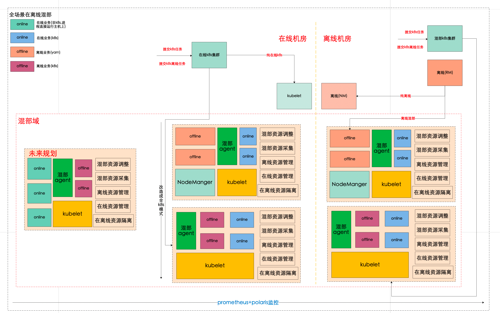
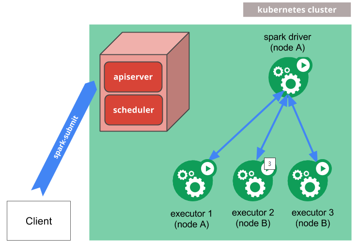
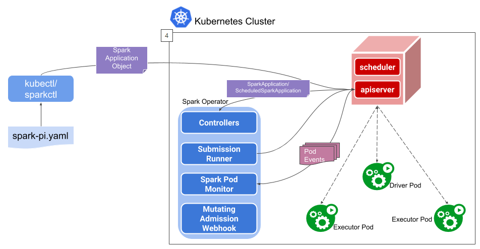

# Spark on K8s 项目技术文档

## 一、项目背景与目标

### 1.1 核心目标
**始于混部，终于统一调度**

实现 K8s 统一调度架构，将 Spark 任务调度到 K8s 进行管理，从 K8s+Yarn 混部方案迁移到 K8s 统一调度。

### 1.2 项目背景
当前混部能力是通过两套不同调度器实现，彼此间无法高效地交互细粒度的资源信息。

### 1.3 业务价值
1. **构建统一的资源视图**：通过动态感知在/离线应用的运行时特征，进一步优化调度效果
2. **简化混部能力的部署运维流程**：混部架构统一、同一个调度器控制资源，无需额外组件协调
3. **计算调度架构升级**：我们的hadoop集群因为版本问题，很难再进行迭代升级，而采用spark on k8s 可以逐渐从原来的hadoop计算调度迁移到k8s，我们只需要维护hdfs，在离线统一一套计算调度引擎

## 二、技术架构

### 2.1 整体架构变化

#### 原架构


#### Spark on K8s 架构


#### 资源控制架构


### 2.2 架构变化点
1. **多一套对接k8s的kyuubi集群**
2. **混部节点上只有kubelet，nm会下线**

### 2.3 业界演进路径参考
**阿里字节的混部路径**：
资源池分时 → yarn+k8s同时调度 → 在离线调度统一k8s

## 三、技术方案详解

### 3.1 核心模块实现方案

| 序号 | 相关模块 | 需实现内容 | 实现方案 | 实现成本 | 需要的外部支持 |
|------|----------|------------|----------|----------|----------------|
| 1 | 部署环境及相关组件适配 | kyuubi环境配置改造 | 搭建一套新的kyuubi对接spark on k8s | 低 | 无 |
| 2 | spark相关改造适配 | 1. 默认driver与excutor采用service ip通讯，spark代码改造成pod ip通讯<br/>2. spark on 需要使用ess,我们这里使用celeborn来代替，所以只有上了celeborn的任务才可以迁移k8s<br/>3. 任务完成后driver不会自动删除<br/>4. 当前使用1.16 k8s版本，需要看更新的k8s版本是否还有其他问题<br/>5. spark 其他配置优化、修改 | 高 | 无 |
| 3 | mars提交任务适配 | 根据任务需要调度到k8s的标签，将任务提交到对接k8s的kyuubi集群上 | 低 | 无 |
| 4 | k8s离线调度器 | 对标yarn调度器，需要有多队列资源分配、控制的能力和高并发调度的能力 | 1. yunikorn，apache下为了适配离线任务在k8s场景下开发的调度器<br/>2. volcano，华为贡献的批调度器，多队列管理没有yunikorn完善<br/>当前倾向基于yunikorn做定制化开发完善 | 高 | k8s版本升级 |
| 5 | 日志采集 | 需要将spark运行的日志进行采集，如driver、excutor日志 | 1. 在drvier和excutor中加入filebeat将日志采集到kafka，es查询<br/>2. 新建设Kafka集群、es集群 | 高 | 日志采集方案确定 |
| 6 | 运维周边 | 1. 任务清场<br/>2. 任务巡检<br/>3. 计费、资源计算<br/>4. 任务资源优化<br/>5. 在离线混部适配 | 待定 | 高 | - |
| 7 | 任务迁移 | 1. 任务迁移分批<br/>2. 任务对比耗时 | 待定 | 高 | - |

### 3.2 K8s离线调度器选型

#### 技术调研结果
k8s离线调度器开源的有2个方案选择：YuniKorn和Volcano，因为yunikorn支持队列和yarn功能类似，所以优先调研了这个。

#### 版本兼容性问题
- **当前k8s版本1.16**：只能使用0.11版本的yunikorn
- **1.0之后的版本**：支持以schedule插件的方式进行运行
- **0.11版本**：只支持以crd方式运行，看不到pod，只能看到调度器自己定义的资源对象，ip信息等都没法看

**结论**：需要k8s升级到1.19以上版本。

### 3.3 Spark 配置参数详解

#### 提交SQL样例
```bash
/home/www/kyuubi/apache-kyuubi-1.7.1-bin/bin/beeline -u "jdbc:hive2://dc09-prod-lan-master-host-370130.host.idcvdian.com:2181,dc09-prod-lan-master-host-370131.host.idcvdian.com:2181,dc09-prod-lan-master-host-370132.host.idcvdian.com:2181,dc09-prod-lan-master-host-370133.host.idcvdian.com:2181,dc09-prod-lan-master-host-370134.host.idcvdian.com:2181/default;serviceDiscoveryMode=zooKeeper;zooKeeperNamespace=k8s_kyuubi1.7.1_prod#\   
spark.submit.deployMode=cluster;\
spark.app.name=spark-kubernetes-test;\
spark.kubernetes.file.upload.path=/user/spark/kyuubi;\
spark.kubernetes.driver.podTemplateFile=/data/spark3.2.2/conf/spark-driver.yaml;\
spark.kubernetes.executor.podTemplateFile=/data/spark3.2.2/conf/spark-executor.yaml;\
spark.kryoserializer.buffer.max=512m;\
spark.shuffle.service.enabled=false;\
spark.shuffle.manager=org.apache.spark.shuffle.celeborn.SparkShuffleManager;\
spark.master=k8s://https://bigdata-spark-k8s.idcvdian.com:443;\
spark.kubernetes.driver.master=https://bigdata-spark-k8s.idcvdian.com:443;\
spark.kubernetes.container.image=harbor.vdian.net/bigdata/spark:7.0;\
spark.kubernetes.driver.pod.name=${NAME};\
spark.kubernetes.executor.podNamePrefix=spark-resource-test;\
spark.kubernetes.driver.label.queue=root.P1;\
spark.kubernetes.executor.label.queue=root.P1;\
spark.kubernetes.authenticate.driver.serviceAccountName=spark-sa;\
spark.dynamicAllocation.enabled=true;\
spark.dynamicAllocation.maxExecutors=10;\
spark.kryoserializer.buffer.max=512m;\
spark.celeborn.client.spark.shuffle.writer=hash;\
spark.kubernetes.driver.request.cores=1;\
spark.kubernetes.driver.limit.cores=1;\
spark.kubernetes.executor.request.cores=1;\
spark.kubernetes.executor.limit.cores=1;\
spark.driver.memory=10g;\
spark.executor.memory=6G;\
spark.kubernetes.driver.volumes.hostPath.spark-local-dir-1.mount.path=/tmp/13;\
spark.kubernetes.driver.volumes.hostPath.spark-local-dir-1.options.path=/data13/spark_data;\
spark.kubernetes.driver.volumes.hostPath.spark-local-dir-2.mount.path=/tmp/14;\
spark.kubernetes.driver.volumes.hostPath.spark-local-dir-2.options.path=/data14/spark_data;\
spark.kubernetes.executor.volumes.hostPath.spark-local-dir-1.mount.path=/tmp/13;\
spark.kubernetes.executor.volumes.hostPath.spark-local-dir-1.options.path=/data13/spark_data;\
spark.kubernetes.executor.volumes.hostPath.spark-local-dir-2.mount.path=/tmp/14;\
spark.kubernetes.executor.volumes.hostPath.spark-local-dir-2.options.path=/data14/spark_data;\
spark.kubernetes.executor.volumes.hostPath.volume1.mount.path=/opt/spark/work-dir;\
spark.kubernetes.executor.volumes.hostPath.volume1.options.path=/data13/spark_data;\
spark.kubernetes.executor.volumes.hostPath.volume2.mount.path=/opt/spark/work-dir;\
spark.kubernetes.executor.volumes.hostPath.volume2.options.path=/data14/spark_data;\
spark.kubernetes.driver.scheduler.name=yunikorn;\
spark.kubernetes.executor.scheduler.name=yunikorn"   -f ${SQL}
```

#### 关键参数说明

| 序号 | 参数 | 说明 | 参数类型 | 备注 |
|------|------|------|----------|------|
| 1 | spark.submit.deployMode=cluster | 把driver提交到集群运行 | 系统 | - |
| 2 | spark.master=k8s://https://bigdata-spark-k8s.idcvdian.com:443 | k8s地址，基本不会改 | 系统 | - |
| 3 | spark.kubernetes.container.image=harbor.vdian.net/bigdata/spark:7.0 | driver和executor用的spark镜像 | 系统 | 更新版本可能需要改 |
| 4 | spark.kubernetes.driver.podTemplateFile | 提交到k8s依赖的driver yaml模板 | 系统 | - |
| 5 | spark.kubernetes.executor.podTemplateFile | 提交到k8s依赖的executor yaml模板 | 系统 | - |
| 6 | spark.kubernetes.authenticate.driver.serviceAccountName=spark-sa | 因为新版的k8s设置了证书认证，这个是在k8s创建的一个serviceaccount | 系统 | - |
| 7 | spark.kubernetes.driver.label.queue=root.P1 | driver分到的队列 | 任务 | - |
| 8 | spark.kubernetes.executor.label.queue=root.P1 | executor分到的队列 | 任务 | - |
| 9 | spark.kubernetes.driver.request.cores=1 | driver调度分配的cpu | 任务 | - |
| 10 | spark.kubernetes.driver.limit.cores=1 | driver最大使用的cpu | 任务 | 建议1:1分配或按任务等级分级 |
| 11 | spark.kubernetes.driver.scheduler.name=yunikorn | driver调度器，使用yunikorn | 系统 | - |
| 12 | spark.kubernetes.executor.scheduler.name=yunikorn | executor调度器，使用yunikorn | 系统 | - |

**重要说明**：
- 以上基本参数最好拆到vitamin，方便后续修改
- 名字不能包含"_"
- 磁盘挂载配置是为了让其使用之前yarn专门用的2个盘，避免与在线业务共用

## 四、调度策略

### 4.1 离线机房混部
会有3种情况：**纯离线，离线+k8s混部，k8s混部**

#### 判断条件
- **能提交到k8s混部**：目前先按照能使用celeborn的任务
- **k8s是否还能提交任务**：提供一个指标，查看集群内存空闲情况

#### 监控指标
prometheus地址：http://10.16.6.159:9090/
```
sum(kube_pod_container_resource_limits{resource='memory'})/ sum (machine_memory_bytes)
```

### 4.2 在线机房混部
暂时先不弄，因为涉及到k8s升级，在线k8s集群这边要升级。等后面升级完再考虑。

## 五、项目演进计划

| 里程碑 | 阶段目标 | 预计完成时间 | 备注 |
|--------|----------|--------------|------|
| 1 | 确定k8s版本，验证spark和调度器对该版本的兼容性 | 4.30 | 1. 搭建确定好的k8s版本<br/>2. 验证spark在该k8s版本下运行的情况<br/>3. 验证调度器在该版本下运行的情况 |
| 2 | k8s离线调度器相关功能对标yarn调度可用 | 5.30 | 1. 确定k8s离线调度器选型、版本<br/>2. 验证相关功能是否匹配yarn<br/>3. 一些功能适配、定制化开发 |
| 3 | 部署环境及相关组件适配 | 5.30 | kyuubi、spark、mars联调，整条任务调度链路打通 |
| 4 | 迁移部分spark内部任务到k8s | 6.15 | 性能优化、参数优化等 |
| 5 | 运维相关周边功能可用 | 8.30 | 1. 查看任务日志体验对标yarn<br/>2. 任务资源、计费等适配k8s<br/>3. 其他相关功能 |
| 6 | 迁移部分spark p3的任务到k8s | 8.30 | 性能优化、参数优化、资源调度等是否符合预期 |
| 7 | 迁移部分spark p1的任务到k8s | 10.30 | - |
| 8 | 约2000+迁移到rss的任务迁移到k8s | 11.30 | - |
| 9 | 当前混部资源下约5000+任务迁移到k8s | - | 需资源足够，当前rss nvme盘不够 |
| 10 | spark任务都迁移到k8s，资源利用率提升到40% | - | - |

## 六、关键技术挑战

### 6.1 K8s版本升级
- **当前问题**：k8s 1.16版本限制了yunikorn调度器功能
- **解决方案**：升级到1.19-1.23版本（成本相对较小）
- **影响范围**：需要协调基础设施团队配合

### 6.2 日志采集方案
- **技术方案**：在driver和executor中加入filebeat将日志采集到kafka，es查询
- **基础设施**：需要新建设Kafka集群、es集群
- **待确定事项**：能否复用vlog采集还是其他方案

### 6.3 Spark适配改造
- **网络通讯**：driver与executor从service ip通讯改为pod ip通讯
- **外部服务依赖**：使用celeborn代替ess
- **生命周期管理**：任务完成后driver自动删除机制
- **配置优化**：大量spark配置参数需要优化调整

## 七、风险评估与应对策略

### 7.1 技术风险
1. **K8s版本兼容性**：需要验证新版本k8s的稳定性
2. **调度器成熟度**：yunikorn在生产环境的稳定性验证
3. **性能对比**：确保迁移后性能不下降

### 7.2 业务风险
1. **任务迁移风险**：分批迁移，先内部任务再P3再P1
2. **资源不足风险**：当前rss nvme盘容量限制
3. **运维复杂度**：需要维护两套调度系统

### 7.3 应对策略
1. **充分测试**：在测试环境充分验证各个组件的兼容性
2. **分阶段实施**：按照里程碑计划逐步推进
3. **监控告警**：建立完善的监控体系，及时发现问题
4. **回滚方案**：保留原有yarn调度能力，确保可以快速回滚

## 八、总结

Spark on K8s 项目是一个复杂的系统性工程，涉及多个技术栈的整合和改造。通过统一调度架构，我们能够：

1. **提升资源利用率**：实现更精细化的资源管理和调度
2. **简化运维流程**：统一的调度器避免了多套系统的维护成本
3. **技术架构升级**：从传统的Hadoop生态迁移到云原生的K8s生态

项目的成功实施需要各个团队的密切配合，特别是在K8s版本升级、日志采集方案确定等关键环节。通过分阶段的实施策略和完善的风险控制措施，我们有信心在2024年内完成主要目标，为公司的技术架构升级奠定坚实基础。