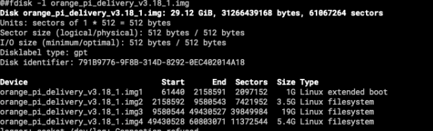

## 背景

当前制作镜像方式:通过dd全盘备份类似于"dd if=/dev/sda of=xx",这种方式可以保留全部分区信息。
操作比较简便,但问题是dd进行备份的时候是根据分区大小全量copy的,就是说你分区划分的多大,dd出来的img就多大。
它是不管这个分区实际数据大小的。

比如目前这个镜像大小约30个G,但实际的有效数据只有7-8个G



## 方案调研

- 想办法去除镜像内的空数据
- 通过orange-build重新构建镜像

### 方案一、去除镜像内的空数据

#### 如何去优化？
- [有人建议通过获取分区块个数来进行备份，但尝试过之后，多分区的话走不通](https://askubuntu.com/questions/298033/i-use-dd-to-backup-my-ubuntu-but-the-backup-image-is-too-large)
- 想到将每个分区进行备份之后，进行merge，但这样就丢失了分区信息，导致镜像不可用。也没走通。
- 创建一个空的img文件，然后进行分区格式化，最后全量同步数据，此方案走通了

##### 创建一个适合大小的稀疏文件

计算镜像大小:
```shell
@#df -h
Filesystem      Size  Used Avail Use% Mounted on
/dev/sda2       3.2G  2.7G  264M  92% /media/root-ro
/dev/sda3       19G   7G    12G   58% /media/root-rw
/dev/sda1      1022M  120M  903M  12% /boot
```
根据sda分区的使用量来计算即可。可以适当扩容一点空间。这里例子共用了10G的空间。

生成一个空白的镜像文件:
```shell
@#dd if=/dev/zero of=test.img bs=1M count=10240
@#ls -l -h
total 11G
-rw-r--r-- 1 root root 10G Sep 13 14:12 test.img
```

##### 将镜像文件进行分区并格式化

使用parted为img文件分区:
```shell
标记label,选择gpt or GPT主引导格式,MBR:msdos, GPT:gpt

@#parted test.img -s -- mklabel gpt

#创建分区 sda1(/boot)
@#parted test.img -s -- mkpart primary ext4 30M 512M
@#e2label /dev/mapper/loop0p1 opi_root

#创建分区 sda2(/media/root-ro)
parted test.img -s -- mkpart primary ext4 512M 4G

#创建分区 sda3(/media/root-rw)
parted test.img -s -- mkpart primary ext4 4G 5G
```

查看test.img文件分区:
```shell
@#fdisk -l test.img
Disk test.img: 10 GiB, 10737418240 bytes, 20971520 sectors
Units: sectors of 1 * 512 = 512 bytes
Sector size (logical/physical): 512 bytes / 512 bytes
I/O size (minimum/optimal): 512 bytes / 512 bytes
Disklabel type: gpt
Disk identifier: F8C55DFB-C444-4703-8A6A-E8337F78D499

Device       Start     End Sectors  Size Type
test.img1    59392  999423  940032  459M Linux filesystem
test.img2   999424 7813119 6813696  3.2G Linux filesystem
test.img3  7813120 9764863 1951744  953M Linux filesystem
```

对分区进行格式化,在格式化前,需要先将img文件映射给系统的loop设备,
然后在将loop设备映射给device mapper:
```shell
#将test.img映射成loop设备
@#losetup -f --show test.img
/dev/loop0
```

给loop设备建立分区映射规则:
```shell
apt install kpartx
@#kpartx -va /dev/loop0
add map loop0p1 (253:0): 0 940032 linear 7:0 59392
add map loop0p2 (253:1): 0 6813696 linear 7:0 999424
add map loop0p3 (253:2): 0 1951744 linear 7:0 7813120

#对loop分区格式化
@#mkfs.vfat /dev/mapper/loop0p1
mkfs.fat 4.2 (2021-01-31)

@#mkfs.ext4 /dev/mapper/loop0p2
mke2fs 1.46.5 (30-Dec-2021)
Discarding device blocks: done
Creating filesystem with 851712 4k blocks and 212992 inodes
Filesystem UUID: 3db34abb-5aa2-44b6-b0e2-b1289a8516c4
Superblock backups stored on blocks:
	32768, 98304, 163840, 229376, 294912, 819200

Allocating group tables: done
Writing inode tables: done
Creating journal (16384 blocks): done
Writing superblocks and filesystem accounting information: done

@#mkfs.ext4 /dev/mapper/loop0p3
mke2fs 1.46.5 (30-Dec-2021)
Discarding device blocks: done
Creating filesystem with 243968 4k blocks and 61056 inodes
Filesystem UUID: 3fd9a9d8-6e7b-4b1f-a7ad-f23eff9a6b66
Superblock backups stored on blocks:
	32768, 98304, 163840, 229376

Allocating group tables: done
Writing inode tables: done
Creating journal (4096 blocks): done
Writing superblocks and filesystem accounting information: done
```

挂载这几个loop分区:
```shell
@#mkdir /tmp/sda1 /tmp/sda2 /tmp/sda3
@#mount /dev/mapper/loop0p1 /tmp/sda1/
@#mount /dev/mapper/loop0p2 /tmp/sda2/
@#mount /dev/mapper/loop0p3 /tmp/sda3/

@#df -h
...
/dev/mapper/loop0p1  459M  8.0K  459M   1% /tmp/sda1
/dev/mapper/loop0p2  3.2G   28K  3.0G   1% /tmp/sda2
/dev/mapper/loop0p3  920M   28K  856M   1% /tmp/sda3
```

同步数据:
```shell
@#rsync -aP /boot/* /tmp/sda1/
sending incremental file list
Image
     34,109,952 100%   81.45MB/s    0:00:00 (xfr#1, to-chk=165/166)
System.map-5.10.110-rockchip-rk3588
      7,780,782 100%   14.87MB/s    0:00:00 (xfr#2, to-chk=164/166)
boot.bmp
        230,456 100%  447.42kB/s    0:00:00 (xfr#3, to-chk=163/166)
boot.cmd
          3,729 100%    7.24kB/s    0:00:00 (xfr#4, to-chk=162/166)
boot.scr
          3,801 100%    7.36kB/s    0:00:00 (xfr#5, to-chk=161/166)
config-5.10.110-rockchip-rk3588
        219,610 100%  422.17kB/s    0:00:00 (xfr#6, to-chk=160/166)
initrd.img-5.10.110-rockchip-rk3588
     22,680,451 100%   27.14MB/s    0:00:00 (xfr#7, to-chk=159/166)
logo.bmp
....

...以此类推,其他分区也是这样
```

卸载,关闭loop/devicemapper挂载
```shell
@#umount /tmp/sda1  /tmp/sda2 /tmp/sda3
@#losetup -l
NAME       SIZELIMIT OFFSET AUTOCLEAR RO BACK-FILE          DIO LOG-SEC
/dev/loop0         0      0         0  0 /tmp/test/test.img   0     512
@#losetup -d /dev/loop0
@#kpartx -d /dev/loop0
```

综上,这样就可以实现自定义镜像大小了。可以完全根据实际的数据量进行定义,就可以解决镜像过大的问题。

