# cpu性能

## 一、cpu啥时候才叫有瓶颈

> *   cpu运行的快还是慢、cpu有没有问题，cpu是不是还需要优化。这些是平常开发和运维中经常遇到的问题。那么我门到底如何去判断机器cpu运行的到底有没有异常呢。

从我排查问题来说，单看系统指标不能完全反应应用运行的状态，所以我的经验一般都是先看看机器上运行的服务到底是什么，在不了解服务是做什么的就去分析系统指标正不正常，完全是瞎扯淡。。。 举个例子我感触很深的例子：大数据cpu常年跑到90%以上，而在线业务基本都是20%以下，那这个能说大数据的cpu有异常嘛？

所以分析系统指标，一定要看上面的服务到底是个什么状态。

## 二、cpu硬件性能决定了cpu绝对速度的快慢

系统cpu的优化都是基于相同硬件去对比，cpu主频低的在怎么调也不会比cpu主频高的快。

从下面这个命令可以分析cpu自身硬件条件怎么样：

```
#lscpu
Architecture:          x86_64
CPU op-mode(s):        32-bit, 64-bit
Byte Order:            Little Endian
CPU(s):                96
On-line CPU(s) list:   0-95
Thread(s) per core:    2
Core(s) per socket:    24
Socket(s):             2
NUMA node(s):          1
Vendor ID:             GenuineIntel
CPU family:            6
Model:                 85
Model name:            Intel(R) Xeon(R) Gold 5220R CPU @ 2.20GHz
Stepping:              7
CPU MHz:               2900.113
CPU max MHz:           4000.0000
CPU min MHz:           1000.0000
BogoMIPS:              4400.00
Virtualization:        VT-x
L1d cache:             32K
L1i cache:             32K
L2 cache:              1024K
L3 cache:              36608K
NUMA node0 CPU(s):     0-95
Flags:                 fpu vme de pse tsc msr pae mce cx8 apic sep mtrr pge mca cmov pat pse36 clflush dts acpi mmx fxsr sse sse2 ss ht tm pbe syscall nx pdpe1gb rdtscp lm constant_tsc art arch_perfmon pebs bts rep_good nopl xtopology nonstop_tsc cpuid aperfmperf pni pclmulqdq dtes64 ds_cpl vmx smx est tm2 ssse3 sdbg fma cx16 xtpr pdcm pcid dca sse4_1 sse4_2 x2apic movbe popcnt tsc_deadline_timer aes xsave avx f16c rdrand lahf_lm abm 3dnowprefetch cpuid_fault epb cat_l3 cdp_l3 invpcid_single intel_ppin ssbd mba ibrs ibpb stibp ibrs_enhanced tpr_shadow vnmi flexpriority ept vpid fsgsbase tsc_adjust bmi1 hle avx2 smep bmi2 erms invpcid rtm cqm mpx rdt_a avx512f avx512dq rdseed adx smap clflushopt clwb intel_pt avx512cd avx512bw avx512vl xsaveopt xsavec xgetbv1 xsaves cqm_llc cqm_occup_llc cqm_mbm_total cqm_mbm_local dtherm ida arat pln pts hwp hwp_act_window hwp_epp hwp_pkg_req pku ospke avx512_vnni flush_l1d arch_capabilities
```

核心需要关注的:

```
1.cpu的主频，这个机器主频是2.20GHz，主频越高cpu计算的越快
Model name:            Intel(R) Xeon(R) Gold 5220R CPU @ 2.20GHz

2.cpu核心
CPU(s):                96
On-line CPU(s) list:   0-95 (2*24*2=96)
Thread(s) per core:    2  (机器支持超线程技术的话,每个核心可以虚拟出来2个线程)
Core(s) per socket:    24 (cpu核心数)
Socket(s):             2 (代表物理机cpu个数)

3.经常忽略的一点就是cpu的缓存，这个对于cpu性能也很重要(见amd/intel cpu架构分析)
L1d cache:             32K
L1i cache:             32K
L2 cache:              1024K
L3 cache:              36608K

cpu的3级缓存,L1速度最快依次类推，这个越大缓存的数据越多,速度自然会快。
```

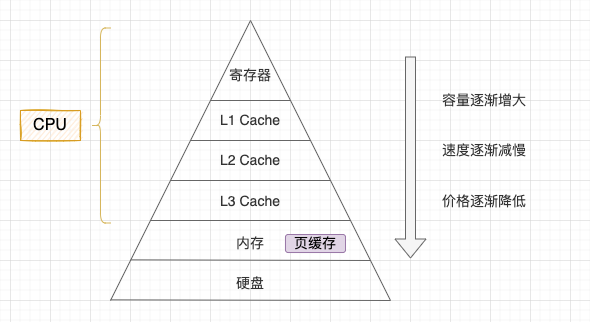

intel cpu架构简图：

在 CPU Cache 的概念刚出现时，CPU 和内存之间只有一个缓存，随着芯片集成密度的提高，现代的 CPU Cache 已经普遍采用 L1/L2/L3 多级缓存的结构来改善性能。自顶向下容量逐渐增大，访问速度也逐渐降低。当缓存未命中时，缓存系统会向更底层的层次搜索。

*   **L1 Cache：** 在 CPU 核心内部，分为指令缓存和数据缓存，分开存放 CPU 使用的指令和数据；
*   **L2 Cache：** 在 CPU 核心内部，尺寸比 L1 更大；
*   **L3 Cache：** 在 CPU 核心外部，所有 CPU 核心共享同一个 L3 缓存。

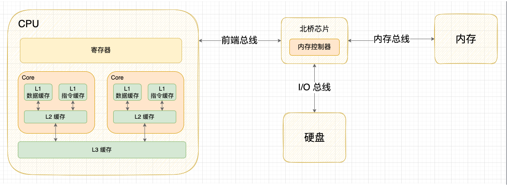

[cpu](https://frankdenneman.nl/2019/10/14/amd-epyc-naples-vs-rome-and-vsphere-cpu-scheduler-updates/)的访问速度：

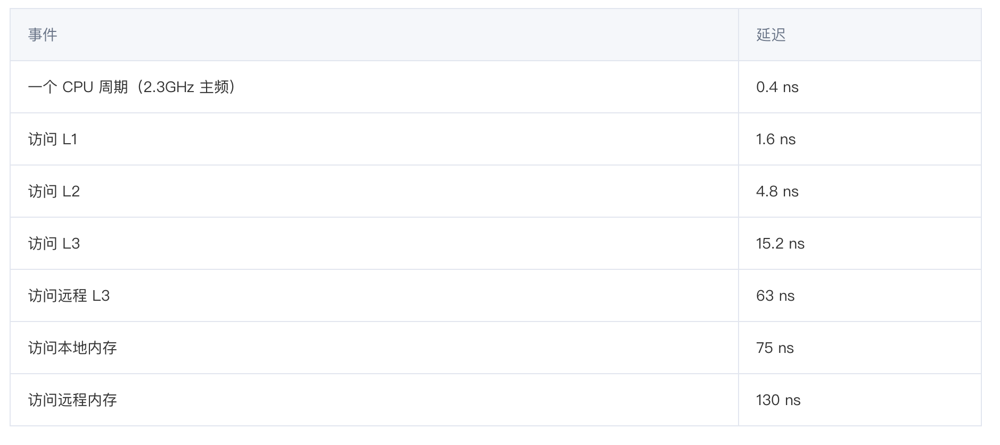

通过上面的分析可以看出来，想让cpu速度越快，就要让他尽量在一个L3内进行数据/指令计算，否则延迟会变得很高。上述这些基本已经可以确认cpu物理上的性能上限了。

*   对比以下intel和amd cpu架构的区别

```
yum install hwloc-libs hwloc-gui
```

查看L3分布
```
hwloc-ls
```

*   查看硬件内存分布
```
dmidecode|grep -P -A10 "Memory\s+Device"|egrep "Size|NODE"
```

*   生成cpu硬件架构图
```
lstopo --of png > server.png
```

> intel的cpu, 可以发现intel一个物理CPU共享一个L3

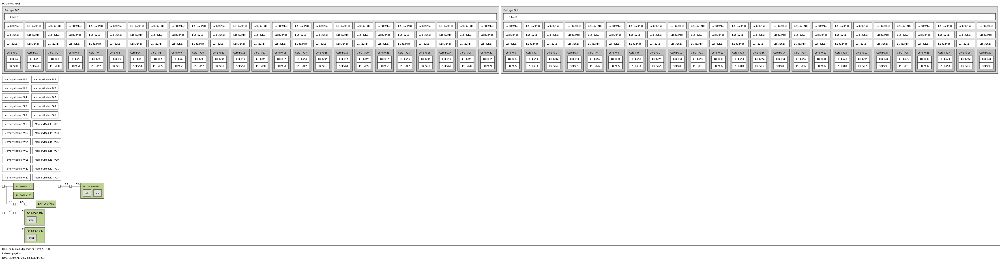

> AMD的cpu，可以发现amd一个物理CPU有多个L3

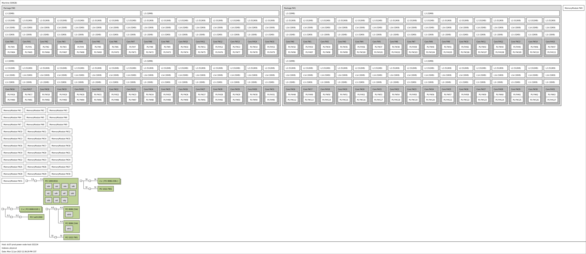

之前分析过跨L3越多，延迟越高，所以针对AMD架构，需要尽量让cpu少切换，尽量让他在一个L3单元完成计算。详细可以参考这个[文章](https://cloud.tencent.com/developer/article/1580471)的分析。

## 三、从操作系统(软件)角度去看cpu的性能

### &#x20;3.1 使用cpu的几种模式

CPU动态节能技术用于降低服务器功耗，通过选择系统空闲状态不同的电源管理策略，可以实现不同程度降低服务器功耗，更低的功耗策略意味着CPU唤醒更慢对性能 影响更大。
对于对时延和性能要求高的应用，建议关闭CPU的动态调节功能，禁止 CPU休眠，并把CPU频率固定到最高。

```
几种模式如下：
performance: 顾名思义只注重效率，将CPU频率固定工作在其支持的最高运行频率上，而不动态调节。
userspace:最早的cpufreq子系统通过userspace governor为用户提供了这种灵活性。系统将变频策略的决策权交给了用户态应用程序，并提供了相应的接口供用户态应用程序调节CPU 运行频率使用。也就是长期以来都在用的那个模式。可以通过手动编辑配置文件进行配置
powersave: 将CPU频率设置为最低的所谓“省电”模式，CPU会固定工作在其支持的最低运行频率上。因此这两种governors 都属于静态governor，即在使用它们时CPU 的运行频率不会根据系统运行时负载的变化动态作出调整。这两种governors 对应的是两种极端的应用场景，使用performance governor 是对系统高性能的最大追求，而使用powersave governor 则是对系统低功耗的最大追求。
ondemand: 按需快速动态调整CPU频率， 一有cpu计算量的任务，就会立即达到最大频率运行，等执行完毕就立即回到最低频率；ondemand：userspace是内核态的检测，用户态调整，效率低。而ondemand正是人们长期以来希望看到的一个完全在内核态下工作并且能够以更加细粒度的时间间隔对系统负载情况进行采样分析的governor。 在 ondemand governor 监测到系统负载超过 up_threshold 所设定的百分比时，说明用户当前需要 CPU 提供更强大的处理能力，因此 ondemand governor 会将CPU设置在最高频率上运行。但是当 ondemand governor 监测到系统负载下降，可以降低 CPU 的运行频率时，到底应该降低到哪个频率呢？ ondemand governor 的最初实现是在可选的频率范围内调低至下一个可用频率，例如 CPU 支持三个可选频率，分别为 1.67GHz、1.33GHz 和 1GHz ，如果 CPU 运行在 1.67GHz 时 ondemand governor 发现可以降低运行频率，那么 1.33GHz 将被选作降频的目标频率。
conservative: 与ondemand不同，平滑地调整CPU频率，频率的升降是渐变式的,会自动在频率上下限调整，和ondemand的区别在于它会按需分配频率，而不是一味追求最高频率；

#cat /sys/devices/system/cpu/cpu1/cpufreq/scaling_governor (查看cpu使用模式)
performance

#cpupower frequency-info
analyzing CPU 0:
  driver: intel_pstate
  CPUs which run at the same hardware frequency: 0
  CPUs which need to have their frequency coordinated by software: 0
  maximum transition latency:  Cannot determine or is not supported.
  hardware limits: 1000 MHz - 4.00 GHz
  available cpufreq governors: performance powersave
  current policy: frequency should be within 1000 MHz and 4.00 GHz.
                  The governor "performance" may decide which speed to use
                  within this range.
  current CPU frequency: Unable to call hardware
  current CPU frequency: 2.90 GHz (asserted by call to kernel)  (2.2GHz--超频--->2.9GHz)
  boost state support:
    Supported: yes
    Active: yes
```

> 另外根据硬件同bios也需要设置，bios也设置完成后会自动开始超频：

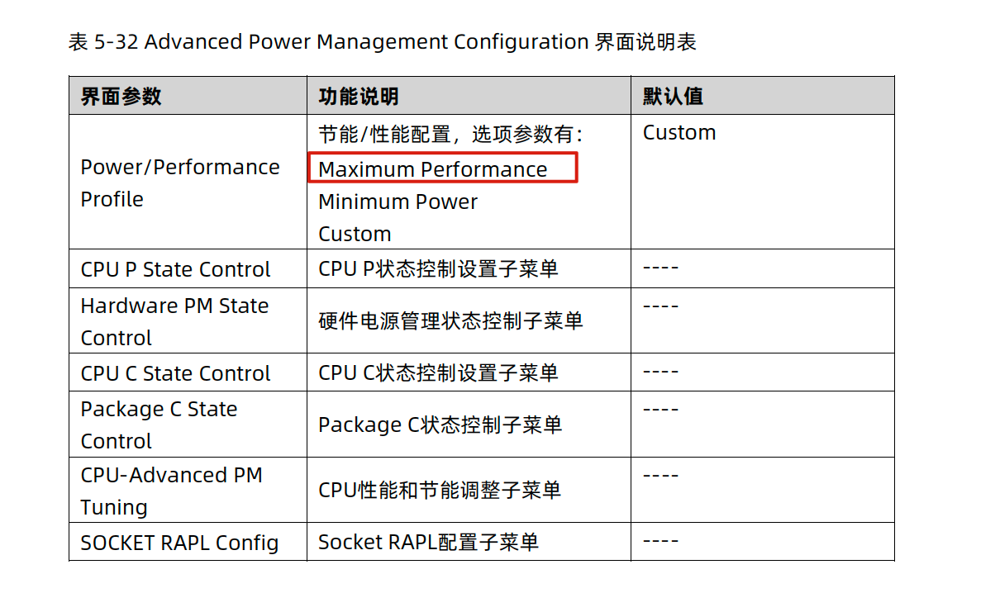

### 3.2 常用命令指标及分析

> linux中一切皆文件,所有的命令都是通过解析不同的内核文件来计算各种指标的

cpu性能优化的一个脑图：

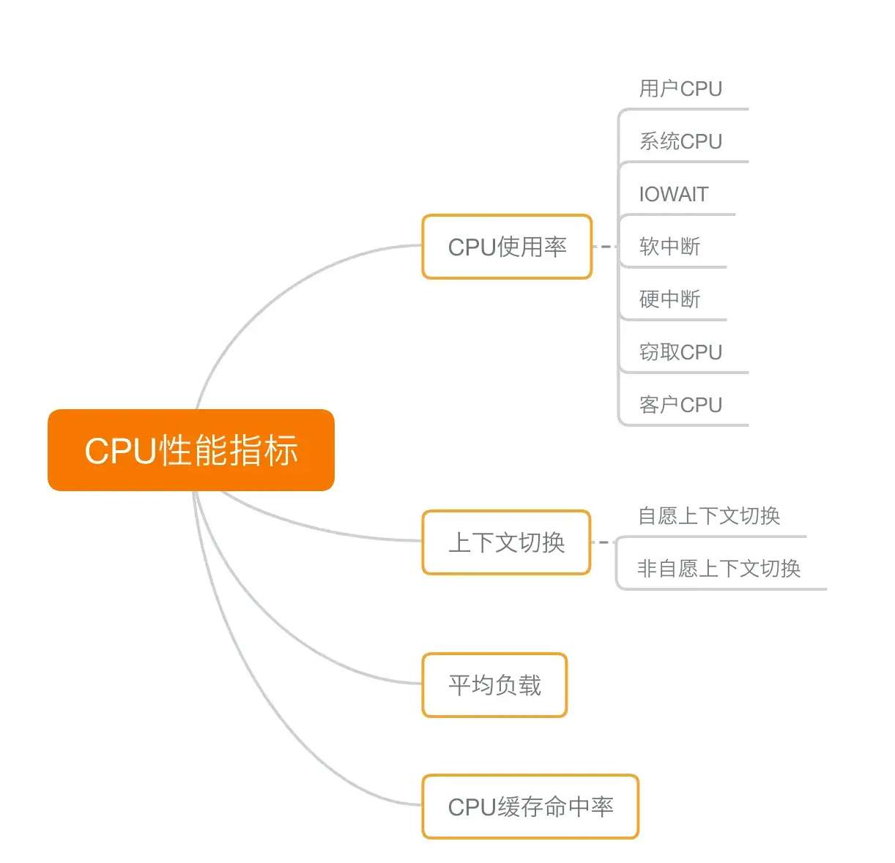

#### 3.2.1 负载

这个指标比较宽泛，主要是为了看出系统整体的情况，

```
top/uptime 都可以看平均负载情况(对应1/5/15分钟的平均负载)
load average: 0.20, 0.15, 0.20
```


那么平均负载到底代表什么呢？&#x20;

简单的理解其实就是平均活跃的进程数，既然平均的是活跃进程数，那么最理想的，就是每个 CPU 上都刚好运行着一个进程，这样每个 CPU 都得到了充分利用。比如当平均负载为 2 时，意味着什么呢？

*   在只有 2 个 CPU 的系统上，意味着所有的 CPU 都刚好被完全占用。
*   在 4 个 CPU 的系统上，意味着 CPU 有 50% 的空闲。
*   而在只有 1 个 CPU 的系统中，则意味着有一半的进程竞争不到 CPU。

这个值只是一个参考，类似一个概览，影响负载高不高的有几种情况：

*   **CPU 密集型进程 （进程大量消耗cpu的，这种时候负载和cpu都会高）**
*   **I/O 密集型进程 （进程大量读写磁盘又没到io瓶颈，这时候cpu不一定会高，但负载会高）**
*   **大量进程的场景  （进程过多都要去争抢、cpu和负载也会高）**

上面这些情况主要是找到哪些进程引起的可以通过:

> 现在基本都是单机单应用。更多的时候去找到系统那个指标导致应用进程出现问题，排查起来比单机多进程要轻松不少。
```
$ pidstat -u 5 1
14:23:25      UID       PID    %usr %system  %guest   %wait    %CPU   CPU  Command
14:23:30        0      3190   25.00    0.00    0.00   74.80   25.00     0  stress
14:23:30        0      3191   25.00    0.00    0.00   75.20   25.00     0  stress
14:23:30        0      3192   25.00    0.00    0.00   74.80   25.00     1  stress
14:23:30        0      3193   25.00    0.00    0.00   75.00   25.00     1  stress
14:23:30        0      3194   24.80    0.00    0.00   74.60   24.80     0  stress
14:23:30        0      3195   24.80    0.00    0.00   75.00   24.80     0  stress
14:23:30        0      3196   24.80    0.00    0.00   74.60   24.80     1  stress
14:23:30        0      3197   24.80    0.00    0.00   74.80   24.80     1  stress
14:23:30        0      3200    0.00    0.20    0.00    0.20    0.20     0  pidstat
```

可以看到cpu处于wait很高到了75%,说明都在争抢cpu资源。这些只是一些案例。在实际排查问题中，这些可能都用不到
主要是为了理解指标含义，只有深入理解了这些含义才能在出现问题时候将他们联系起来。

#### 3.2.2 使用率
```
$ cat /proc/stat | grep ^cpu
cpu  280580 7407 286084 172900810 83602 0 583 0 0 0
cpu0 144745 4181 176701 86423902 52076 0 301 0 0 0
cpu1 135834 3226 109383 86476907 31525 0 282 0 0 0
```
这里的每列的含义都是各个指标的累计值，所以(我们公司的监控系统)就是解析这个文件去计算的。每列含义如下:

```
user（通常缩写为 us），代表用户态 CPU 时间。注意，它不包括下面的 nice 时间，但包括了 guest 时间。
nice（通常缩写为 ni），代表低优先级用户态 CPU 时间，也就是进程的 nice 值被调整为 1-19 之间时的 CPU 时间。这里注意，nice 可取值范围是 -20 到 19，数值越大，优先级反而越低。
system（通常缩写为 sys），代表内核态 CPU 时间。
idle（通常缩写为 id），代表空闲时间。注意，它不包括等待 I/O 的时间（iowait）。
iowait（通常缩写为 wa），代表等待 I/O 的 CPU 时间。
irq（通常缩写为 hi），代表处理硬中断的 CPU 时间。
softirq（通常缩写为 si），代表处理软中断的 CPU 时间。
steal（通常缩写为 st），代表当系统运行在虚拟机中的时候，被其他虚拟机占用的 CPU 时间。
guest（通常缩写为 guest），代表通过虚拟化运行其他操作系统的时间，也就是运行虚拟机的 CPU 时间。
guest_nice（通常缩写为 gnice），代表以低优先级运行虚拟机的时间。
```

- sys

一般内核态cpu占用都很低，可以理解就是内核占用cpu的时间，遇到过几种内核态cpu很高的场景如：

> 1.内存不足触发直接回收

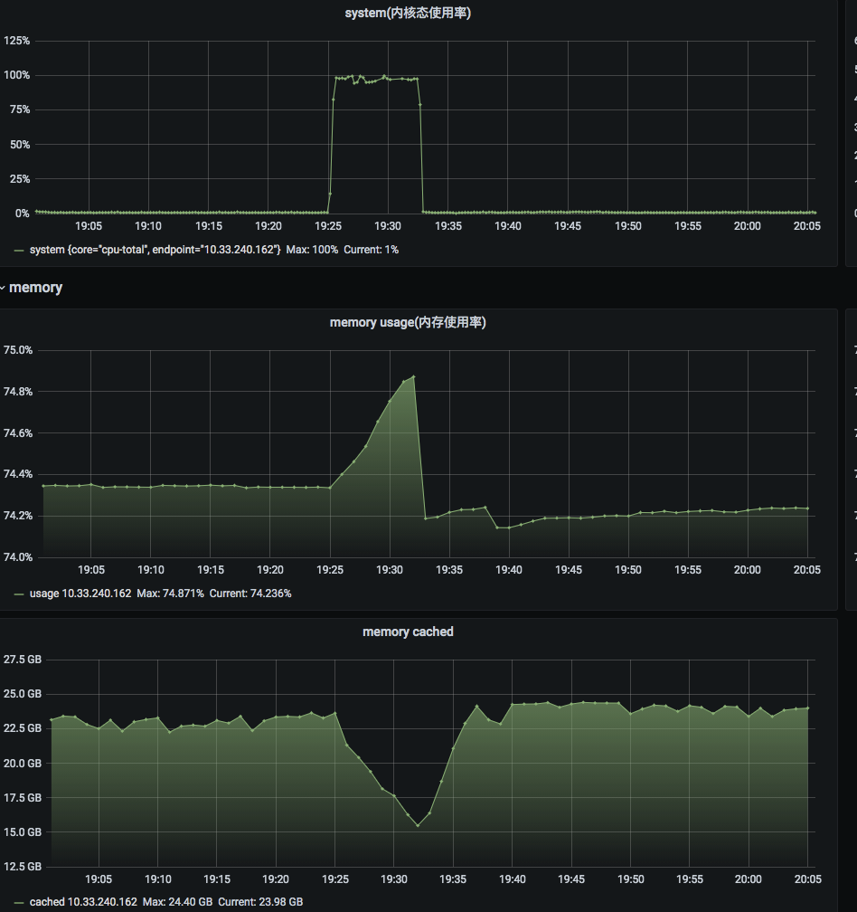

> 2.文件句柄不足、应用死循环申请

- iowait

这个指标高了，一般代表系统io打满了，io速度很慢cpu都去等io了，这个非常耗性能，如下图就是读磁盘数据量太大导致。

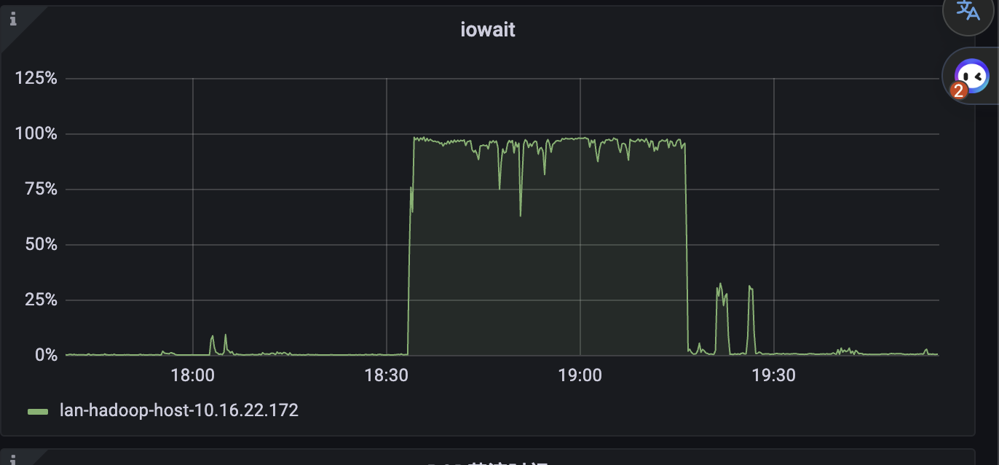

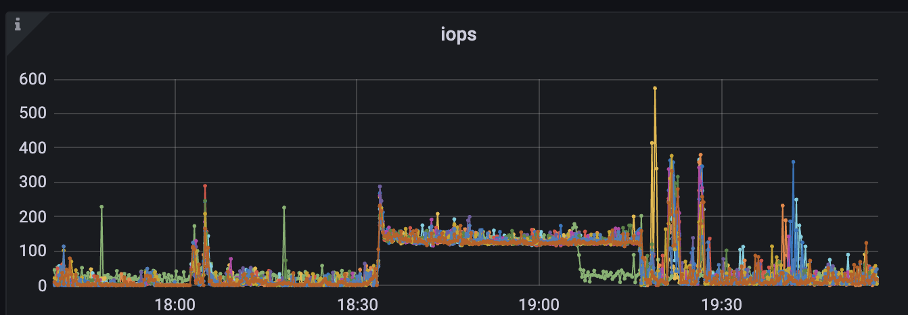

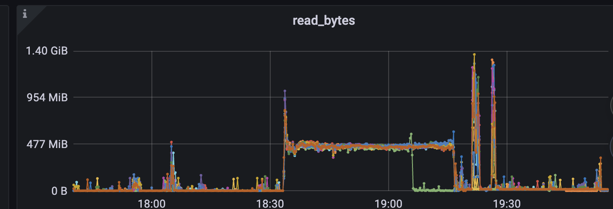

- irq&softirq

**中断其实是一种异步的事件处理机制，可以提高系统的并发处理能力**。

由于中断处理程序会打断其他进程的运行，所以，**为了减少对正常进程运行调度的影响，中断处理程序就需要尽可能快地运行**。如果中断本身要做的事情不多，那么处理起来也不会有太大问题；
但如果中断要处理的事情很多，中断服务程序就有可能要运行很长时间。
特别是，中断处理程序在响应中断时，还会临时关闭中断。这就会导致上一次中断处理完成之前，其他中断都不能响应，也就是说中断有可能会丢失。

例子：
网卡接收到数据包后，会通过**硬件中断**的方式，通知内核有新的数据到了。这时，内核就应该调用中断处理程序来响应它。你可以自己先想一下，这种情况下的上半部和下半部分别负责什么工作呢？
对上半部来说，既然是快速处理，其实就是要把网卡的数据读到内存中，然后更新一下硬件寄存器的状态（表示数据已经读好了），最后再发送一个软中断信号，通知下半部做进一步的处理。
而下半部被软中断信号唤醒后，需要从内存中找到网络数据，再按照网络协议栈，对数据进行逐层解析和处理，直到把它送给应用程序。

简单理解：

*   上半部直接处理硬件请求，也就是我们常说的硬中断，特点是快速执行；
*   而下半部则是由内核触发，也就是我们常说的软中断，特点是延迟执行。

```
# cat /proc/softirqs
CPU0       CPU1       CPU2       CPU3
HI:          1          0          0          0
TIMER: 1132128656 1595501777 1390596155 1326551853
NET_TX:          1          0          1          0
NET_RX: 1478194685 1257808897 1173299515 1138820441
BLOCK:          0          0          0          0
BLOCK_IOPOLL:          0          0          0          0
TASKLET:         16          0          0          0
SCHED: 2301871731 2350810224 2278937730 2226823418
HRTIMER:          0          0          0          0
RCU: 3498014370 3716109607 3597936368 3585064901

static struct softirq_action softirq_vec[NR_SOFTIRQS];
enum {
HI_SOFTIRQ = 0, /* 优先级高的tasklets /
TIMER_SOFTIRQ, / 定时器的下半部 /
NET_TX_SOFTIRQ, / 发送网络数据包 /
NET_RX_SOFTIRQ, / 接收网络数据包 /
BLOCK_SOFTIRQ, / BLOCK装置 /
BLOCK_IOPOLL_SOFTIRQ,
TASKLET_SOFTIRQ, / 正常优先级的tasklets /
SCHED_SOFTIRQ, / 调度程序 /
HRTIMER_SOFTIRQ, / 高分辨率定时器 /
RCU_SOFTIRQ, / RCU锁定 /
NR_SOFTIRQS / 10 */
};
```
        
每个cpu都对应一个各种软中断的运行次数，因为这个是累积值，所以要看这些中断变化的速率，这一般也会导致软中断指标变高，这时那就看是那种类型变高了，
常见的就是网络中断(NET_TX/RX_SOFTIRQ)、调度中断(TASK/SCHED_SOFTIRQ)。

比如：

1.syn flood攻击，不断的给网卡发送小包，会导致网络软中断变高。那就通过sar或者其他的查看网卡的工具，具体去分析是哪些请求导致的。

2.如果看到是调度中断变高，那大概率是因为cpu发生争抢，大家都获取不到cpu资源。

- steal
> 这个一般业务同学都遇不到，做虚拟化的遇到的比较多，当一个物理机做kvm虚拟化，超卖太严重就会触发。

#### 3.2.3 上下文切换

> 什么是CPU上下文

Linux 是一个多任务操作系统，它支持远大于 CPU 数量的任务同时运行。当然，这些任务实际上并不是真的在同时运行，而是因为系统在很短的时间内，将 CPU 轮流分配给它们，造成多任务同时运行的错觉。 而在每个任务运行前，CPU 都需要知道任务从哪里加载、又从哪里开始运行，也就是说，需要系统事先帮它设置好**CPU 寄存器和程序计数器（Program Counter, PC）**。
CPU 寄存器，是 CPU 内置的容量小、但速度极快的内存。而程序计数器，则是用来存储 CPU 正在执行的指令位置、或者即将执行的下一条指令位置。它们都是 CPU 在运行任何任务前，必须的依赖环境，因此也被叫做**CPU上下文**。
**CPU 上下文切换**，就是先把前一个任务的 CPU 上下文（也就是 CPU 寄存器和程序计数器）保存起来，然后加载新任务的上下文到这些寄存器和程序计数器，最后再跳转到程序计数器所指的新位置，运行新任务。 而这些保存下来的上下文，会存储在系统内核中，并在任务重新调度执行时再次加载进来。这样就能保证任务原来的状态不受影响，让任务看起来还是连续运行。

> **上下文切换的种类**

* **1.系统调用上下文切换（特权模式切换）**
* **2.进程上下文切换**
* **3.线程上下文切换**
* **4.中断上下文切换**


**1. 系统调用上下文切换（特权模式切换）**

Linux 按照特权等级，把进程的运行空间分为内核空间和用户空间，分别对应着下图中， CPU 特权等级的 Ring 0 和 Ring 3。

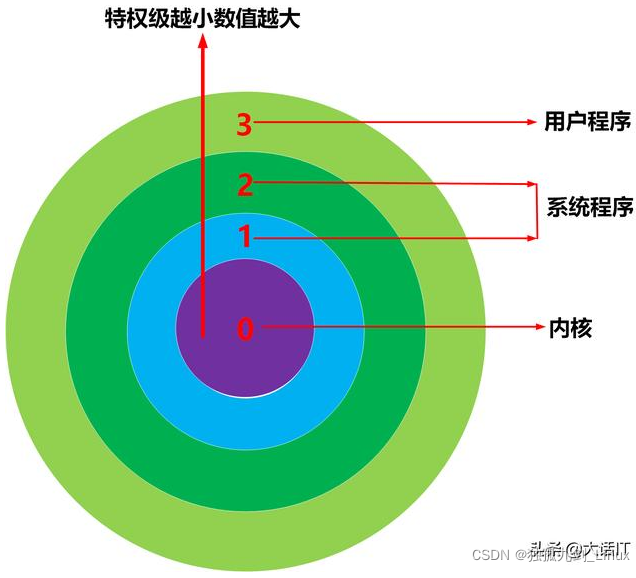

*   内核空间（Ring 0）具有最高权限，可以直接访问所有资源；
*   用户空间（Ring 3）只能访问受限资源，不能直接访问内存等硬件设备，必须通过系统调用陷入到内核中，才能访问这些特权资源。
    &#x20;

由**系统调用**完成从用户态到内核态的转变。这个过程也会发生CPU上下文切换。CPU 寄存器里原来用户态的指令位置，需要先保存起来。接着，为了执行内核态代码，CPU 寄存器需要更新为内核态指令的新位置。

最后才是跳转到内核态运行内核任务。而系统调用结束后，CPU 寄存器需要恢复原来保存的用户态，然后再切换到用户空间，继续运行进程。**所以，一次系统调用的过程，其实是发生了两次 CPU 上下文切换。**

不过，需要注意的是，系统调用过程中，并不会涉及到虚拟内存等进程用户态的资源，也不会切换进程。这跟我们通常所说的进程上下文切换是不一样的（系统调用在同一个进程里运行）。

所以系统调用过程通常称为**特权模式切换**，而不是上下文切换。但实际上，系统调用过程中，CPU 的上下文切换还是无法避免的。

**2. 进程上下文切换**

**进程是由内核来管理和调度的，进程的切换只能发生在内核态**。所以，进程的上下文不仅包括了虚拟内存、栈、全局变量等用户空间的资源，还包括了内核堆栈、寄存器等内核空间的状态。

根据[Tsuna](https://blog.tsunanet.net/2010/11/how-long-does-it-take-to-make-context.html)的测试报告，每次上下文切换都需要几十纳秒到数微妙的 CPU 时间。这个时间还是相当可观的，特别是在进程上下文切换次数较多的情况下，很容易导致 CPU 将大量时间耗费在寄存器、内核栈以及虚拟内存等资源的保存和恢复上，

进而大大缩短了真正运行进程的时间。这也是导致平均负载升高的一个重要因素。

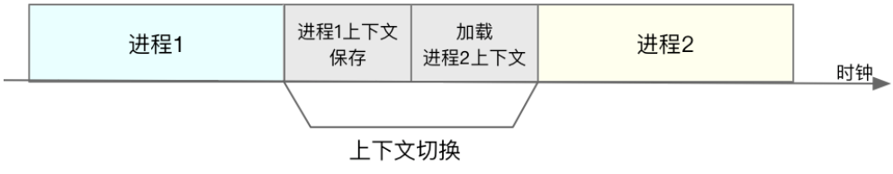

**进程上下文切换的时机：**

*   进程所分配的时间片耗尽，就会被系统挂起 （nvcswch 非自愿切换）
*   进程在系统资源（比如内存）不足时，需等待资源满足才能运行 （cswch 自愿切换）
*   进程调用如sleep等方法主动挂起 （cswch 自愿切换）
*   当有优先级更高的进程运行时，为了保证高优先级进程的运行，当前进程会被挂起 （进程优先级nice值,nvcswch 非自愿切换)
*   发生硬件中断时，CPU 上的进程会被中断挂起，转而执行内核中的中断服务程序。（nvcswch 非自愿切换）

**3. 线程上下文切换**

线程与进程的一大区别在于，**线程是调度的基本单位，而进程则是资源拥有的基本单位**。内核的任务调度对象是线程。而进程只是给线程提供了虚拟内存、全局变量等资源。 线程也有自己的私有数据，比如栈和寄存器等，这些在上下文切换时也是需要保存的。

**线程上下文切换可以分为两种：**

*   前后两个线程属于不同进程。此时，因为资源不共享，所以切换过程就跟进程上下文切换是一样。
*   前后两个线程属于同一个进程。此时，因为虚拟内存是共享的，所以在切换时，虚拟内存这些资源就保持不动，只需要切换线程的私有数据、寄存器等不共享的数据。
    虽然同为上下文切换，但同进程内的线程切换，要比多进程间的切换消耗更少的资源，这也正是多线程代替多进程的一个优势。

**4. 中断上下文切换**

为了快速响应硬件的事件，**中断处理会打断进程的正常调度和执行**，转而调用中断处理程序，响应设备事件。而在打断其他进程时，就需要将进程当前的状态保存下来，这样在中断结束后，进程仍然可以从原来的状态恢复运行。（关于CPU中断可参考irq&softirq ）

跟进程上下文不同，中断上下文切换并不涉及到进程的用户态。所以，即便中断过程打断了一个正处在用户态的进程，也不需要保存和恢复这个进程的虚拟内存、全局变量等用户态资源。中断上下文，其实只包括内核态中断服务程序执行所必需的状态，包括 CPU 寄存器、内核堆栈、硬件中断参数等。

对同一个 CPU 来说，**中断处理比进程拥有更高的优先级**，所以中断上下文切换并不会与进程上下文切换同时发生。同样道理，由于中断会打断正常进程的调度和执行，所以大部分中断处理程序都短小精悍，以便尽可能快的执行结束。

对于上下文切换主要用vmstat和pidstat来进行分析，下面的工具梳理图有。例如：
```
# vmstat
procs -----------memory---------- ---swap-- -----io---- -system-- ------cpu-----
 r  b   swpd   free   buff  cache   si   so    bi    bo   in   cs us sy id wa st
 1  0      0 2095424    372 4749812    0    0     1    22    0    0  5  4 91  0  0

含义通过man去查阅即可
# man vmstat
   Procs
       r: The number of runnable processes (running or waiting for run time). 就绪队列的长度，也就是正在运行和等待 CPU 的进程数。
       b: The number of processes in uninterruptible sleep. 则是处于不可中断睡眠状态的进程数。
   System
       in: The number of interrupts per second, including the clock. 是每秒中断的次数
       cs: The number of context switches per second.  每秒上下文切换的次数

# 某个进行的切换情况/每隔5秒输出1组数据
// pidstat -w 1 -p 32650 
# pidstat -w 5
03:37:45 PM   UID       PID   cswch/s nvcswch/s  Command
03:37:46 PM  1000     31787      0.00      0.00  sshd
03:37:47 PM  1000     31787      0.00      0.00  sshd
```

上面也提到了2个指标一个是cswch ，表示每秒自愿上下文切换（voluntary context switches）的次数，另一个则是 nvcswch ，表示每秒非自愿上下文切换（non voluntary context switches）的次数。

*   所谓自愿上下文切换，是指进程无法获取所需资源，导致的上下文切换。比如说， I/O、内存等系统资源不足时，就会发生自愿上下文切换。
*   而非自愿上下文切换，则是指进程由于时间片已到等原因，被系统强制调度，进而发生的上下文切换。比如说，大量进程都在争抢 CPU 时，就容易发生非自愿上下文切换。

针对这些指标都要看曲线或者速率，是不是突增的，排查问题的时候对突增、突减，波动比较大的指标都要敏感，当然还有一种情况是，指标一直处于一条直线，一点波动都没有，这种也大概率会有问题。
从上面切换来看以后看到上下文切换的指标异常，那我门应该能快速联想到:

*   自愿上下文切换变多了，说明进程都在等待资源(io/内存都有可能)；
*   非自愿上下文切换变多了，说明进程都在被强制调度，也就是都在争抢 CPU，说明 CPU 的确成了瓶颈；
*   中断次数变多了，说明 CPU 被中断处理程序占用，还需要通过查看 /proc/interrupts 文件来分析具体的中断类型（如上面irq/softirq分析的，哪个中断多就去分析对应的资源类型）。

#### 3.2.4 CPU缓存命中率

文章上面介绍了cpu分为3层缓存,那针对CPU缓存来说有2个重点：

1.尽量在一个L3里进行任务的处理，跨L3越多，延迟越高


2.cpu总需要和内存交互，尽量让cpu使用离自己最近的本地内存，

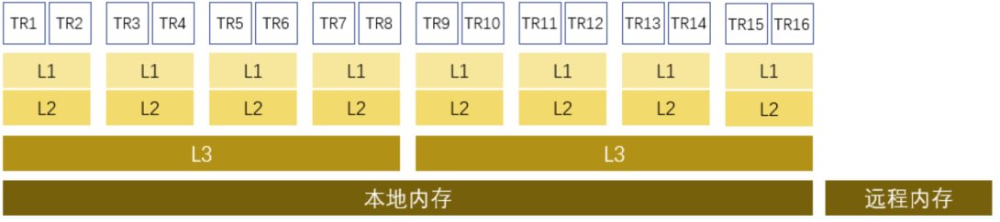

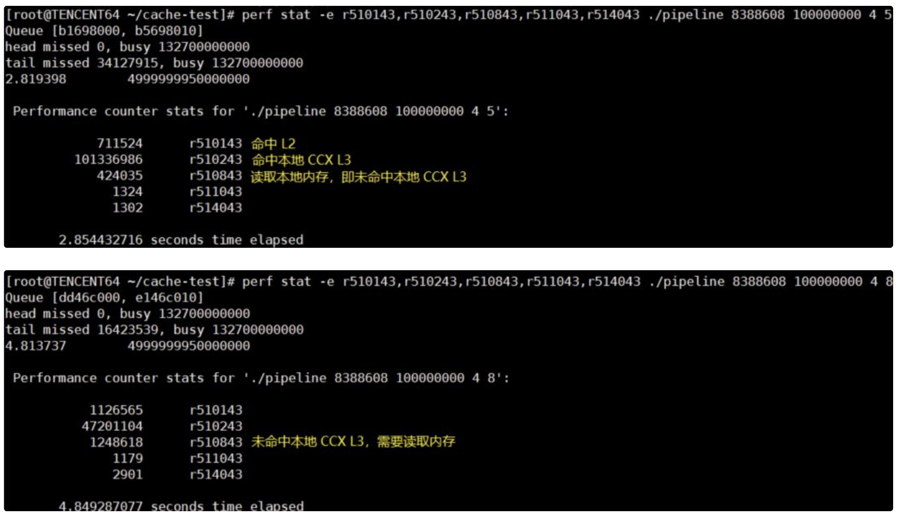

```
perf record -e L1-dcache-load-misses -a ls
perf.data      perf.data.old
[ perf record: Woken up 1 times to write data ]
[ perf record: Captured and wrote 0.018 MB perf.data (3 samples) ]

# perf report
# Samples: 3  of event 'L1-dcache-load-misses'
# Event count (approx.): 4098
#
# Overhead  Command  Shared Object      Symbol                 
# ........  .......  .................  .......................
    99.95%  ls       busybox            [.] 0x00000000000c293c
     0.05%  perf     [kernel.kallsyms]  [k] generic_exec_single
```
    

#### 3.2.5 进程状态&优先级

> 进程状态

top,ps 就可以看到进程状态比如：
```
top - 20:10:52 up 584 days, 6 min,  1 user,  load average: 0.49, 0.77, 1.00
Tasks: 1053 total,   1 running, 534 sleeping,   3 stopped,   1 zombie
%Cpu(s):  0.7 us,  0.2 sy,  0.0 ni, 99.0 id,  0.0 wa,  0.0 hi,  0.0 si,  0.0 st
KiB Mem : 39460323+total, 49853380 free, 92479152 used, 25227070+buff/cache
KiB Swap:        0 total,        0 free,        0 used. 29951840+avail Mem

  PID USER      PR  NI    VIRT    RES    SHR S  %CPU %MEM     TIME+ COMMAND
23747 hdfs      20   0  107.5g  65.8g  34640 S  67.2 17.5   4055:41 java
27106 hbase     20   0   22.4g  12.1g  51336 S   7.6  3.2  39:03.16 java
30028 root      20   0   38.2g  31972  15288 S   4.0  0.0   0:00.12 java
53992 hdfs      20   0 3210968 431384  26428 S   3.3  0.1  58055:30 java
31961 root      20   0 2891160 643848   6520 S   2.6  0.2  25731:11 python
 6582 ams       20   0 1189912  28476   3324 S   2.0  0.0   5254:29 python2.7
16662 hbase     20   0 7515464   2.0g  50812 S   0.7  0.5  17:34.47 java
 3900 root      20   0   90580   1180    316 S   0.3  0.0   1367:10 rngd
 4842 root      20   0       0      0      0 I   0.3  0.0   0:00.19 kworker/u192:0
25946 root      30  10 1813496 229324   9168 S   0.3  0.1   4083:11 osqueryd
30011 root      20   0  161164   5596   3840 R   0.3  0.0   0:00.04 top
    1 root      20   0  191768   4908   2700 S   0.0  0.0 563:32.27 systemd
    2 root      20   0       0      0      0 S   0.0  0.0   4:00.85 kthreadd
    4 root       0 -20       0      0      0 I   0.0  0.0   0:00.00 kworker/0:0H
    6 root       0 -20       0      0      0 I   0.0  0.0   0:00.00 mm_percpu_wq
    7 root      20   0       0      0      0 S   0.0  0.0  14:57.31 ksoftirqd/0
    8 root      20   0       0      0      0 I   0.0  0.0 771:24.21 rcu_sched
```

*   R 是 Running 或 Runnable 的缩写，表示进程在 CPU 的就绪队列中，正在运行或者正在等待运行。
*   D 是 Disk Sleep 的缩写，也就是不可中断状态睡眠（Uninterruptible Sleep），一般表示进程正在跟硬件交互，并且交互过程不允许被其他进程或中断打断。
*   Z 是 Zombie 的缩写，如果你玩过“植物大战僵尸”这款游戏，应该知道它的意思。它表示僵尸进程，也就是进程实际上已经结束了，但是父进程还没有回收它的资源（比如进程的描述符、PID 等）。
*   S 是 Interruptible Sleep 的缩写，也就是可中断状态睡眠，表示进程因为等待某个事件而被系统挂起。当进程等待的事件发生时，它会被唤醒并进入 R 状态。
*   I 是 Idle 的缩写，也就是空闲状态，用在不可中断睡眠的内核线程上。前面说了，硬件交互导致的不可中断进程用 D 表示，但对某些内核线程来说，它们有可能实际上并没有任何负载，用 Idle 正是为了区分这种情况。要注意，D 状态的进程会导致平均负载升高， I 状态的进程却不会。
*   T 或者 t，也就是 Stopped 或 Traced 的缩写，表示进程处于暂停或者跟踪状态。向一个进程发送 SIGSTOP 信号，它就会因响应这个信号变成暂停状态（Stopped）；再向它发送 SIGCONT 信号，进程又会恢复运行（如果进程是终端里直接启动的，则需要你用 fg 命令，恢复到前台运行）。而当你用调试器（如 gdb）调试一个进程时，在使用断点中断进程后，进程就会变成跟踪状态，这其实也是一种特殊的暂停状态，只不过你可以用调试器来跟踪并按需要控制进程的运行。
*   X，也就是 Dead 的缩写，表示进程已经消亡，所以你不会在 top 或者 ps 命令中看到它。

遇到较多的：

*   不可中断状态，表示进程正在跟硬件交互，为了保护进程数据和硬件的一致性，系统不允许其他进程或中断打断这个进程。进程长时间处于不可中断状态，通常表示系统有 I/O 性能问题。
    这个比较容易理解，当大量进程都处于D状态，说明都在等io，一般都是io有问题会出现这个状态。
*   僵尸进程表示进程已经退出，但它的父进程还没有回收子进程占用的资源。短暂的僵尸状态我们通常不必理会，但进程长时间处于僵尸状态，就应该注意了，可能有应用程序没有正常处理子进程的退出。
    僵尸进程这个比较难处理，一般情况内核都会回收，但一些异常情况，导致内核无法回收，就会产生僵尸进程。比如之前遇到的yarn节点由于内存问题。导致大量Z的进程，不但没回收，还占用系统资源

> 比如这个场景，某个节点iowait一直非常高

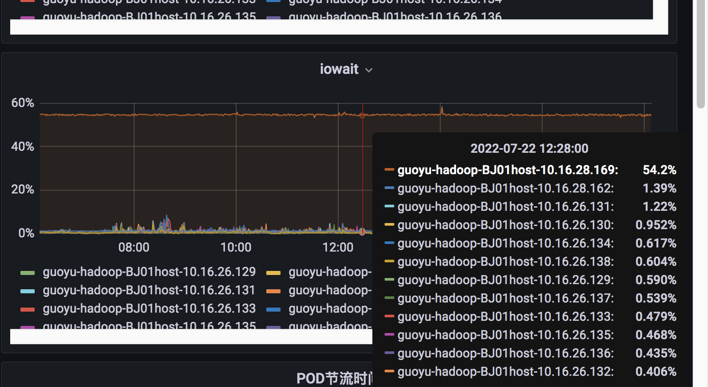

> 节点当时很多僵尸进程：

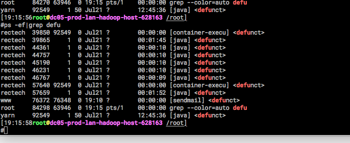

> 分析内核日志发现大量进程都有这个报错，和僵尸进程产生的时间基本对得上

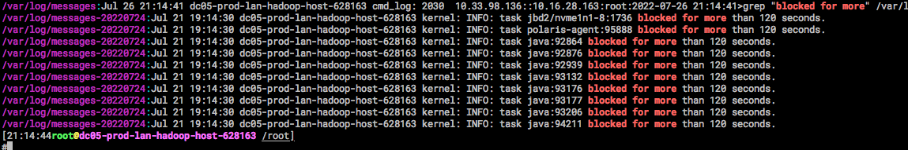

这种就是由于内存在刷盘的时候，同时有大量io同步的动作，导致进程无法正常去做io的动作导致被block住。在这种负载异常情况下，内核无法回收的进程就变成了僵尸进程。
> 进程优先级：这个作用就是在资源分配的时候优先级高的进程能先拿到资源

主要是弄清楚2个指标一个是nice值一个是pri值，pri代表优先级，nice值不是优先级，但是会影响pri，简单来说就是可以通过nice去修改进程的pri。比如：

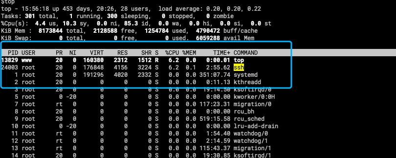

在top中"ssh"这个服务PR值是20，NI值是0

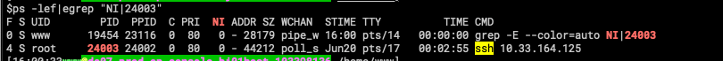

在ps中"ssh"这个服务的PRI是80,NI值是0

这个值怎么算的呢？我门来看一下内核的定义：

<https://elixir.bootlin.com/linux/v5.16.6/source/include/linux/sched/prio.h>
```
/* SPDX-License-Identifier: GPL-2.0 */
#ifndef _LINUX_SCHED_PRIO_H
#define _LINUX_SCHED_PRIO_H

#define MAX_NICE	19
#define MIN_NICE	-20
#define NICE_WIDTH	(MAX_NICE - MIN_NICE + 1)

/*
 * Priority of a process goes from 0..MAX_PRIO-1, valid RT
 * priority is 0..MAX_RT_PRIO-1, and SCHED_NORMAL/SCHED_BATCH
 * tasks are in the range MAX_RT_PRIO..MAX_PRIO-1. Priority
 * values are inverted: lower p->prio value means higher priority.
 */

#define MAX_RT_PRIO		100

#define MAX_PRIO		(MAX_RT_PRIO + NICE_WIDTH)
#define DEFAULT_PRIO		(MAX_RT_PRIO + NICE_WIDTH / 2)

/*
 * Convert user-nice values [ -20 ... 0 ... 19 ]
 * to static priority [ MAX_RT_PRIO..MAX_PRIO-1 ],
 * and back.
 */
#define NICE_TO_PRIO(nice)	((nice) + DEFAULT_PRIO)
#define PRIO_TO_NICE(prio)	((prio) - DEFAULT_PRIO)

/*
 * Convert nice value [19,-20] to rlimit style value [1,40].
 */
static inline long nice_to_rlimit(long nice)
{
    return (MAX_NICE - nice + 1);
}

/*
 * Convert rlimit style value [1,40] to nice value [-20, 19].
 */
static inline long rlimit_to_nice(long prio)
{
    return (MAX_NICE - prio + 1);
}

#endif /* _LINUX_SCHED_PRIO_H */

DEFAULT_PRIO		(MAX_RT_PRIO + NICE_WIDTH / 2) = 100 + 40/2 = 120
```

**所以非实时进程默认的pr是120。但是top和ps中为什么pr还有区别？**
```
top_PR = DEFAULT_PRIO - 100 = 20
ps_PRI = DEFAULT_PRIO - 40 = 80
```

上面提到nice可以影响pri，这个是为什么呢？就是这段，如果nice值变高，pri值就会变高。而非实时进程pri越高优先级越低。
```
define NICE_TO_PRIO(nice)	((nice) + DEFAULT_PRIO)
```

实时进程(比如内核的watchdog)>pri值低的>pri值高的

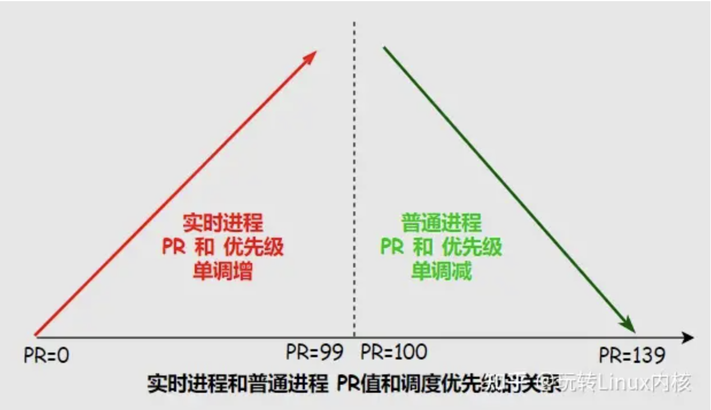

nice值的范围是-20～20，对应的pri就是100-139。
```
修改nice值也比较简单
#ps -elf|grep polaris
4 S root      3388     1  0  90  10 - 183913 futex_ 2022 ?        10:53:55 /usr/bin/polaris-agent -c /etc/polaris/agent.conf

#renice  -0 3388
3388 (process ID) old priority 10, new priority 0

#ps -elf|grep polaris
4 S root      3388     1  0  80   0 - 183913 futex_ 2022 ?        10:53:55 /usr/bin/polaris-agent -c /etc/polaris/agent.conf
```

#### 3.2.6 工具梳理

网上别人梳理的一个性能分析工具，整理的不错：

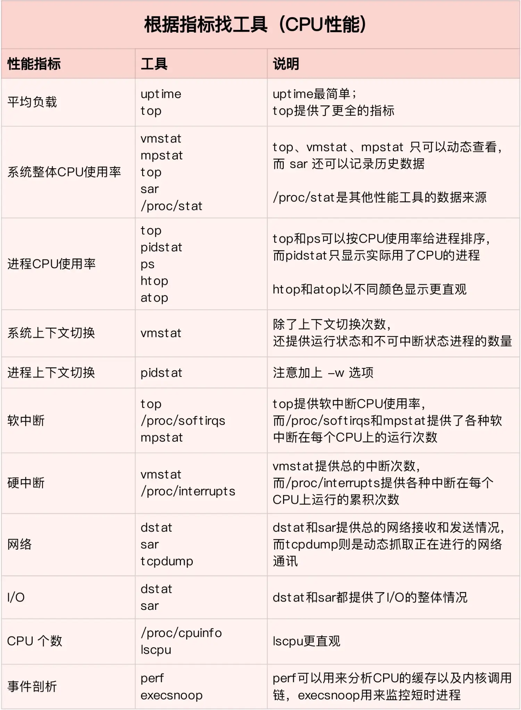

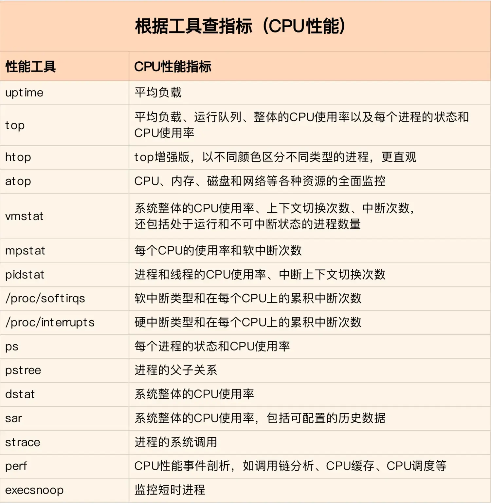

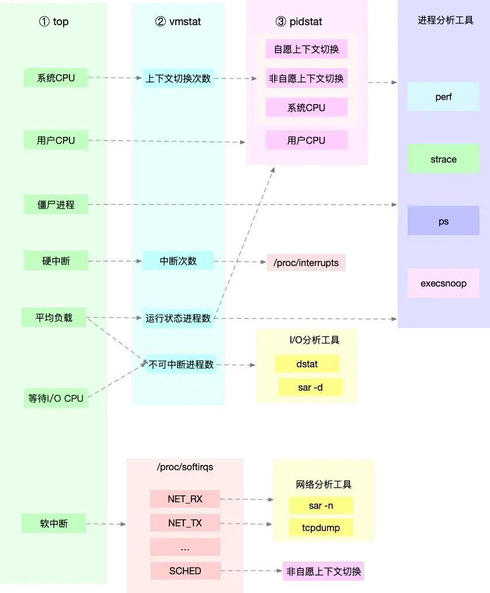

## 四、cpu性能优化总结

**系统优化**

*   CPU 绑定：把进程绑定到一个或者多个 CPU 上，可以提高 CPU 缓存的命中率，减少跨 CPU 调度带来的上下文切换问题 （如上面讲到的AMD 多L3问题）
*   CPU 独占：跟 CPU 绑定类似，进一步将 CPU 分组，并通过 CPU 亲和性机制为其分配进程。这样，这些 CPU 就由指定的进程独占，换句话说，不允许其他进程再来使用这些 CPU。(现在大核心的kvm采用的方式，不同kvm独占不同的cpu)
*   优先级调整：使用 nice 调整进程的优先级，正值调低优先级，负值调高优先级。优先级的数值含义前面我们提到过，在这里，适当降低非核心应用的优先级，增高核心应用的优先级，可以确保核心应用得到优先处理。（可以看一下机器上某些一些监控agent优先级设置的比较低）
*   为进程设置资源限制：使用 Linux cgroups 来设置进程的 CPU 使用限，可以防止由于某个应用自身的问题，而耗尽系统资源。还有就是根据应用特征去设置不同的cpu分配周期,用时间换空间比如调整cpu.cfs\_period\_us,在获得的总cpu不变情况下，拉长每个周期的cpu时间片。
*   中断负载均衡：无论是软中断还是硬中断，它们的中断处理程序都可能会耗费大量的 CPU。开启 irqbalance 服务或者配置 smp\_affinity，就可以把中断处理过程自动负载均衡到多个 CPU 上。
*   系统资源预留: 单独站在cpu角度来说，就是计算机器整体资源情况，预留一定cpu buffer。避免应用进程打满导致影响系统、内核进程

## 五、文章参考

- <https://frankdenneman.nl/2019/10/14/amd-epyc-naples-vs-rome-and-vsphere-cpu-scheduler-updates/>
- <https://cloud.tencent.com/developer/article/1580471>
- <https://xiaolincoding.com/os/1_hardware/how_cpu_deal_task.html#%E8%B0%83%E6%95%B4%E4%BC%98%E5%85%88%E7%BA%A7>
- <https://fanlv.fun/2020/09/13/linux-optimize/#%E8%BD%AF%E4%B8%AD%E6%96%AD%EF%BC%88softirq%EF%BC%89>
- <https://fanlv.fun/2020/09/13/linux-optimize/#CPU%E6%80%A7%E8%83%BD%E7%AF%87>
- <https://elixir.bootlin.com/linux/v5.0/source/include/uapi/linux/oom.h#L9>

