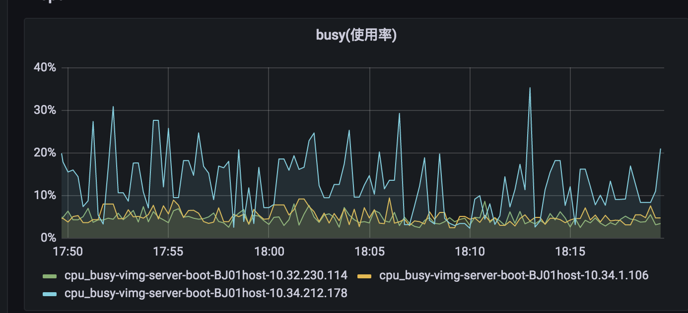
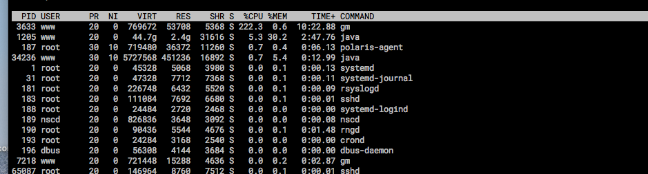

## 1.现象

从监控看，k8s上的节点cpu使用率明显比kvm高，并且抖动厉害，但是从历史监控来看，一直有cpu抖动的情况，但是业务都是正常的。



## 2.问题排查



gm会使用较高的cpu。和中间件交流此进程是图片处理的一个库，默认会拿宿主机的cpu核数，所以在此处拿了node节点的核数(96核)，google看到可以增加环境变量指定使用核数
查看官方文档找到了这个feature：http://www.graphicsmagick.org/OpenMP.html。

增加环境变量export OMP_NUM_THREADS=4,重启进程后观察cpu使用率恢复正常，和kvm保持一致，验证猜想。

针对调用库执行sh的代码，指定线程数为逻辑核数，包含gm和ffprobe。

参考：http://www.graphicsmagick.org/OpenMP.html
```
String result = pooledGMService.execute("identify", "-format", "width:%w height:%h type:%m fileSize:%b transparency:%A orientation:%[EXIF:Orientation] ", fileMeta.getSrcPath());
=》
String result = pooledGMService.execute("identify", "-format", "width:%w height:%h type:%m fileSize:%b transparency:%A orientation:%[EXIF:Orientation] ", "-limit", "threads", "4", fileMeta.getSrcPath());
 ```
 
参考：https://blog.csdn.net/weixin_42183453/article/details/112805166
```
private static List<String[]> threadsArgs = Collections.singletonList(new String[]{"-threads", "4"});
FFmpegProbeResult result = fFprobe.probe(filePath, threadsArgs);
```
