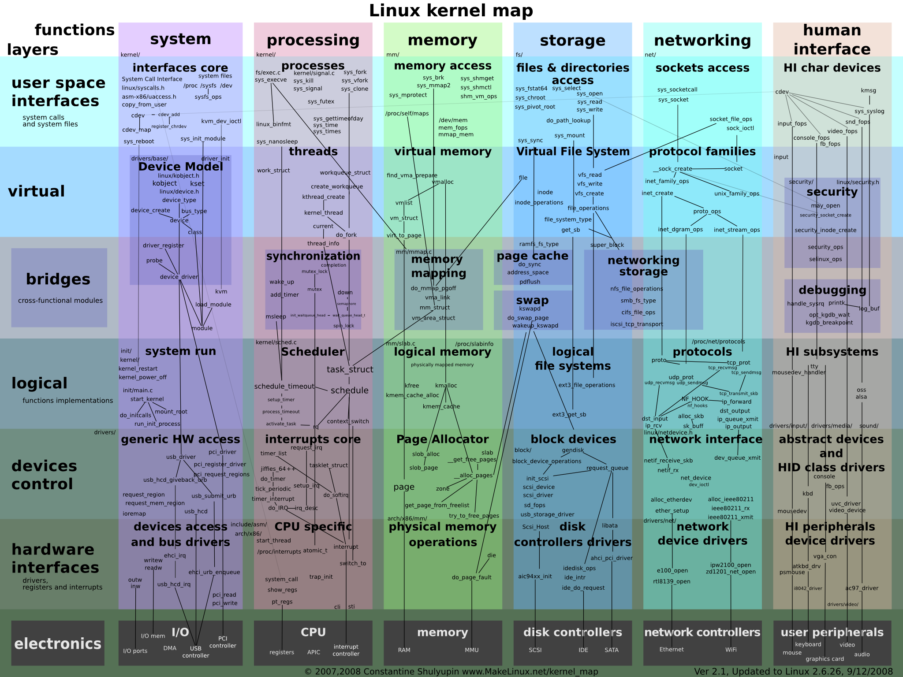
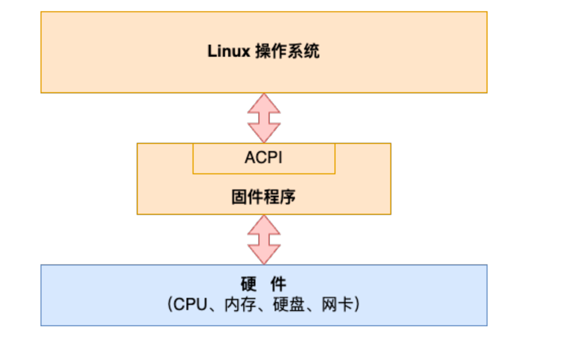
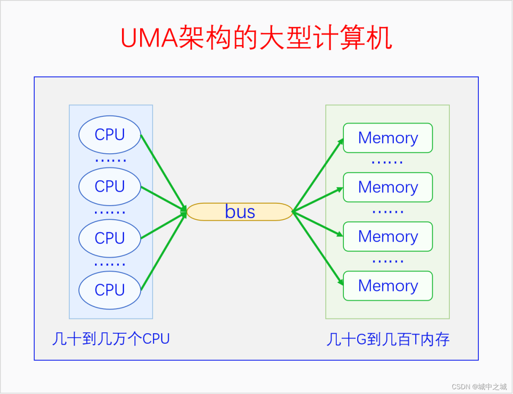
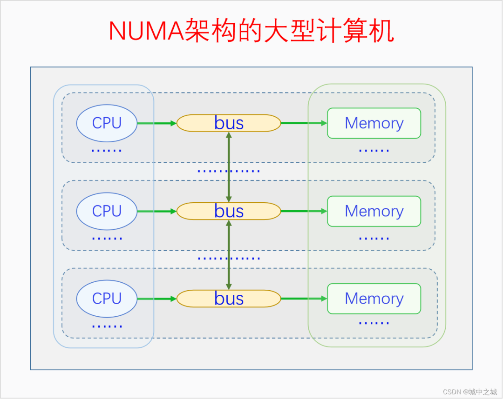
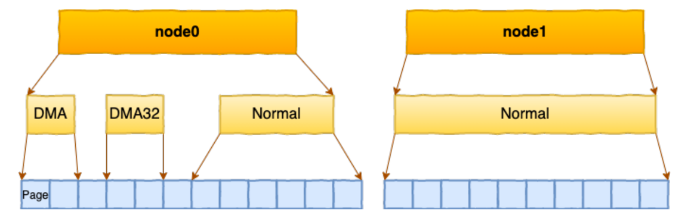
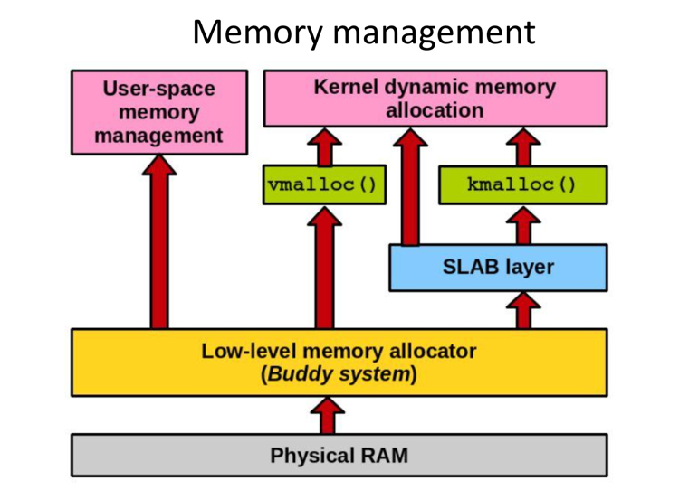
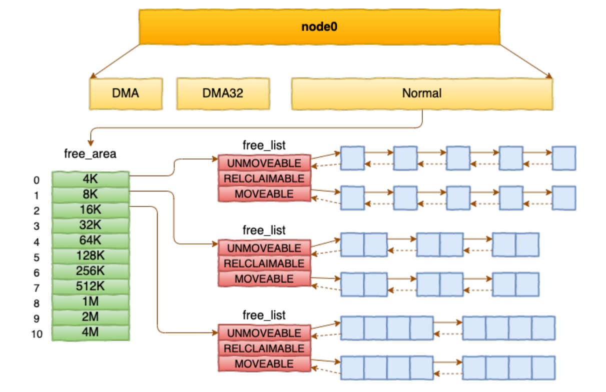
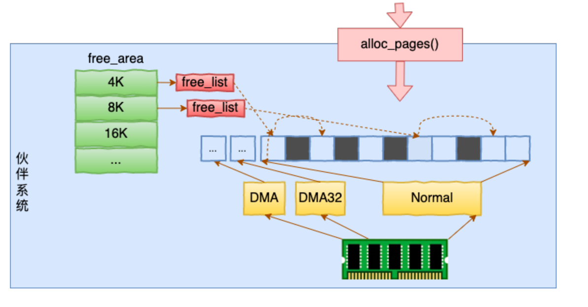
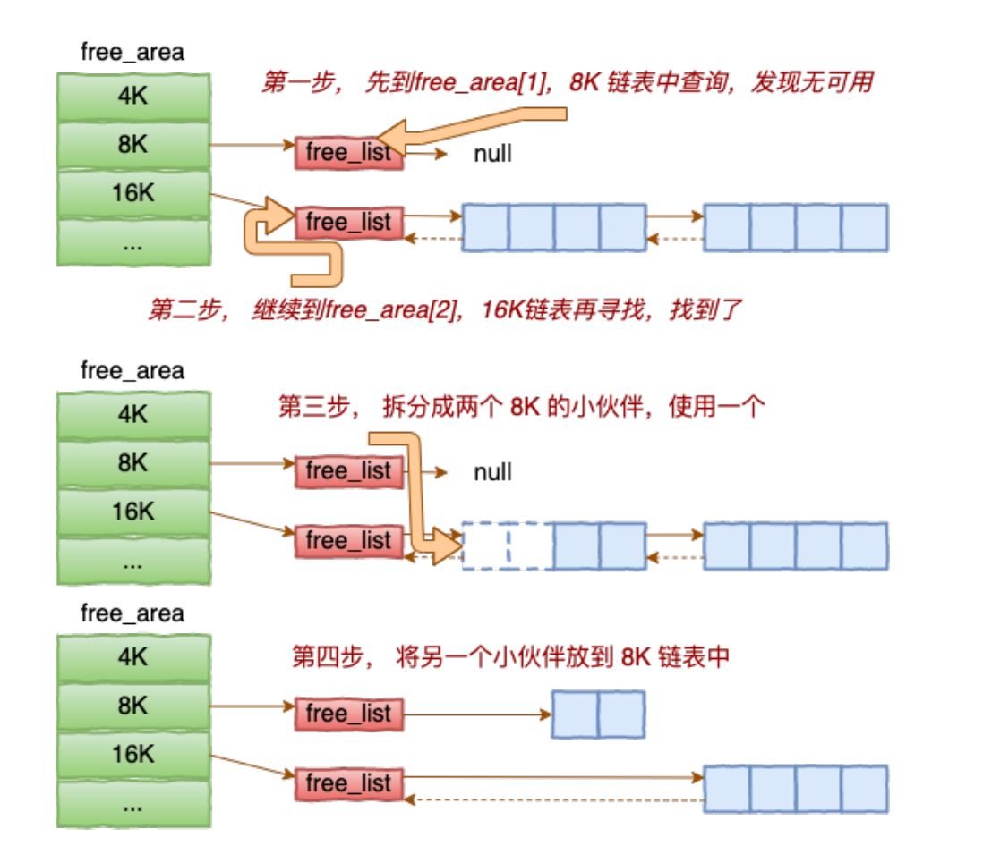
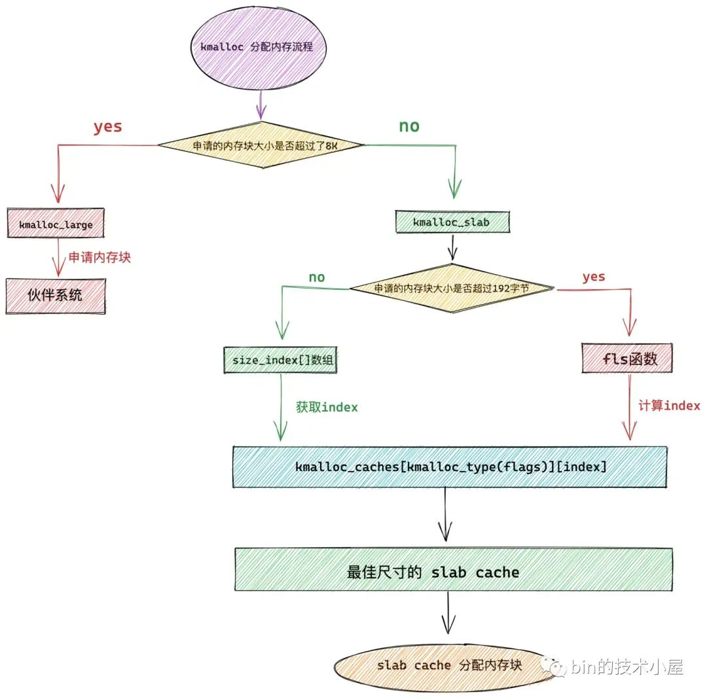

# linux memory

我们在研究linux内存管理的时候先来看一张图，我们先通过这个图，可以看出来linux内存管理包含了哪些主要的功能。



我们从下往上来看，第一眼看上去会比较乱，我们先对每一块有一个大概的认知即可。

- memory
  - MMU
    在虚拟内存中，CPU访问任何内存都是通过虚拟内存地址来访问的，但是实际上最终访问内存还是得用物理内存地址。所以在CPU中存在一个MMU，负责把虚拟地址转化为物理地址，然后再去访问内存。
- physical memory operations
  - 物理内存如何划分的?操作系统怎么知道内存？
- page Allocator
  - 内存页如何分配的
- logical memory
  - kfree,kmalloc,kmem_cache等，这里的函数都是k开头的，那我们先不要细究，知道他肯定是和内核有关的就行了
- memory mapping
  - 字面理解内存映射？到底干啥的后面在研究
- virtual memory
  - 虚拟内存,我们都知道应用程序在申请内存的时候不是直接给你分配物理地址，而是给你一串连续的虚拟内存地址
- memory access
  - 内存访问，那这个就是内核给我提供的api，可以调用这些接口去做操作内存的事情啦

到这里我们其实对linux管理内存做了哪些事情有个大概的认知轮廓了，然后我们一步一步，结合机器上的环境+架构图+代码，一步一步去深入理解linux是如何管理内存的

## 一、物理内存

### 1.1 物理内存初始化
在服务器上⼀般都会插很多条内存。但Linux内核在刚启动的时候是不了解这些硬件信息的。内核必须对整个系统
中的内存进⾏初始化，以⽅便后⾯的使⽤。具体过程包括物理内存检测、memblock初期分配器创建、内存NUMA
之node节点信息获取、⻚管理机制初始化、向伙伴系统交接可⽤内存范围等

- 内核如何知道我们的机器有多大内存？这是我们的服务器一共16*32GB=512GB
```shell
@#dmidecode |grep -w "Memory Device" -A 5|grep Size:|grep "Size: 32 GB"|grep -v Range
	Size: 32 GB
	Size: 32 GB
	Size: 32 GB
	Size: 32 GB
	Size: 32 GB
	Size: 32 GB
	Size: 32 GB
	Size: 32 GB
	Size: 32 GB
	Size: 32 GB
	Size: 32 GB
	Size: 32 GB
	Size: 32 GB
	Size: 32 GB
	Size: 32 GB
	Size: 32 GB
```
- 为什么机器内存变少了?
```shell
@#free -g
               total        used        free      shared  buff/cache   available
Mem:             503         240         135           8         127         227
Swap:              0           0           0
```
#### 1.1.1 固件程序介绍
内核需要识别到这些内存才可以进⾏后⾯的使⽤。
但其实操作系统在刚刚启动的时候，对内存的可⽤地址范围、NUMA分组信息都是⼀⽆所知。在计算机的体系结构
中，除了操作系统和硬件外，中间还存在着⼀层固件（firmware）。



固件是位于主板上的使⽤ SPI Nor Flash 存储着的软件。起着在硬件和操作系统中间承上启下的作⽤。它对外提供
接⼝规范是⾼级配置和电源接⼝（ ACPI，Advanced Configuration and Power Interface）。其第⼀个版本ACPI
1.0是1997年的时候由英特尔、微软和东芝公司共同推出的。截⽌书稿写作时最新的版本是2022年8⽉发布的6.5版
本。在UEFI论坛⾥可以下载到最新的规范⽂档https://uefi.org/sites/default/files/resources/ACPI_Spec_6_5_Aug
29.pdf。
在这个规范中，定义了计算机硬件和操作系统之间的接⼝，包含的主要内容有计算机硬件配置描述、设备通信⽅
式、电源功能管理等功能。在计算机启动过程中，固件负责着硬件⾃检、初始化硬件设备、加载操作系统引导程
序，将控制权转移到操作系统并提供接⼝供操作系统读取硬件信息。操作系统所需要的内存等硬件信息都是通过固
件来获取的。

通过内核日志可以清晰的看到BIOS对物理内存的结果:
```shell
@#grep kernel /var/log/messages*|grep -v audit|grep BIOS-e820:
/var/log/messages-20240616:Jun 11 12:12:49 dc05-prod-lan-hadoop-host-610154 kernel: BIOS-e820: [mem 0x0000000000000000-0x000000000009bfff] usable
/var/log/messages-20240616:Jun 11 12:12:49 dc05-prod-lan-hadoop-host-610154 kernel: BIOS-e820: [mem 0x000000000009c000-0x000000000009ffff] reserved
/var/log/messages-20240616:Jun 11 12:12:49 dc05-prod-lan-hadoop-host-610154 kernel: BIOS-e820: [mem 0x00000000000e0000-0x00000000000fffff] reserved
/var/log/messages-20240616:Jun 11 12:12:49 dc05-prod-lan-hadoop-host-610154 kernel: BIOS-e820: [mem 0x0000000000100000-0x000000007a288fff] usable
/var/log/messages-20240616:Jun 11 12:12:49 dc05-prod-lan-hadoop-host-610154 kernel: BIOS-e820: [mem 0x000000007a289000-0x000000007af0afff] reserved
/var/log/messages-20240616:Jun 11 12:12:49 dc05-prod-lan-hadoop-host-610154 kernel: BIOS-e820: [mem 0x000000007af0b000-0x000000007b93afff] ACPI NVS
/var/log/messages-20240616:Jun 11 12:12:49 dc05-prod-lan-hadoop-host-610154 kernel: BIOS-e820: [mem 0x000000007b93b000-0x000000007bab4fff] ACPI data
/var/log/messages-20240616:Jun 11 12:12:49 dc05-prod-lan-hadoop-host-610154 kernel: BIOS-e820: [mem 0x000000007bab5000-0x000000007bae8fff] usable
/var/log/messages-20240616:Jun 11 12:12:49 dc05-prod-lan-hadoop-host-610154 kernel: BIOS-e820: [mem 0x000000007bae9000-0x000000007bafefff] ACPI data
/var/log/messages-20240616:Jun 11 12:12:49 dc05-prod-lan-hadoop-host-610154 kernel: BIOS-e820: [mem 0x000000007baff000-0x000000007bafffff] usable
/var/log/messages-20240616:Jun 11 12:12:49 dc05-prod-lan-hadoop-host-610154 kernel: BIOS-e820: [mem 0x000000007bb00000-0x000000008fffffff] reserved
/var/log/messages-20240616:Jun 11 12:12:49 dc05-prod-lan-hadoop-host-610154 kernel: BIOS-e820: [mem 0x00000000feda8000-0x00000000fedabfff] reserved
/var/log/messages-20240616:Jun 11 12:12:49 dc05-prod-lan-hadoop-host-610154 kernel: BIOS-e820: [mem 0x00000000ff310000-0x00000000ffffffff] reserved
/var/log/messages-20240616:Jun 11 12:12:49 dc05-prod-lan-hadoop-host-610154 kernel: BIOS-e820: [mem 0x0000000100000000-0x000000207fffffff] usable
```

> 小结：linux就是通过固件程序提供的ACPI接口获取到物理内存的信息
#### 1.1.2 memblock分配器申请内存
内核在启动时伙伴系统创建之前，所有的内存都是通过memblock内存分配器来分配的。⽐较重要的两个使⽤的场
景是crash kernel和⻚管理初始化。

##### crash kernel 申请内存
内核为了在崩溃时能记录崩溃的现场，⽅便以后排查分析，设计实现了⼀套kdump机制。kdump机制实际上在服
务器上启动了两个内核，第⼀个是正常使⽤的内核，第⼆个是崩溃发⽣时的应急内核。有了kdump机制，发⽣系统
崩溃的时候kdump使⽤kexec启动到第⼆个内核中运⾏。这样第⼀个内核中的内存就得以保留下来了。然后可以把
崩溃时的所有运⾏状态都收集到dump core中。

```shell
@#cat /etc/default/grub
GRUB_TIMEOUT=5
GRUB_DISTRIBUTOR="$(sed 's, release .*$,,g' /etc/system-release)"
GRUB_DEFAULT=saved
GRUB_DISABLE_SUBMENU=true
GRUB_TERMINAL_OUTPUT="console"
GRUB_CMDLINE_LINUX="crashkernel=512M-2G:64M,2G-4G:128M,4G-8G:192M,8G-:256M biosdevname=0 net.ifnames=0 rhgb quiet numa=off intel_idle.max_cstate=0 processor.max_cstate=1 rdblacklist=igb"
GRUB_DISABLE_RECOVERY="true"
```

这里我们不对 kdump 机制过多展开，我们想重点说的是这套机制是需要额外的内存才能⼯作的。通过
reserve_crashkernel_low 和 reserve_crashkernel两个函数向 memblock 内存分配器申请内存。

```shell
@#grep kernel /var/log/messages*|grep -v audit|grep -i crash
/var/log/messages-20240616:Jun 11 12:12:49 dc05-prod-lan-hadoop-host-610154 kernel: Command line: BOOT_IMAGE=/boot/vmlinuz-4.14.105-19-0018 root=UUID=e4335d3f-cff7-467c-9b8b-c7606ee07455 ro crashkernel=512M-2G:64M,2G-4G:128M,4G-8G:192M,8G-:256M biosdevname=0 net.ifnames=0 rhgb quiet numa=off intel_idle.max_cstate=0 processor.max_cstate=1 rdblacklist=igb
/var/log/messages-20240616:Jun 11 12:12:49 dc05-prod-lan-hadoop-host-610154 kernel: Reserving 256MB of memory at 608MB for crashkernel (System RAM: 130978MB)
/var/log/messages-20240616:Jun 11 12:12:49 dc05-prod-lan-hadoop-host-610154 kernel: Kernel command line: BOOT_IMAGE=/boot/vmlinuz-4.14.105-19-0018 root=UUID=e4335d3f-cff7-467c-9b8b-c7606ee07455 ro crashkernel=512M-2G:64M,2G-4G:128M,4G-8G:192M,8G-:256M biosdevname=0 net.ifnames=0 rhgb quiet numa=off intel_idle.max_cstate=0 processor.max_cstate=1 rdblacklist=igb
/var/log/messages-20240616:Jun 11 12:12:49 dc05-prod-lan-hadoop-host-610154 kernel: megaraid_sas 0000:84:00.0: firmware crash dump#011: no
/var/log/messages-20240616:Jun 11 04:13:04 dc05-prod-lan-hadoop-host-610154 systemd: Starting Crash recovery kernel arming...
/var/log/messages-20240616:Jun 11 04:13:06 dc05-prod-lan-hadoop-host-610154 systemd: Started Crash recovery kernel arming.
```

##### ⻚管理初始化
将来Linux的伙伴系统是按⻚的⽅式来管理所有的物理内存的，⻚的⼤⼩是 4KB。每⼀个⻚都需要使⽤⼀个 struct
page 对象来表示。这个对象也是需要消耗内存的。在不同的版本中，struct page 的⼤⼩不⼀样，⼀般⼤⼩是 64
字节。

如何知道struct page大小呢？关于struc page可以在这个代码下面看定义
```shell
//file:include/linux/mm_types.h
struct page {
 unsigned long flags;
 ...
}
```

不过看代码肯定一头雾水，我们直接debug:

```shell
@#mkdir /home/structpage
@#cd /home/structpage
```

```shell
#include <linux/kernel.h>
#include <linux/init.h>
#include <linux/module.h>
#include <linux/sched.h>
#include <linux/fdtable.h>
#include <linux/fs_struct.h>
#include <linux/mm_types.h>
#include <linux/init_task.h>
#include <linux/types.h>
#include <linux/atomic.h>
MODULE_LICENSE("GPL");

static int __init print_pcb(void){
        printk("begin.\n");
        size_t page_size = sizeof(struct page);
	printk("struck page:%lu",page_size);
        return 0;
}
static void __exit exit_pcb(void){
        printk("exiting...\n");
}
module_init(print_pcb);
module_exit(exit_pcb);
```

```shell
obj-m:=structpage.o
CURRENT_PATH:=$(shell pwd)
LINUX_KERNEL:=$(shell uname -r)
LINUX_KERNEL_PATH:=/usr/src/linux-headers-$(LINUX_KERNEL)
all:
	make -C $(LINUX_KERNEL_PATH) M=$(CURRENT_PATH) modules
clean:
	make -C $(LINUX_KERNEL_PATH) M=$(CURRENT_PATH) clean
```
```shell
root@new-ubuntu-server:/home/structpage# make
make -C /usr/src/linux-headers-5.15.0-113-generic M=/home/structpage modules
make[1]: Entering directory '/usr/src/linux-headers-5.15.0-113-generic'
  CC [M]  /home/structpage/structpage.o
/home/structpage/structpage.c: In function ‘print_pcb’:
/home/structpage/structpage.c:15:9: warning: ISO C90 forbids mixed declarations and code [-Wdeclaration-after-statement]
   15 |         size_t page_size = sizeof(struct page);
      |         ^~~~~~
  MODPOST /home/structpage/Module.symvers
  CC [M]  /home/structpage/structpage.mod.o
  LD [M]  /home/structpage/structpage.ko
  BTF [M] /home/structpage/structpage.ko
Skipping BTF generation for /home/structpage/structpage.ko due to unavailability of vmlinux
make[1]: Leaving directory '/usr/src/linux-headers-5.15.0-113-generic'
```

```shell
root@new-ubuntu-server:/home/structpage# ls
Makefile  modules.order  Module.symvers  structpage.c  structpage.ko  structpage.mod  structpage.mod.c  structpage.mod.o  structpage.o
```

```shell
#加载内核模块
root@new-ubuntu-server:/home/structpage# insmod structpage.ko

#我们可以看到打印的是64
root@new-ubuntu-server:/home/structpage# dmesg -T
[Tue Jul  2 14:50:22 2024] begin.
[Tue Jul  2 14:50:22 2024] struck page:64
[Tue Jul  2 14:50:36 2024] exiting...
#卸载内核模块
root@new-ubuntu-server:/home/structpage# rmmod structpage
```

由于struct page 结构体⼤⼩是 64 字节。那么平均每 4 KB 就额外需要消耗 64 字节内存⽤来存储这个对象。
64/4096 约等于 1.56%，那么管理 16 GB 的内存⼤约需要 (16*1024 MB) * 1.56%，约 256 MB 的内存。
相信看到这⾥，你就能理解开篇中提到为什么free -m看到的内存少了。Linux 并不会把全部的物理内存都提供给我
们使⽤。Linux 为了维护⾃身的运⾏，会需要消耗⼀些内存。在本⽂中我们介绍了 kdump 机制对内存的消耗，也
介绍了内存的⻚管理机制对内存的占⽤。但实际上还以⼀些其他的消耗，例如 NUMA 机制中的 node 、zone 的管
理等等也都需要内存。所以如果你通过 free -m 查看到可⽤内存⽐实际的物理内存⼩也丝毫不⽤感到奇怪。


### 1.2 物理内存划分
linux内核在获取到机器物理层面的大小后还需要对内存进行分层，那内核是如何进行划分的呢？

图中的CPU都是物理CPU。当一个系统中的CPU越来越多、内存越来越多的时候，内存总线就会成为一个系统的瓶颈。
如果大家都还挤在同一个总线上，速度必然很慢。
于是我们可以采取一种方法，把一部分CPU和一部分内存直连在一起，构成一个节点，不同节点之间CPU访问内存采用间接方式。
节点内的内存访问速度就会很快，节点之间的内存访问速度虽然很慢，但是我们可以尽量减少节点之间的内存访问，这样系统总的内存访问速度就会很快。





#### 1.2.1 node
通过上面的架构图，我们看到在现在的计算机是numa架构，每个cpu下面会绑定一部分内存，
我们看下linux这个文件，可以看到物理内存先会被划分成node
```shell
root@new-ubuntu-server:/home/structpage# cat /proc/buddyinfo
Node 0, zone      DMA      0      0      0      0      0      0      0      0      1      1      2
Node 0, zone    DMA32      6      1      5      3      3      3      5      2      4      6    678
Node 0, zone   Normal   1134   1372    660    281    163     85     61     20      7     41  31110
```

#### 1.2.2 zone
接着node被拆分为了多个zone



- zone DMA
  DMA(Direct Memory Access：直接内存存取)，由配置项CONFIG_ZONE_DMA决定是否存在。在x86上DMA内存区域是物理内存的前16M，这是因为早期的ISA总线上的DMA控制器只有24根地址总线，只能访问16M物理内存。为了兼容这些老的设备，所以需要专门开辟前16M物理内存作为一个区域供这些设备进行DMA操作时去分配物理内存。
- zone DMA32
  由配置项CONFIG_ZONE_DMA32决定是否存在。后来的DMA控制器有32根地址总线，可以访问4G物理内存了。但是在32位的系统上最多只支持4G物理内存，所以没必要专门划分一个区域。但是到了64位系统时候，很多CPU能支持48位到52位的物理内存，于是此时就有必要专门开个区域给32位的DMA控制器使用了。
- zone Normal
  常规内存，无配置项控制，必然存在，除了其它几个内存区域之外的内存都是常规内存ZONE_NORMAL。在X86-64架构下，DMA和DMA32之外的内存全部在NORMAL的Zone⾥管理
  
历史上在 32 位机时代的时候还有个 ZONE_HIGHMEM，不过到了 64 位机后由于寻址空间⼤幅度增加，这个 zone 就被淘汰了。在每个zone下，都包含了许许多多个 Page（⻚⾯）， 在linux下⼀个Page的⼤⼩⼀般是 4 KB。

```shell
root@new-ubuntu-server:/home/structpage# getconf PAGESIZE
4096
```

## 二、物理内存分配

当我们把物理内存区划弄明白之后，再来学习物理内存分配就比较容易了。
物理内存分配最底层的是页帧分配。页帧分配的分配单元是区域，分配粒度是页面。
如何进行页帧分配呢？Linux采取的算法叫做伙伴系统(buddy system)。只有伙伴系统还不行，因为伙伴系统进行的是大粒度的分配，我们还需要批发与零售，
于是便有了slab allocator和kmalloc。这几种内存分配方法分配的都是线性映射的内存，当系统连续内存不足的时候，Linux还提供了vmalloc用来分配非线性映射的内存。
下面我们画图来看一下它们之间的关系。



Buddy System既是直接的内存分配接口，也是所有其它内存分配器的底层分配器。Slab建立在Buddy的基础之上，Kmalloc又建立在Slab的基础之上。
Vmalloc和CMA也是建立在Buddy的基础之上。Linux采取的这种内存分配体系提供了丰富灵活的内存接口，还能同时减少外部碎片和内部碎片。

### 2.1 伙伴系统

```shell
root@new-ubuntu-server:/home/structpage# cat /proc/pagetypeinfo
Page block order: 9
Pages per block:  512

Free pages count per migrate type at order       0      1      2      3      4      5      6      7      8      9     10
Node    0, zone      DMA, type    Unmovable      0      0      0      0      0      0      0      0      1      0      0
Node    0, zone      DMA, type      Movable      0      0      0      0      0      0      0      0      0      1      2
Node    0, zone      DMA, type  Reclaimable      0      0      0      0      0      0      0      0      0      0      0
Node    0, zone      DMA, type   HighAtomic      0      0      0      0      0      0      0      0      0      0      0
Node    0, zone      DMA, type      Isolate      0      0      0      0      0      0      0      0      0      0      0
Node    0, zone    DMA32, type    Unmovable      0      0      1      1      0      0      1      0      1      0      0
Node    0, zone    DMA32, type      Movable      6      1      4      2      3      3      4      2      3      6    678
Node    0, zone    DMA32, type  Reclaimable      0      0      0      0      0      0      0      0      0      0      0
Node    0, zone    DMA32, type   HighAtomic      0      0      0      0      0      0      0      0      0      0      0
Node    0, zone    DMA32, type      Isolate      0      0      0      0      0      0      0      0      0      0      0
Node    0, zone   Normal, type    Unmovable     45    346    408     66     55     35      8      1      1     39      4
Node    0, zone   Normal, type      Movable   1091    374    233    184     93     43     50     18      6      2  31106
Node    0, zone   Normal, type  Reclaimable      2     29     26     27     16      7      3      1      0      0      0
Node    0, zone   Normal, type   HighAtomic      0      0      0      0      0      0      0      0      0      0      0
Node    0, zone   Normal, type      Isolate      0      0      0      0      0      0      0      0      0      0      0

Number of blocks type     Unmovable      Movable  Reclaimable   HighAtomic      Isolate
Node 0, zone      DMA            3            5            0            0            0
Node 0, zone    DMA32            4         1495            0            0            0
Node 0, zone   Normal          198        63726           76            0            0
```
通过linux这个文件可以看到连续内存块到数量



内核提供分配器函数 alloc_pages 到上⾯的多个链表中寻找可⽤连续⻚⾯。

```shell
struct page * alloc_pages(gfp_t gfp_mask, unsigned int order)
```

当内核或者⽤户进程中需要物理⻚的时候，就可以调⽤alloc_pages来申请真正的物理内存了。alloc_pages从zone
的free_area空闲⻚⾯链表中寻找合适的内存块返回



关于alloc_pages的⼯作过程我们举个简单的⼩例⼦来帮助⼤家理解。假如要申请8K-连续两个⻚框的内存。为了描
述⽅便，我们先暂时忽略UNMOVEABLE、RELCLAIMABLE等不同类型。



第⼀步，先到free_area[1]中申请，因为这个链表正好管理的就是8KB的连续内存块。但不巧的是发现这个链表中
是空的，表示⽆内存可⽤。那接着就会到更⼤的空闲内存链表free_area[2]中去查找。这时候发现终于有内存了。
就会从链表中拿⼀个16KB的空闲内存块下来。由于我们要申请的只是8KB的内存，把这个16KB内存块全部返回太
浪费了。所以这⾥会涉及到⼀次切割，把16KB切成两个8KB的内存块。其中⼀个返回给⽤户，另外⼀个放到专⻔管
理8KB空闲⻚的free_area[1]中管理起来。

所以在基于伙伴系统的内存分配中，有可能需要将⼤块内存拆分成两个⼩伙伴。在释放中，也可能会将两个⼩伙伴
合并再次组成更⼤块的连续内存。通过这种⽅式灵活地应对各种不同⼤⼩内存块的申请。就这样，内核通过伙伴系
统将物理⻚⾼效地管理了起来。并通过alloc_page函数对内核其它模块提供物理⻚分配功能。

### 2.2 Slab系统

伙伴系统的最小分配粒度是页面，但是内核中有很多大量的同一类型结构体的分配请求，比如说进程的结构体task_struct，
如果使用伙伴系统来分配显然不合适，如果自己分配一个页面，然后可以分割成多个task_struct，
显然也很麻烦，于是内核中给我们提供了slab分配机制来满足这种需求。
Slab的基本思想很简单，就是自己先从伙伴系统中分配一些页面，
然后把这些页面切割成一个个同样大小的基本块，用户就可以从slab中申请分配一个同样大小的内存块了。
如果slab中的内存不够用了，它会再向伙伴系统进行申请。
不同的slab其基本块的大小并不相同，内核的每个模块都要为自己的特定需求分配特定的slab，
然后再从这个slab中分配内存。

刚开始的时候内核中就只有一个slab，其接口和实现都叫slab。
但是后来内核中又出现了两个slab实现，slob和slub。
slob是针对嵌入式系统进行优化的，slub是针对内存比较多的系统进行优化的，它们的接口还是slab。
由于现在的计算机内存普遍都比较大，连手机的的内存都6G、8G起步了，所以现在除了嵌入式系统之外，
内核默认使用的都是slub。下面我们画个图看一下它们的关系。


[slab原理与实现可以详细阅读](https://www.cnblogs.com/binlovetech/p/17288990.html)

```shell
root@new-ubuntu-server:~# cat /proc/slabinfo
slabinfo - version: 2.1
# name            <active_objs> <num_objs> <objsize> <objperslab> <pagesperslab> : tunables <limit> <batchcount> <sharedfactor> : slabdata <active_slabs> <num_slabs> <sharedavail>
....
kmalloc-cg-1k        960    960   1024   32    8 : tunables    0    0    0 : slabdata     30     30      0
kmalloc-cg-512       960    960    512   32    4 : tunables    0    0    0 : slabdata     30     30      0
kmalloc-cg-256       576    576    256   32    2 : tunables    0    0    0 : slabdata     18     18      0
kmalloc-cg-192      1008   1008    192   42    2 : tunables    0    0    0 : slabdata     24     24      0
kmalloc-cg-128       544    544    128   32    1 : tunables    0    0    0 : slabdata     17     17      0
kmalloc-cg-96       1008   1008     96   42    1 : tunables    0    0    0 : slabdata     24     24      0
kmalloc-cg-64       1536   1536     64   64    1 : tunables    0    0    0 : slabdata     24     24      0
kmalloc-cg-32       3072   3072     32  128    1 : tunables    0    0    0 : slabdata     24     24      0
kmalloc-cg-16       6400   6400     16  256    1 : tunables    0    0    0 : slabdata     25     25      0
kmalloc-cg-8       12288  12288      8  512    1 : tunables    0    0    0 : slabdata     24     24      0
kmalloc-8k           260    260   8192    4    8 : tunables    0    0    0 : slabdata     65     65      0
kmalloc-4k          1312   1312   4096    8    8 : tunables    0    0    0 : slabdata    164    164      0
kmalloc-2k          1392   1392   2048   16    8 : tunables    0    0    0 : slabdata     87     87      0
kmalloc-1k          2560   2560   1024   32    8 : tunables    0    0    0 : slabdata     80     80      0
kmalloc-512        17255  17600    512   32    4 : tunables    0    0    0 : slabdata    550    550      0
kmalloc-256         5920   5920    256   32    2 : tunables    0    0    0 : slabdata    185    185      0
kmalloc-192         2226   2226    192   42    2 : tunables    0    0    0 : slabdata     53     53      0
kmalloc-128        14496  14496    128   32    1 : tunables    0    0    0 : slabdata    453    453      0
kmalloc-96          3990   3990     96   42    1 : tunables    0    0    0 : slabdata     95     95      0
kmalloc-64         14912  14912     64   64    1 : tunables    0    0    0 : slabdata    233    233      0
kmalloc-32         22912  22912     32  128    1 : tunables    0    0    0 : slabdata    179    179      0
kmalloc-16         12288  12288     16  256    1 : tunables    0    0    0 : slabdata     48     48      0
kmalloc-8          15872  15872      8  512    1 : tunables    0    0    0 : slabdata     31     31      0
kmem_cache_node      576    576     64   64    1 : tunables    0    0    0 : slabdata      9      9      0
kmem_cache           352    352    256   32    2 : tunables    0    0    0 : slabdata     11     11      0
```

```shell
root@new-ubuntu-server:~# slabtop
Active / Total Objects (% used)    : 881058 / 887480 (99.3%)
 Active / Total Slabs (% used)      : 19305 / 19305 (100.0%)
 Active / Total Caches (% used)     : 116 / 176 (65.9%)
 Active / Total Size (% used)       : 229526.60K / 233160.23K (98.4%)
 Minimum / Average / Maximum Object : 0.01K / 0.26K / 10.69K

  OBJS ACTIVE  USE OBJ SIZE  SLABS OBJ/SLAB CACHE SIZE NAME
152235 152235 100%    0.05K   1791       85      7164K ftrace_event_field
147798 147564  99%    0.19K   3519       42     28152K dentry
 77649  77649 100%    0.10K   1991       39      7964K buffer_head
 64262  60456  94%    0.70K   1397       46     44704K proc_inode_cache
 42880  42880 100%    0.12K   1340       32      5360K kernfs_node_cache
 ...
```

关于slab相关的内存指标含义，后续进一步分析，这里不做详细介绍

### 2.3 kmalloc体系




[kmalloc体系](https://www.cnblogs.com/binlovetech/p/17495824.html)
