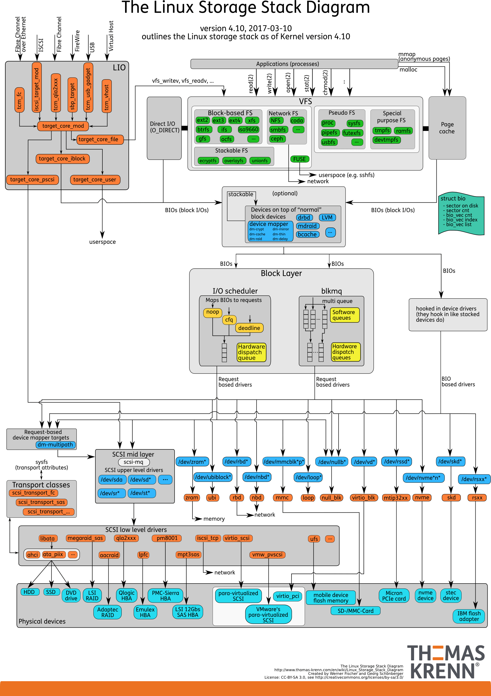
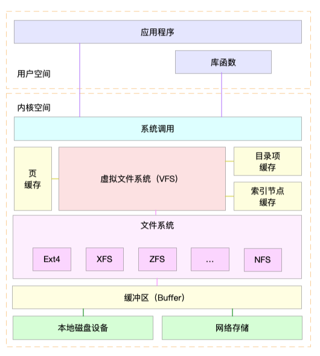
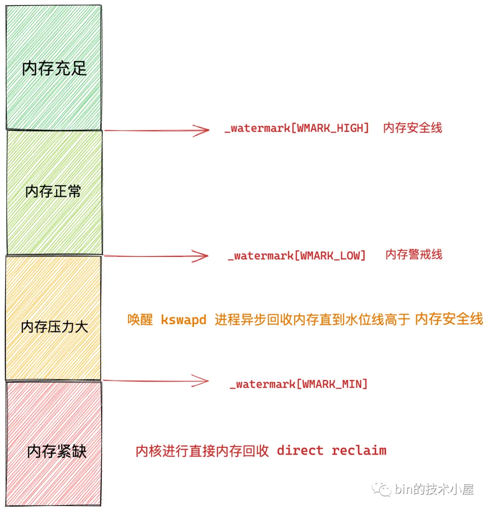
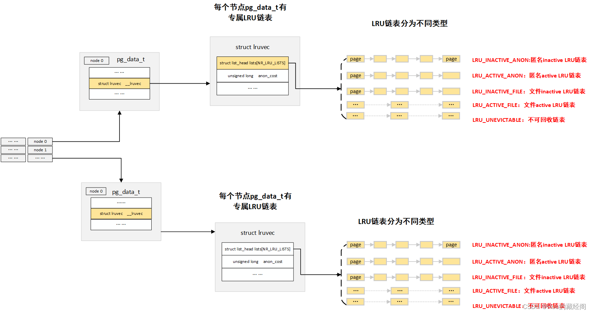

# 深入理解内存cache

通过之前的内存总结了解linux中的内存是以page为单位进行管理的，
Page Cache是Linux内核中的一种缓存机制，用于缓存文件系统中的数据和元数据。
当应用程序读取文件时，文件的内容会被缓存到Page Cache中，如果下次再次读取该文件，内核会直接从Page Cache中读取数据，而不必再次访问磁盘。
page cache是存储在内存中的Page的一种特殊用法。

那page cache是如何产生的？又是如何释放的？pagecache和磁盘又有什么联系呢？



# 一、page cache是如何产生的

先看看drop cache里放的是什么：
https://www.kernel.org/doc/Documentation/sysctl/vm.txt

```shell
drop_caches

Writing to this will cause the kernel to drop clean caches, as well as
reclaimable slab objects like dentries and inodes.  Once dropped, their
memory becomes free.

To free pagecache:
echo 1 > /proc/sys/vm/drop_caches
To free reclaimable slab objects (includes dentries and inodes):
echo 2 > /proc/sys/vm/drop_caches
To free slab objects and pagecache:
echo 3 > /proc/sys/vm/drop_caches

1.读写文件的内容
2.目录缓存
3.文件的元信息
上图中的:read,write,open,stat,chmod和这些可以关联起来,那我们来试验一下
```

## 1.1 写文件

```shell
root@new-ubuntu-server:~# echo 3 > /proc/sys/vm/drop_caches
root@new-ubuntu-server:~# vmstat 1
procs -----------memory---------- ---swap-- -----io---- -system-- ------cpu-----
 r  b   swpd   free   buff  cache   si   so    bi    bo   in   cs us sy id wa st
 0  0      0 131005584  10884 164044    0    0     0     0    6    4  0  0 100  0  0
 0  0      0 131005584  10884 164044    0    0     0     0    6    4  0  0 100  0  0
```

关于vmstat,指标的含义我们在内存分析工具里面会详细介绍，这里我们关注
内存部分的 buff 和 cache ，以及 io 部分的 bi 和 bo 即可。

bi 和 bo 则分别表示块设备读取和写入的大小，单位为块 / 秒。因为 Linux 中块的大小是 1KB，所以这个单位也就等价于 KB/s。

这里简单提一下关于磁盘块大小https://wiki.linuxquestions.org/wiki/Block_devices_and_block_sizes
现在link block大小都是1KB,但如果文件系统设置的block size 是4096,那么即使一个很小的文件也要占文件系统4KB大小。
```shell
root@new-ubuntu-server:~# stat -f /home/
  File: "/home/"
    ID: c09974c1a4262947 Namelen: 255     Type: ext2/ext3
Block size: 4096       Fundamental block size: 4096
Blocks: Total: 25656558   Free: 24123371   Available: 22808555
Inodes: Total: 6553600    Free: 6463192
```

```shell
root@new-ubuntu-server:~# # df .
Filesystem           1K-blocks      Used Available Use% Mounted on
/dev/sdb2            307599572 274077896  17896456  94% /mnt/sdb2
root@new-ubuntu-server:~# # echo hallo>welt
root@new-ubuntu-server:~# # df .
Filesystem           1K-blocks      Used Available Use% Mounted on
/dev/sdb2            307599572 274077900  17896452  94% /mnt/sdb2
root@new-ubuntu-server:~# # du -csh welt
4.0K    welt
4.0K    total
```

正常情况下，空闲系统中，你应该看到的是，这几个值在多次结果中一直保持不变。接下来，
到第二个终端执行 dd 命令，通过读取随机设备，生成一个 500MB 大小的文件
```shell
root@new-ubuntu-server:~# dd if=/dev/urandom of=/tmp/file bs=1M count=500
```

```shell
root@new-ubuntu-server:~# vmstat 1
procs -----------memory---------- ---swap-- -----io---- -system-- ------cpu-----
 r  b   swpd   free   buff  cache   si   so    bi    bo   in   cs us sy id wa st
  0  0      0 131029536   3312 147252    0    0     0     0 6021   74  0  0 100  0  0
 1  0      0 131022984   3320 153460    0    0    68    60 6044  119  0  0 100  0  0
 1  0      0 130789888   3320 386232    0    0     0     0 6029  141  0  4 96  0  0
 1  0      0 130555536   3320 619988    0    0     0     0 6020  100  0  4 96  0  0
 0  1      0 130503888   3336 671876    0    0    16 512000 12914 8629  0  2 96  3  0
 0  0      0 130503632   3336 672308    0    0     0     0 6071  140  0  0 100  0  0
 0  0      0 130503632   3336 672308    0    0     0     0 6021   72  0  0 100  0  0
 0  0      0 130503632   3348 672308    0    0     0    72 6034   92  0  0 100  0  0
 0  0      0 130503632   3348 672308    0    0     0     0 6054  125  0  0 100  0  0
 0  0      0 130503632   3348 672308    0    0     0     0 6018   68  0  0 100  0  0
```
通过观察 vmstat 的输出，我们发现，在 dd 命令运行时， Cache 在不停地增长，而 Buffer 基本保持不变。
最后bo输出512000也就是500MB的写入。

## 1.2 读文件

```shell
# 首先清理缓存
root@new-ubuntu-server:~# echo 3 > /proc/sys/vm/drop_caches
# 运行dd命令读取文件数据
root@new-ubuntu-server:~# dd if=/tmp/file of=/dev/null
```

```shell
root@new-ubuntu-server:~# vmstat 1
procs -----------memory---------- ---swap-- -----io---- -system-- ------cpu-----
 r  b   swpd   free   buff  cache   si   so    bi    bo   in   cs us sy id wa st
 0  1      0 7724164   2380 110844    0    0 16576     0   62  360  2  2 76 21  0
 0  1      0 7691544   2380 143472    0    0 32640     0   46  439  1  3 50 46  0
 0  1      0 7658736   2380 176204    0    0 32640     0   54  407  1  4 50 46  0
 0  1      0 7626052   2380 208908    0    0 32640    40   44  422  2  2 50 46  0
```
观察 vmstat 的输出，你会发现读取文件时（也就是 bi 大于 0 时），Buffer 保持不变，而 Cache 则在不停增长。

经过这个案例说明文件的读写都要经过cache。


## 1.3 写磁盘

我们上vmstat看到除了cache，还有个buffer，那buffer又是什么？



我们通过这个图可以看到buffer是在文件系统和磁盘设备之间，其实就是裸IO的缓存，他的作用就是读写的请求不经过文件系统，而是直接去读写裸设备的数据。我们也来试验一下就知道了：

我们往/dev/sda2这个磁盘写入2G数据(之前是写入/tmp/file这个是通过vfs写文件系统的)
```shell
#注意这个命令会将磁盘清空，所以要在空的数据盘做测试！！！！
root@new-ubuntu-server:/home# dd if=/dev/urandom of=/dev/sda2 bs=1M count=2048 
2048+0 records in
2048+0 records out
2147483648 bytes (2.1 GB, 2.0 GiB) copied, 8.44153 s, 254 MB/s
```

```shell
root@new-ubuntu-server:~# vmstat 1
procs -----------memory---------- ---swap-- -----io---- -system-- ------cpu-----
 r  b   swpd   free   buff  cache   si   so    bi    bo   in   cs us sy id wa st
 0  0      0 128952928   5212 2248552    0    0     0     1    9    4  0  0 100  0  0
 0  0      0 128952928   5212 2248740    0    0     0     0 6023   73  0  0 100  0  0
 1  0      0 128758144 194836 2253304    0    0    68    16 6071  191  0  3 97  0  0
 1  0      0 128503408 442716 2260552    0    0     0     0 6043   93  0  4 96  0  0
 1  0      0 128247424 691548 2267176    0    0     0     0 6023  101  0  4 96  0  0
 1  0      0 127990952 940380 2274064    0    0     0     0 6023   85  0  4 96  0  0
 1  0      0 127734000 1189212 2281388    0    0     0     0 6024  118  0  4 96  0  0
 1  0      0 127477776 1437704 2288072    0    0     0     0 6020  109  0  4 96  0  0
 1  0      0 127222048 1685852 2294916    0    0     0     0 6026  104  0  4 96  0  0
 1  0      0 126965096 1934684 2302036    0    0     0     0 6042  137  0  4 96  0  0
 0  0      0 126792352 2101596 2307152    0    0     0     8 8074 3584  0  3 97  0  0
 0  0      0 126791848 2101596 2307652    0    0     0     0 6030   90  0  0 100  0  0
 0  0      0 126791848 2101596 2307652    0    0     0     0 6017  115  0  0 100  0  0
 0  0      0 126791848 2101596 2307652    0    0     0     0 6030   87  0  0 100  0  0
 0  0      0 126791848 2101596 2307652    0    0     0     0 6030  108  0  0 100  0  0
 0  0      0 126791848 2101596 2307652    0    0     0     0 6015   66  0  0 100  0  0
 0  0      0 126791848 2101596 2307652    0    0     0     0 6023   81  0  0 100  0  0
 0  0      0 126791848 2101596 2307652    0    0     0     0 6023   76  0  0 100  0  0
 0  1      0 126791848 2101596 2307652    0    0     0 169116 8703 4050  0  0 99  1  0
 1  0      0 126791600 2101596 2307652    0    0     0 642652 16081 15163  0  1 96  3  0
 1  0      0 126791600 2101596 2307652    0    0     0 624496 15961 15052  0  1 96  3  0
 0  1      0 126791600 2101596 2307652    0    0     0 642968 16088 15185  0  1 96  3  0
 0  0      0 126791600 2101596 2307652    0    0     0 17940 6330  516  0  0 100  0  0
 0  0      0 126791600 2101596 2307652    0    0     0     0 6024   68  0  0 100  0  0
 0  0      0 126791600 2101596 2307652    0    0     0     0 6017   75  0  0 100  0  0
 0  0      0 126791600 2101596 2307652    0    0     0     0 6030   72  0  0 100  0  0
```

从这里会看到，虽然同是写数据，写磁盘跟写文件的现象还是不同的。写磁盘时（也就是 bo 大于 0 时），Buffer 和 Cache 都在增长，但显然 Buffer 的增长快得多。
这说明，写磁盘用到了大量的 Buffer。

## 1.4 读磁盘

那么，磁盘读又是什么情况呢？我们再运行第二个案例来看看。首先，回到第二个终端，运行下面的命令。清理缓存后，从磁盘分区 /dev/sda1 中读取数据，写入空设备：

```shell
# 首先清理缓存
root@new-ubuntu-server:~# echo 3 > /proc/sys/vm/drop_caches
# 运行dd命令读取文件
root@new-ubuntu-server:~# dd if=/dev/sda2 of=/dev/null bs=1M count=1024
```

```shell
root@new-ubuntu-server:~# vmstat 1
procs -----------memory---------- ---swap-- -----io---- -system-- ------cpu-----
 r  b   swpd   free   buff  cache   si   so    bi    bo   in   cs us sy id wa st
0  0      0 7225880   2716 608184    0    0     0     0   48  159  0  0 100  0  0
 0  1      0 7199420  28644 608228    0    0 25928     0   60  252  0  1 65 35  0
 0  1      0 7167092  60900 608312    0    0 32256     0   54  269  0  1 50 49  0
 0  1      0 7134416  93572 608376    0    0 32672     0   53  253  0  0 51 49  0
 0  1      0 7101484 126320 608480    0    0 32748     0   80  414  0  1 50 49  0
```
观察 vmstat 的输出，你会发现读磁盘时（也就是 bi 大于 0 时），Buffer 和 Cache 都在增长，但显然 Buffer 的增长快很多。
这说明读磁盘时，数据缓存到了 Buffer 中。

从上面测试结果看文件/磁盘的读写都会产生cache，而写磁盘会产生buffer cache。

我们从cache的种类来区分的话除了文件缓存还有其他很多种：
- 文件缓存
- 匿名页缓存(swap如堆，栈，数据段等，不是以文件形式存在，因此无法和磁盘文件交换，但可以通过硬盘上划分额外的swap交换分区或使用交换文件进行交换。)
- tmpfs(它可以将内存的一部分空间拿来当做文件系统使用，使内存空间可以当做目录文件来用。)
- 共享内存(进程通讯)
- mmap(内存映射,mmap就是将一个文件映射进进程的虚拟内存地址，之后就可以通过操作内存的方式对文件的内容进行操作，es大量使用)

这些方式都会产生cache,但是我们日常接触较多的还是文件缓存。

# 二、page cache是如何释放的

内核之所以要进行内存回收，主要原因有两个：

- 一、内核需要为任何时刻突发到来的内存申请提供足够的内存。所以一般情况下保证有足够的free空间对于内核来说是必要的。
另外，Linux内核使用cache的策略虽然是不用白不用，内核会使用内存中的page cache对部分文件进行缓存，以便提升文件的读写效率。
所以内核有必要设计一个周期性回收内存的机制，以便cache的使用和其他相关内存的使用不至于让系统的剩余内存长期处于很少的状态。

- 二、当真的有大于空闲内存的申请到来的时候，会触发强制内存回收。
所以，内核在应对这两类回收的需求下，分别实现了两种不同的机制。
一个是使用kswapd进程对内存进行周期检查，以保证平常状态下剩余内存尽可能够用。
另一个是直接内存回收（direct page reclaim），就是当内存分配时没有空闲内存可以满足要求时，触发直接内存回收。

linux 内核回收操作究竟针对的page有哪些呢？主要定义在这个enum里面：
```
#define LRU_BASE 0
#define LRU_ACTIVE 1
#define LRU_FILE 2

enum lru_list {
        LRU_INACTIVE_ANON = LRU_BASE,
        LRU_ACTIVE_ANON = LRU_BASE + LRU_ACTIVE,
        LRU_INACTIVE_FILE = LRU_BASE + LRU_FILE,
        LRU_ACTIVE_FILE = LRU_BASE + LRU_FILE + LRU_ACTIVE,
        LRU_UNEVICTABLE,
        NR_LRU_LISTS
};
```
根据这个enum可以看到，内存回收主要需要进行扫描的包括anon的inactive和active以及file的inactive和active四个链表。
就是说，内存回收操作主要针对的就是内存中的文件页（file cache）和匿名页。关于活跃（active）还是不活跃（inactive）的判断内核会使用lru算法进行处理并进行标记，
我们在下面clean page替换里面仔细分析lru策略。

我们在内存总结里面分析过匿名页和文件页,而我们通常会把/proc/sys/vm/swappiness设置成0，尽量不去回收匿名页。所以我们这里主要就是分析文件页的回收。

## 2.1 内存回收的方式



- kswapd(后台回收)
也就是唤醒 kswapd 内核线程，这种方式是异步回收的，不会阻塞进程。

- direct reclaim(直接回收)
这种方式是同步回收的，会阻塞进程，这样就会造成很长时间的延迟，以及系统的 CPU 利用率会升高，最终引起系统负荷飙高。

那它是具体怎么回收的呢？观察 Page Cache 直接回收和后台回收最简单方便的方式是使用 sar：
```shell
root@new-ubuntu-server:~# sar -B
05:28:01 PM  pgpgin/s pgpgout/s   fault/s  majflt/s  pgfree/s pgscank/s pgscand/s pgsteal/s    %vmeff
05:28:31 PM      0.00     21.87     11.60      0.00     11.07      0.00      0.00      0.00      0.00
05:29:01 PM      0.00     15.19     35.75      0.00     24.79      0.00      0.00      0.00      0.00
05:29:31 PM      0.00     22.40     18.63      0.00     17.30      0.00      0.00      0.00      0.00
05:30:00 PM      0.00     26.96     27.58      0.00     23.33      0.00      0.00      0.00      0.00
05:30:01 PM      0.00      3.70   1925.93      0.00    640.74      0.00      0.00      0.00      0.00
05:30:31 PM      0.00     30.67    201.00      0.00    147.20      0.00      0.00      0.00      0.00
05:31:01 PM      0.00     15.73     34.82      0.00     20.16      0.00      0.00      0.00      0.00
05:31:31 PM      0.00     42.27      6.80      0.00     17.40      0.00      0.00      0.00      0.00
05:32:01 PM      0.00     15.06     35.72      0.00     20.23      0.00      0.00      0.00      0.00
05:32:31 PM      0.00     21.20     13.77      0.00     45.27      0.00      0.00      0.00      0.00
05:33:01 PM      0.00     17.46     34.92      0.00     22.83      0.00      0.00      0.00      0.00
```

```
pgpgin/s: Total number of kilobytes the system paged in from disk per second.
pgpgout/s: Total number of kilobytes the system paged out to disk per second.
fault/s: fault/s: Number of page faults (major + minor) made by the system per second. This is not a count of page faults that generate I/O, because some page faults can be resolved without I/O.
majflt/s: Number of major faults the system has made per second, those which have required loading a memory page from disk.
pgfree/s: Number of pages placed on the free list by the system per second.
pgscank/s: Number of pages scanned by the kswapd daemon per second.
pgscand/s: Number of pages scanned directly per second.
pgsteal/s: Number of pages the system has reclaimed from cache (pagecache and swapcache) per second to satisfy its memory demands.
%vmeff: Calculated as pgsteal / pgscan, this is a metric of the efficiency of page reclaim. If it is near 100% then almost every page coming off the tail of the inactive list is being reaped. If it gets too low (e.g. less than 30%) then the virtual memory is having some difficulty. This field is displayed as zero if no pages have been scanned during the interval of time.
```

## 2.2 回收的文件页类型:
### 2.2.1 clean page
linux内核是如何判断回收哪些cache呢？站在我们用户角度，有些经常用的数据(没被修改过的)肯定不希望被回收，因为热点数据被回收了，还要重新从磁盘读取，这样势必会影响性能。

```shell
root@new-ubuntu-server:~# cat /proc/meminfo
Active:          2311992 kB
Inactive:        2165772 kB
Active(anon):       2220 kB
Inactive(anon):   144564 kB
Active(file):    2309772 kB
Inactive(file):  2021208 kB
```

linux内核记录了这个指标,那内核是如何判断哪些文件页是活跃的哪些是不活跃的呢？



为什么会有 active 链表和 inactive 链表？

内存回收的关键是如何实现一个高效的页面替换算法 PFRA (Page Frame Replacement Algorithm) ，提到页面替换算法大家可能立马会想到 LRU (Least-Recently-Used) 算法。
LRU 算法的核心思想就是那些最近最少使用的页面，在未来的一段时间内可能也不会再次被使用，所以在内存紧张的时候，会优先将这些最近最少使用的页面置换出去。在这种情况下其实一个 active 链表就可以满足我们的需求。
但是这里会有一个严重的问题，LRU 算法更多的是在时间维度上的考量，突出最近最少使用，但是它并没有考量到使用频率的影响，假设有这样一种状况，就是一个页面被疯狂频繁的使用，毫无疑问它肯定是一个热页，
但是这个页面最近的一次访问时间离现在稍微久了一点点，此时进来大量的页面，这些页面的特点是只会使用一两次，以后将再也不会用到。
在这种情况下，根据 LRU 的语义这个之前频繁地被疯狂访问的页面就会被置换出去了（本来应该将这些大量一次性访问的页面置换出去的），当这个页面在不久之后要被访问时，此时已经不在内存中了，还需要在重新置换进来，造成性能的损耗。这种现象也叫 Page Thrashing（页面颠簸）。
因此，内核为了将页面使用频率这个重要的考量因素加入进来，于是就引入了 active 链表和 inactive 链表。工作原理如下：

- 1.首先 inactive 链表的尾部存放的是访问频率最低并且最少访问的页面，在内存紧张的时候，这些页面被置换出去的优先级是最大的。
- 2.对于文件页来说，当它被第一次读取的时候，内核会将它放置在 inactive 链表的头部，如果它继续被访问，则会提升至 active 链表的尾部。
如果它没有继续被访问，则会随着新文件页的进入，内核会将它慢慢的推到 inactive 链表的尾部，如果此时再次被访问则会直接被提升到 active 链表的头部。大家可以看出此时页面的使用频率这个因素已经被考量了进来。
- 3.对于匿名页来说，当它被第一次读取的时候，内核会直接将它放置在 active 链表的尾部，注意不是 inactive 链表的头部，这里和文件页不同。
因为匿名页的换出 Swap Out 成本会更大，内核会对匿名页更加优待。当匿名页再次被访问的时候就会被被提升到 active 链表的头部。

当遇到内存紧张的情况需要换页时，内核会从 active 链表的尾部开始扫描，将一定量的页面降级到 inactive 链表头部，这样一来原来位于 inactive 链表尾部的页面就会被置换出去。

为什么会把 active 链表和 inactive 链表分成两类，一类是匿名页，一类是文件页？
在《memory总结》中，我们介绍了一个叫做 swappiness 的内核参数， 我们可以通过 cat /proc/sys/vm/swappiness 命令查看，swappiness 选项的取值范围为 0 到 100，默认为 60。
swappiness 用于表示 Swap 机制的积极程度，数值越大，Swap 的积极程度，越高越倾向于回收匿名页。数值越小，Swap 的积极程度越低，越倾向于回收文件页。
因为回收匿名页和回收文件页的代价是不一样的，回收匿名页代价会更高一点，所以引入 swappiness 来控制内核回收的倾向。
注意： swappiness 只是表示 Swap 积极的程度，当内存非常紧张的时候，即使将 swappiness 设置为 0 ，也还是会发生 Swap 的。

假设我们现在只有 active 链表和 inactive 链表，不对这两个链表进行匿名页和文件页的归类，在需要页面置换的时候，内核会先从 active 链表尾部开始扫描，
当 swappiness 被设置为 0 时，内核只会置换文件页，不会置换匿名页。

由于 active 链表和 inactive 链表没有进行物理页面类型的归类，所以链表中既会有匿名页也会有文件页，如果链表中有大量的匿名页的话，内核就会不断的跳过这些匿名页去寻找文件页，并将文件页替换出去，这样从性能上来说肯定是低效的。
因此内核将 active 链表和 inactive 链表按照匿名页和文件页进行了归类，当 swappiness 被设置为 0 时，内核只需要去 nr_zone_active_file 和 nr_zone_inactive_file 链表中扫描即可，提升了性能。

其实除了以上我介绍的四种 LRU 链表（匿名页的 active 链表，inactive 链表和文件页的active 链表， inactive 链表）之外，内核还有一种链表，比如进程可以通过 mlock() 等系统调用把内存页锁定在内存里，保证该内存页无论如何不会被置换出去，比如出于安全或者性能的考虑，页面中可能会包含一些敏感的信息不想被 swap 到磁盘上导致泄密，或者一些频繁访问的内存页必须一直贮存在内存中。
当这些被锁定在内存中的页面很多时，内核在扫描 active 链表的时候也不得不跳过这些页面，所以内核又将这些被锁定的页面单独拎出来放在一个独立的链表中。

所以内核在回收内存的时候，这两个列表中的回收优先级为：inactive 链表尾部 > inactive 链表头部 > active 链表尾部 > active 链表头部。通过这个优先级来判断要替换的page。
而clean page因为数据没有改动，所以会被直接替换，等下次还需要使用的时候，从磁盘重新加载。

### 2.2.2 dirty page
当 page cache 中的缓存页比磁盘中对应的文件页的数据要新时，就称这些缓存页为脏页。

延时写入的好处就是进程可以多次频繁的对文件进行写入但都是写入到 page cache 中不会有任何磁盘 IO 发生。
随后内核可以将进程的这些多次写入操作转换为一次磁盘 IO ，将这些写入的脏页一次性刷新回磁盘中，这样就把多次磁盘 IO 转换为一次磁盘 IO 极大地提升文件 IO 的性能。
那么内核在什么情况下才会去触发 page cache 中的脏页回写呢？

- 1.内核在初始化的时候，会创建一个 timer 定时器去定时唤醒内核 flusher 线程回写脏页。
- 2.当内存中脏页的数量太多了达到了一定的比例，就会主动唤醒内核中的 flusher 线程去回写脏页。
- 3.脏页在内存中停留的时间太久了，等到 flusher 线程下一次被唤醒的时候就会回写这些驻留太久的脏页。
- 4.用户进程可以通过 sync() 回写内存中的所有脏页和 fsync() 回写指定文件的所有脏页，这些是进程主动发起脏页回写请求。
- 5.在内存比较紧张的情况下，需要回收物理页或者将物理页中的内容 swap 到磁盘上时，如果发现通过页面置换算法置换出来的页是脏页，那么就会触发回写。

#### 2.2.2.1 内核中的定时器间隔多久唤醒 flusher 线程
- dirty_writeback_centisecs
```shell
root@new-ubuntu-server:~# /proc/sys/vm/dirty_writeback_centisecs
500

dirty_writeback_centisecs

The kernel flusher threads will periodically wake up and write `old' data
out to disk.  This tunable expresses the interval between those wakeups, in
100'ths of a second.

dirty_writeback_centisecs 内核参数的默认值为 500。单位为 0.01 s。也就是说内核会每隔 5s 唤醒一次 flusher 线程来执行相关脏页的回写。
```

#### 2.2.2.2 脏页数量多到什么程度会主动唤醒 flusher 线程

- dirty_background_ratio
- dirty_background_bytes
- dirty_ratio
- dirty_bytes


```shell
root@new-ubuntu-server:~# cat /proc/sys/vm/dirty_background_ratio
10

dirty_background_ratio

Contains, as a percentage of total available memory that contains free pages
and reclaimable pages, the number of pages at which the background kernel
flusher threads will start writing out dirty data.

drity_background_ratio ：当脏页数量在系统的可用内存 available 中占用的比例达到 drity_background_ratio 的配置值时，
内核就会调用 wakeup_flusher_threads 来唤醒 flusher 线程异步回写脏页。默认值为：10。
表示如果 page cache 中的脏页数量达到系统可用内存的 10% 的话，就主动唤醒 flusher 线程去回写脏页到磁盘。
```

```shell
root@new-ubuntu-server:~# cat /proc/sys/vm/dirty_background_bytes
0

dirty_background_bytes

Contains the amount of dirty memory at which the background kernel
flusher threads will start writeback.

Note: dirty_background_bytes is the counterpart of dirty_background_ratio. Only
one of them may be specified at a time. When one sysctl is written it is
immediately taken into account to evaluate the dirty memory limits and the
other appears as 0 when read.

如果 page cache 中脏页占用的内存用量绝对值达到指定的 dirty_background_bytes。内核就会调用 wakeup_flusher_threads 来唤醒 flusher 线程异步回写脏页。默认为：0。
drity_background_ratio与dirty_background_bytes同时只生效一个，一般都不会指定这个参数。
```

```shell
root@new-ubuntu-server:~# cat /proc/sys/vm/dirty_ratio
20

dirty_ratio

Contains, as a percentage of total available memory that contains free pages
and reclaimable pages, the number of pages at which a process which is
generating disk writes will itself start writing out dirty data.

The total available memory is not equal to total system memory.

表示内存中的脏页太多了，用户进程自己都看不下去了，不用等内核 flusher 线程唤醒，用户进程自己主动去回写脏页到磁盘中。
当脏页占用系统可用内存的比例达到 dirty_ratio 配置的值时，用户进程同步回写脏页。默认值为：20 。
```

```shell
root@new-ubuntu-server:~# cat /proc/sys/vm/dirty_bytes
0

如果 page cache 中脏页占用的内存用量绝对值达到指定的 dirty_bytes。用户进程同步回写脏页。默认值为：0。

Contains the amount of dirty memory at which a process generating disk writes
will itself start writeback.

Note: dirty_bytes is the counterpart of dirty_ratio. Only one of them may be
specified at a time. When one sysctl is written it is immediately taken into
account to evaluate the dirty memory limits and the other appears as 0 when
read.

Note: the minimum value allowed for dirty_bytes is two pages (in bytes); any
value lower than this limit will be ignored and the old configuration will be
retained.
```

#### 2.2.2.3 脏页到底在内存中能驻留多久

```shell
root@new-ubuntu-server:~# cat /proc/sys/vm/dirty_expire_centisecs
3000

也就是说在默认配置下，脏页在内存中的驻留时间为 30 s。超过 30 s 之后，flusher 线程将会在下次被唤醒的时候将这些脏页回写到磁盘中。

This tunable is used to define when dirty data is old enough to be eligible
for writeout by the kernel flusher threads.  It is expressed in 100'ths
of a second.  Data which has been dirty in-memory for longer than this
interval will be written out next time a flusher thread wakes up.
```

## 2.2 无法回收的cache：
那上面提到的tmpfs,共享内存,mmap如何回收呢？答案是无法回收，只能自行销毁释放。

### 2.2.1 tmpfs

### 2.2.2 共享内存

### 2.2.3 mmap


