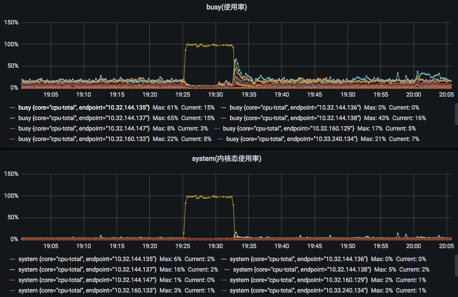
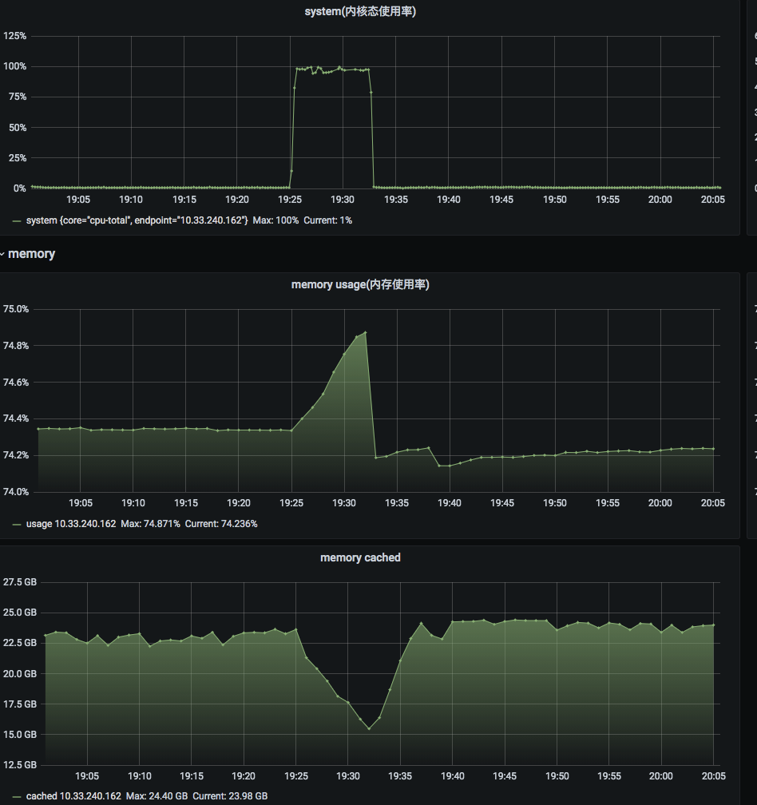
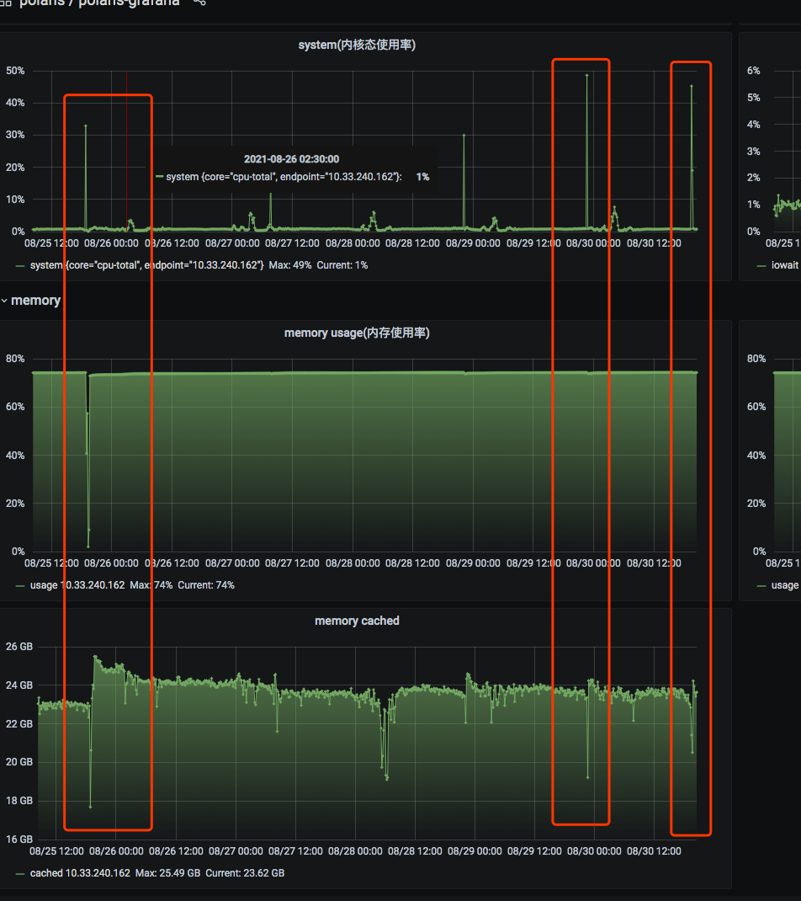

## 一、现象

大数据同学管理的ES集群突然某个节点hung导致集群不可用，引发线上故障。排查了快一周没定位到问题，一周后同样的问题再次出现。
于是大数据负责人找到我们SRE协助他们一起排查问题。

## 二、问题排查

第二次ES集群出现问题，线上和上次一样也是某个节点cpu突然打满，然后集群不可用。因为对ES了解不太多，所以大数据同学还是根据ES相关的日志和sql
去分析是不是有什么大请求导致的。而我则从机器纬度去分析，引起这个节点不可用的原因是什么。

首先从监控看这个节点突然cpu内核态打满，然后持续了一段时间，当时据说这个节点已经无法登陆，所以直接重启了，现场也没了。

当然我们首先排除了硬件本身的问题cpu/磁盘/内存，硬件检测都是正常的。那从系统来分析system高一般有几种情况:
- io瓶颈导致内核态数据拷贝慢进而导致
- 系统进程太多，cpu争抢
- 内存回收

当时我们也是系统指标挨个分析后，最后发现是内存的指标有异常，发生了大量cache回收:

在拉出历史的数据进行确认：历史上每次system打高，都伴随着cache突然回收。那从这里基本断定，就是内存不足导致cpu system打高，进而影响集群。
从这开始我们就已经找到方向了，这个问题和内存有关系，接下来就继续分析，为什么从某天开始就逐渐发生这个问题呢？

http://docs.vdian.net/pages/viewpage.action?pageId=122488778

