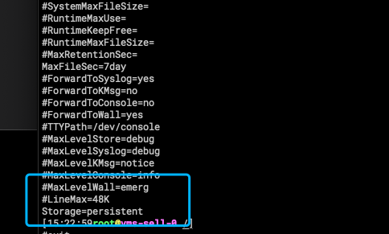

## 一、现象

业务容器中的应用突然就挂了，然后并未找到什么问题，于是找我们协助排查
 
>- 这里插一句，我们对于容器的使用比较特殊，是富容器的用法，一个容器会起多个进程，虽然不是太云原生，但是也是要在公司兼容老的一些系统的一种折衷方案吧。我们容器中的一号进程是systemd

## 二、问题排查

遇到这个问题第一反应就是oom了，于是去看了下内核日志：


分析了一下oom的dump,计算rss（需要*4，因为是rss是按照4k一个page去分配的） 这一列相加 大概是6G，这个数据和监控也符合大概75%的实际使用率(容器分配的是8G)。


但是这个应用分配的内存是8g为啥，实际用了6g就触发oom kill呢？

首先我们监控系统的容器内存使用率算法：container_memory_usage_bytes - container_memory_cache, 这个算出来和rss是基本一致的，从这个角度看没什么问题

但是容器中计算内存oom的是container_memory_working_set_bytes这个指标 。通过查询文档
https://faun.pub/how-much-is-too-much-the-linux-oomkiller-and-used-memory-d32186f29c9d


那我们看看当时这个指标使用的量是多少：


通过查看这个指标我们发现，容器整体内存已经8G了，如果oom以这个为依据确实会触发oom！

那这里还有个问题，就是cache里到底被什么占用了，为什么cache这么大：在进程挂掉之后，还是有2g的cache。


drop cache后发现这部分cache还是存在。
```shell
echo 3 > /proc/sys/vm/drop_caches
```

在之前的文章<<深入理解cache>>中，我们知道cache是怎么产生的，有文件页，匿名页面，当然还有一些无法直接回收的内存。
于是便开始检查：
发现挂载了一个tmpfs类型的目录。


看到这里那就知道这部分cache占用应该就是这个tmpfs导致的了，那这个tmpfs里面又是谁在用呢？

罪魁祸首就是journal了～


容器中journal的配置：


```shell
Storage=
在哪里存储日志文件： "volatile" 表示仅保存在内存中， 也就是仅保存在 /run/log/journal 目录中(将会被自动按需创建)。 
"persistent" 表示优先保存在磁盘上， 也就优先保存在 /var/log/journal 目录中(将会被自动按需创建)， 但若失败(例如在系统启动早期"/var"尚未挂载)，
则转而保存在 /run/log/journal 目录中(将会被自动按需创建)。 "auto"(默认值) 与 "persistent" 类似， 但不自动创建 /var/log/journal 目录， 
因此可以根据该目录的存在与否决定日志的保存位置。 "none" 表示不保存任何日志(直接丢弃所有收集到的日志)， 但日志转发(见下文)不受影响。 默认值是 "auto"
```

改成：



## 三、解决方案

对journal增加配置:Storage=persistent

至此问题解决，后续也未出现此类问题了～