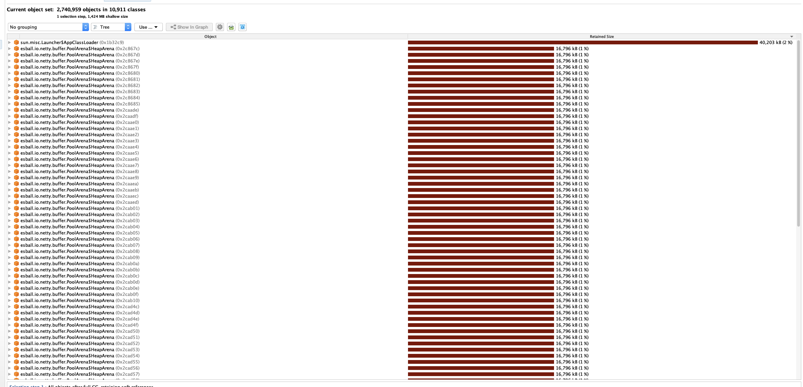
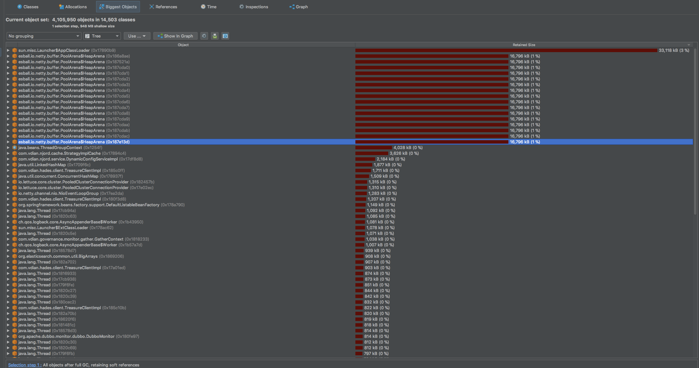
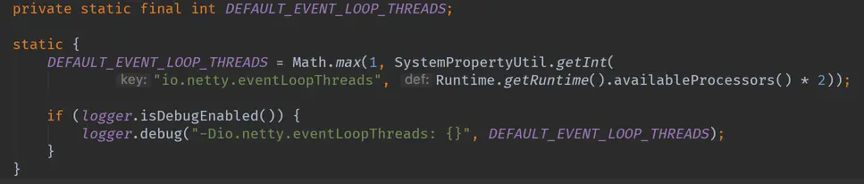

## 1.现象
业务容器化后rt从200ms上涨至400多ms，翻了将近一倍

## 2.问题排查
rt上涨原因是应用一直fullgc

gc日志：
```
Java HotSpot(TM) 64-Bit Server VM (25.121-b13) for linux-amd64 JRE (1.8.0_121-b13), built on Dec 12 2016 16:36:53 by "java_re" with gcc 4.3.0 20080428 (Red Hat 4.3.0-8)
Memory: 4k page, physical 17825792k(24917156k free), swap 0k(0k free)
CommandLine flags: -XX:+CMSClassUnloadingEnabled -XX:CMSInitiatingOccupancyFraction=60 -XX:+CMSParallelRemarkEnabled -XX:ConcGCThreads=4 -XX:+DisableExplicitGC -XX:+HeapDumpOnOutOfMemoryError -XX:HeapDumpPath=/home/www/njord/logs/java.hprof -XX:InitialHeapSize=10737418240 -XX:+ManagementServer -XX:MaxHeapSize=10737418240 -XX:MaxMetaspaceFreeRatio=100 -XX:MaxMetaspaceSize=2147483648 -XX:MaxNewSize=8589934592 -XX:MetaspaceSize=2147483648 -XX:MinMetaspaceFreeRatio=0 -XX:NewSize=8589934592 -XX:OldPLABSize=16 -XX:-OmitStackTraceInFastThrow -XX:ParallelGCThreads=8 -XX:+PrintGC -XX:+PrintGCDateStamps -XX:+PrintGCDetails -XX:+PrintGCTimeStamps -XX:SoftRefLRUPolicyMSPerMB=0 -XX:SurvivorRatio=8 -XX:+UseCMSCompactAtFullCollection -XX:+UseCompressedClassPointers -XX:+UseCompressedOops -XX:+UseConcMarkSweepGC -XX:+UseParNewGC
2020-06-30T15:11:30.700+0800: 5.942: [GC (Allocation Failure) 2020-06-30T15:11:30.700+0800: 5.942: [ParNew: 6710912K->64573K(7549760K), 0.0732810 secs] 6710912K->64573K(9646912K), 0.0734148 secs] [Times: user=0.23 sys=0.04, real=0.07 secs]
2020-06-30T15:11:35.976+0800: 11.218: [GC (Allocation Failure) 2020-06-30T15:11:35.976+0800: 11.218: [ParNew: 6775485K->95117K(7549760K), 0.0464731 secs] 6775485K->95117K(9646912K), 0.0468707 secs] [Times: user=0.26 sys=0.04, real=0.04 secs]
2020-06-30T15:12:01.425+0800: 36.667: [GC (Allocation Failure) 2020-06-30T15:12:01.426+0800: 36.667: [ParNew: 6806029K->193105K(7549760K), 0.0795802 secs] 6806029K->193105K(9646912K), 0.0808266 secs] [Times: user=0.35 sys=0.04, real=0.08 secs]
2020-06-30T15:12:28.575+0800: 63.816: [GC (Allocation Failure) 2020-06-30T15:12:28.575+0800: 63.817: [ParNew: 6904017K->266207K(7549760K), 0.0907465 secs] 6904017K->266207K(9646912K), 0.0924254 secs] [Times: user=0.43 sys=0.06, real=0.10 secs]
2020-06-30T15:12:47.983+0800: 83.224: [GC (Allocation Failure) 2020-06-30T15:12:47.983+0800: 83.225: [ParNew: 6977119K->838848K(7549760K), 0.1981040 secs] 6977119K->1178384K(9646912K), 0.1994382 secs] [Times: user=0.74 sys=0.50, real=0.20 secs]
2020-06-30T15:13:26.334+0800: 121.576: [GC (Allocation Failure) 2020-06-30T15:13:26.335+0800: 121.577: [ParNew: 7549760K->408397K(7549760K), 0.7427499 secs] 7889296K->1515354K(9646912K), 0.7442896 secs] [Times: user=2.28 sys=0.79, real=0.75 secs]
2020-06-30T15:13:27.085+0800: 122.327: [GC (CMS Initial Mark) [1 CMS-initial-mark: 1106957K(2097152K)] 1516290K(9646912K), 0.0168823 secs] [Times: user=0.07 sys=0.01, real=0.01 secs]
2020-06-30T15:13:27.103+0800: 122.345: [CMS-concurrent-mark-start]
2020-06-30T15:13:27.187+0800: 122.429: [CMS-concurrent-mark: 0.079/0.084 secs] [Times: user=0.62 sys=0.07, real=0.09 secs]
2020-06-30T15:13:27.188+0800: 122.429: [CMS-concurrent-preclean-start]
2020-06-30T15:13:27.204+0800: 122.445: [CMS-concurrent-preclean: 0.016/0.016 secs] [Times: user=0.05 sys=0.00, real=0.01 secs]
2020-06-30T15:13:27.204+0800: 122.446: [CMS-concurrent-abortable-preclean-start]
2020-06-30T15:13:29.632+0800: 124.874: [CMS-concurrent-abortable-preclean: 2.405/2.428 secs] [Times: user=3.26 sys=0.09, real=2.43 secs]
2020-06-30T15:13:29.639+0800: 124.881: [GC (CMS Final Remark) [YG occupancy: 995777 K (7549760 K)]2020-06-30T15:13:29.639+0800: 124.881: [Rescan (parallel) , 0.0358703 secs]2020-06-30T15:13:29.675+0800: 124.917: [weak refs processing, 0.0013830 secs]2020-06-30T15:13:29.676+0800: 124.918: [class unloading, 0.0639530 secs]2020-06-30T15:13:29.740+0800: 124.982: [scrub symbol table, 0.0264536 secs]2020-06-30T15:13:29.767+0800: 125.009: [scrub string table, 0.0027446 secs][1 CMS-remark: 1106957K(2097152K)] 2102735K(9646912K), 0.1480645 secs] [Times: user=0.39 sys=0.00, real=0.15 secs]
2020-06-30T15:13:29.788+0800: 125.030: [CMS-concurrent-sweep-start]
2020-06-30T15:13:29.859+0800: 125.100: [CMS-concurrent-sweep: 0.071/0.071 secs] [Times: user=0.31 sys=0.01, real=0.07 secs]
2020-06-30T15:13:29.859+0800: 125.101: [CMS-concurrent-reset-start]
2020-06-30T15:13:29.874+0800: 125.116: [CMS-concurrent-reset: 0.015/0.015 secs] [Times: user=0.01 sys=0.01, real=0.02 secs]
2020-06-30T15:13:31.879+0800: 127.121: [GC (CMS Initial Mark) [1 CMS-initial-mark: 1074664K(2097152K)] 2789738K(9646912K), 0.0587830 secs] [Times: user=0.42 sys=0.00, real=0.06 secs]
2020-06-30T15:13:31.939+0800: 127.181: [CMS-concurrent-mark-start]
2020-06-30T15:13:31.999+0800: 127.240: [CMS-concurrent-mark: 0.059/0.059 secs] [Times: user=0.23 sys=0.00, real=0.06 secs]
2020-06-30T15:13:31.999+0800: 127.241: [CMS-concurrent-preclean-start]
2020-06-30T15:13:32.019+0800: 127.261: [CMS-concurrent-preclean: 0.019/0.020 secs] [Times: user=0.02 sys=0.00, real=0.02 secs]
2020-06-30T15:13:32.020+0800: 127.261: [CMS-concurrent-abortable-preclean-start]
2020-06-30T15:13:32.020+0800: 127.261: [CMS-concurrent-abortable-preclean: 0.000/0.000 secs] [Times: user=0.00 sys=0.00, real=0.00 secs]
2020-06-30T15:13:32.025+0800: 127.266: [GC (CMS Final Remark) [YG occupancy: 1715074 K (7549760 K)]2020-06-30T15:13:32.025+0800: 127.267: [Rescan (parallel) , 0.0622869 secs]2020-06-30T15:13:32.087+0800: 127.329: [weak refs processing, 0.0005263 secs]2020-06-30T15:13:32.088+0800: 127.330: [class unloading, 0.0568250 secs]2020-06-30T15:13:32.145+0800: 127.386: [scrub symbol table, 0.0246570 secs]2020-06-30T15:13:32.169+0800: 127.411: [scrub string table, 0.0022832 secs][1 CMS-remark: 1074664K(2097152K)] 2789738K(9646912K), 0.1478591 secs] [Times: user=0.57 sys=0.00, real=0.14 secs]
2020-06-30T15:13:32.174+0800: 127.415: [CMS-concurrent-sweep-start]
2020-06-30T15:13:32.239+0800: 127.481: [CMS-concurrent-sweep: 0.066/0.066 secs] [Times: user=0.14 sys=0.02, real=0.07 secs]
2020-06-30T15:13:32.240+0800: 127.481: [CMS-concurrent-reset-start]
2020-06-30T15:13:32.245+0800: 127.486: [CMS-concurrent-reset: 0.005/0.005 secs] [Times: user=0.00 sys=0.00, real=0.01 secs]
```

应用jvm参数如下(截取部分性能相关参数)

```
/opt/vdian/java/bin/java -server -Xms10g -Xmx10g -Xmn8g -XX:MetaspaceSize=2g -XX:MaxMetaspaceSize=2g -XX:MinMetaspaceFreeRatio=0 -XX:MaxMetaspaceFreeRatio=100 -XX:+UseConcMarkSweepGC -XX:+UseCMSCompactAtFullCollection -XX:CMSInitiatingOccupancyFraction=75 -XX:+CMSParallelRemarkEnabled -XX:SoftRefLRUPolicyMSPerMB=0 -XX:+CMSClassUnloadingEnabled -XX:SurvivorRatio=8 -XX:+DisableExplicitGC
```

开始以为是gc线程数的问题，因为知道容器中jvm会拿物理机的cpu作为gc的线程数，-XX:ParallelGCThreads=8 -XX:ConcGCThreads=4 。设置后发现问题依旧。

dump容器中的进程进行分析:
```
jmap -dump:format=b,file=njorddump 4661
```

通过jprofiler打开dump：es创建的netty线程是64个，每个大小是16M，16*64=1G，这个就是一直fullgc的罪魁祸首



在dump kvm中的应用内存，进行分析，es创建的netty线程是16个，每个大小是16M，16*16=256M


对比docker和kvm的dump，docker中的线程内存大小是正常的，不正常的是数量，同样是分配8c16g的kvm和docker，为啥docker是64个，而kvm是16？
这个数字太有规律，kvm 是 2 * 8 (kvm 是8c16g)，docker是 2 * 32(容器分配的是8c，但是容器里的cpu是物理机的32c)，

[netty默认创建线程的方法](https://www.jianshu.com/p/512e983eedf5)：Runtime.getRuntime().availableProcessors()这个方法默认拿到的是物理机的核数。


至此问题已经比较明朗了，就是因为es调用的netty库所设置的线程过大，导致内存被占满。

## 解决方法
- 1.临时规避方案，调大应用old区，或者调大触发fullgc的临界点，经测试rt很正常
- 2.彻底解决的话还是容器可以返回实际的cpu个数
- 3.升级jdk(高版本jdk可以自动识别容器中的cpu核数据)