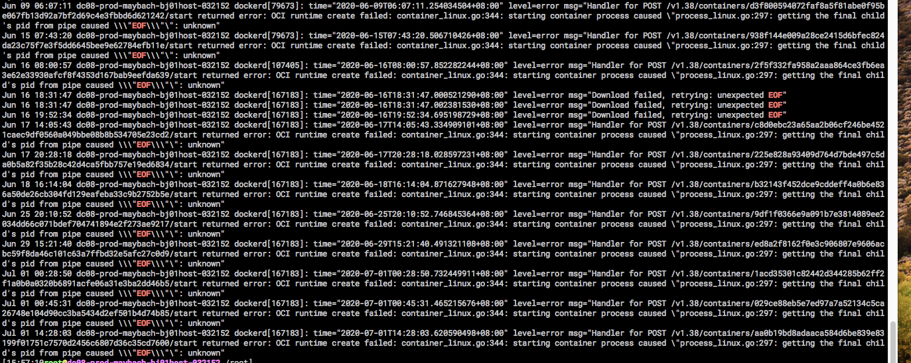

## 线上发现部分容器处于ContainerCreating状态:


### 查看kubelet日志：
```shell
[root@dc07-prod-k8s-node /root] journalctl -u  kubelet
Jul 01 00:45:30 prod-k8s-node kubelet[12227]: I0701 00:45:30.491326   12227 kubelet.go:1908] SyncLoop (ADD, "api"): "turing-schedule-46-20200701004530-zhq44_job-app(1bcd0d00-baf1-11ea-88c6-0242c0219250)"
Jul 01 00:45:30 prod-k8s-node kubelet[12227]: I0701 00:45:30.630571   12227 reconciler.go:207] operationExecutor.VerifyControllerAttachedVolume started for volume "default-token-f5prz" (UniqueName: "kubernetes.io/secret/1bcd0d00-baf1-11ea-88c6-0242c0219250-default-token-f5prz") pod "turing-schedule-46-20200701004530-zhq44" (UID: "1bcd0d00-baf1-11ea-88c6-0242c0219250")
Jul 01 00:45:30 prod-k8s-node kubelet[12227]: I0701 00:45:30.730839   12227 reconciler.go:252] operationExecutor.MountVolume started for volume "default-token-f5prz" (UniqueName: "kubernetes.io/secret/1bcd0d00-baf1-11ea-88c6-0242c0219250-default-token-f5prz") pod "turing-schedule-46-20200701004530-zhq44" (UID: "1bcd0d00-baf1-11ea-88c6-0242c0219250")
Jul 01 00:45:30 prod-k8s-node kubelet[12227]: I0701 00:45:30.746320   12227 operation_generator.go:571] MountVolume.SetUp succeeded for volume "default-token-f5prz" (UniqueName: "kubernetes.io/secret/1bcd0d00-baf1-11ea-88c6-0242c0219250-default-token-f5prz") pod "turing-schedule-46-20200701004530-zhq44" (UID: "1bcd0d00-baf1-11ea-88c6-0242c0219250")
Jul 01 00:45:30 prod-k8s-node kubelet[12227]: W0701 00:45:30.827719   12227 kubelet_pods.go:832] Unable to retrieve pull secret job-app/harbor-secret for job-app/turing-schedule-46-20200701004530-zhq44 due to secret "harbor-secret" not found.  The image pull may not succeed.
Jul 01 00:45:30 prod-k8s-node kubelet[12227]: I0701 00:45:30.827755   12227 kuberuntime_manager.go:397] No sandbox for pod "turing-schedule-46-20200701004530-zhq44_job-app(1bcd0d00-baf1-11ea-88c6-0242c0219250)" can be found. Need to start a new one
Jul 01 00:45:31 prod-k8s-node kubelet[12227]: E0701 00:45:31.465721   12227 remote_runtime.go:96] RunPodSandbox from runtime service failed: rpc error: code = Unknown desc = failed to start sandbox container for pod "turing-schedule-46-20200701004530-zhq44": Error response from daemon: OCI runtime create failed: container_linux.go:344: starting container process caused "process_linux.go:297: getting the final child's pid from pipe caused \"EOF\"": unknown
Jul 01 00:45:31 prod-k8s-node kubelet[12227]: E0701 00:45:31.465799   12227 kuberuntime_sandbox.go:68] CreatePodSandbox for pod "turing-schedule-46-20200701004530-zhq44_job-app(1bcd0d00-baf1-11ea-88c6-0242c0219250)" failed: rpc error: code = Unknown desc = failed to start sandbox container for pod "turing-schedule-46-20200701004530-zhq44": Error response from daemon: OCI runtime create failed: container_linux.go:344: starting container process caused "process_linux.go:297: getting the final child's pid from pipe caused \"EOF\"": unknown
Jul 01 00:45:31 prod-k8s-node kubelet[12227]: E0701 00:45:31.465827   12227 kuberuntime_manager.go:662] createPodSandbox for pod "turing-schedule-46-20200701004530-zhq44_job-app(1bcd0d00-baf1-11ea-88c6-0242c0219250)" failed: rpc error: code = Unknown desc = failed to start sandbox container for pod "turing-schedule-46-20200701004530-zhq44": Error response from daemon: OCI runtime create failed: container_linux.go:344: starting container process caused "process_linux.go:297: getting the final child's pid from pipe caused \"EOF\"": unknown
Jul 01 00:45:31 prod-k8s-node kubelet[12227]: E0701 00:45:31.465926   12227 pod_workers.go:190] Error syncing pod 1bcd0d00-baf1-11ea-88c6-0242c0219250 ("turing-schedule-46-20200701004530-zhq44_job-app(1bcd0d00-baf1-11ea-88c6-0242c0219250)"), skipping: failed to "CreatePodSandbox" for "turing-schedule-46-20200701004530-zhq44_job-app(1bcd0d00-baf1-11ea-88c6-0242c0219250)" with CreatePodSandboxError: "CreatePodSandbox for pod \"turing-schedule-46-20200701004530-zhq44_job-app(1bcd0d00-baf1-11ea-88c6-0242c0219250)\" failed: rpc error: code = Unknown desc = failed to start sandbox container for pod \"turing-schedule-46-20200701004530-zhq44\": Error response from daemon: OCI runtime create failed: container_linux.go:344: starting container process caused \"process_linux.go:297: getting the final child's pid from pipe caused \\\"EOF\\\"\": unknown"
Jul 01 00:45:31 prod-k8s-node kubelet[12227]: I0701 00:45:31.763364   12227 kubelet.go:1953] SyncLoop (PLEG): "turing-schedule-46-20200701004530-zhq44_job-app(1bcd0d00-baf1-11ea-88c6-0242c0219250)", event: &pleg.PodLifecycleEvent{ID:"1bcd0d00-baf1-11ea-88c6-0242c0219250", Type:"ContainerDied", Data:"029ce88eb5e7ed97a7a52134c5ca26748e104d90cc3ba5434d2ef501b4d74b85"}
 
ul 01 00:45:31 prod-k8s-node kubelet[12227]: W0701 00:45:31.763881   12227 kubelet_pods.go:832] Unable to retrieve pull secret job-app/harbor-secret for job-app/turing-schedule-46-20200701004530-zhq44 due to secret "harbor-secret" not found.  The image pull may not succeed.
Jul 01 00:45:31 prod-k8s-node kubelet[12227]: I0701 00:45:31.763906   12227 kuberuntime_manager.go:415] No ready sandbox for pod "turing-schedule-46-20200701004530-zhq44_job-app(1bcd0d00-baf1-11ea-88c6-0242c0219250)" can be found. Need to start a new one
Jul 01 00:47:01 prod-k8s-node kubelet[12227]: W0701 00:47:01.244960   12227 kubelet_pods.go:832] Unable to retrieve pull secret job-app/harbor-secret for job-app/turing-schedule-46-20200701004530-zhq44 due to secret "harbor-secret" not found.  The image pull may not succeed.
Jul 01 00:47:01 prod-k8s-node kubelet[12227]: I0701 00:47:01.244995   12227 kuberuntime_manager.go:415] No ready sandbox for pod "turing-schedule-46-20200701004530-zhq44_job-app(1bcd0d00-baf1-11ea-88c6-0242c0219250)" can be found. Need to start a new one
Jul 01 00:48:06 prod-k8s-node kubelet[12227]: W0701 00:48:06.244845   12227 kubelet_pods.go:832] Unable to retrieve pull secret job-app/harbor-secret for job-app/turing-schedule-46-20200701004530-zhq44 due to secret "harbor-secret" not found.  The image pull may not succeed.
Jul 01 00:48:06 prod-k8s-node kubelet[12227]: I0701 00:48:06.244894   12227 kuberuntime_manager.go:415] No ready sandbox for pod "turing-schedule-46-20200701004530-zhq44_job-app(1bcd0d00-baf1-11ea-88c6-0242c0219250)" can be found. Need to start a new one
Jul 01 00:49:28 prod-k8s-node kubelet[12227]: W0701 00:49:28.244879   12227 kubelet_pods.go:832] Unable to retrieve pull secret job-app/harbor-secret for job-app/turing-schedule-46-20200701004530-zhq44 due to secret "harbor-secret" not found.  The image pull may not succeed.
Jul 01 00:49:28 prod-k8s-node kubelet[12227]: I0701 00:49:28.244923   12227 kuberuntime_manager.go:415] No ready sandbox for pod "turing-schedule-46-20200701004530-zhq44_job-app(1bcd0d00-baf1-11ea-88c6-0242c0219250)" can be found. Need to start a new one
Jul 01 00:50:40 prod-k8s-node kubelet[12227]: W0701 00:50:40.244817   12227 kubelet_pods.go:832] Unable to retrieve pull secret job-app/harbor-secret for job-app/turing-schedule-46-20200701004530-zhq44 due to secret "harbor-secret" not found.  The image pull may not succeed.
Jul 01 00:50:40 prod-k8s-node kubelet[12227]: I0701 00:50:40.244856   12227 kuberuntime_manager.go:415] No ready sandbox for pod "turing-schedule-46-20200701004530-zhq44_job-app(1bcd0d00-baf1-11ea-88c6-0242c0219250)" can be found. Need to start a new one
       
Jul 01 09:35:16 prod-k8s-node kubelet[12227]: I0701 09:35:16.703048   12227 kubelet.go:1924] SyncLoop (DELETE, "api"): "turing-schedule-46-20200701004530-zhq44_job-app(1bcd0d00-baf1-11ea-88c6-0242c0219250)"
Jul 01 09:35:23 prod-k8s-node kubelet[12227]: I0701 09:35:23.265724   12227 kubelet.go:1924] SyncLoop (DELETE, "api"): "turing-schedule-46-20200701004530-zhq44_job-app(1bcd0d00-baf1-11ea-88c6-0242c0219250)"
Jul 01 09:35:23 prod-k8s-node kubelet[12227]: I0701 09:35:23.269859   12227 kubelet.go:1918] SyncLoop (REMOVE, "api"): "turing-schedule-46-20200701004530-zhq44_job-app(1bcd0d00-baf1-11ea-88c6-0242c0219250)"
Jul 01 09:35:23 prod-k8s-node kubelet[12227]: I0701 09:35:23.269914   12227 kubelet.go:2120] Failed to delete pod "turing-schedule-46-20200701004530-zhq44_job-app(1bcd0d00-baf1-11ea-88c6-0242c0219250)", err: pod not found
```

## 日志分析&&流程创建pod流程：

#### 1.该pod已成功被schduler调度，bind成功，kubelet监听到该事件开始启动
```shell
Jul 01 00:45:30 prod-k8s-node kubelet[12227]: I0701 00:45:30.491326   12227 kubelet.go:1908] SyncLoop (ADD, "api"): "turing-schedule-46-20200701004530-zhq44_job-app(1bcd0d00-baf1-11ea-88c6-0242c0219250)"
```

#### 2.kuberruntiem_manager判断该pod不存在开始创建
```shell
Jul 01 00:45:30 prod-k8s-node kubelet[12227]: I0701 00:45:30.827755   12227 kuberuntime_manager.go:397] No sandbox for pod "turing-schedule-46-20200701004530-zhq44_job-app(1bcd0d00-baf1-11ea-88c6-0242c0219250)" can be found. Need to start a new one
```

#### 3.创建pod都通过Syncpod方法，此方法分6个步骤，第一步去检查pod 和container的状态是否有变化。这个pod都是卡在第一步。

*   // 1. Compute sandbox and container changes.
*   // 2. Kill pod sandbox if necessary.
*   // 3. Kill any containers that should not be running.
*   // 4. Create sandbox if necessary.
*   // 5. Create ephemeral containers.
*   // 6. Create init containers.
*   // 7. Create normal containers.


第一次检查发现此pod的sandbox(应该就是default)没有，开始去创建


调用RunPodSandbox方法返回了错误，这个错误应该是docker返回的


kubelet后来发现这个pod还是没创建成功，一直在重试，但是每次检查的时候发现pod sandboxstatus不是ready状态然后一直重试，直到pod被删掉。


为啥create sandbox失败：
```shell
Jul 01 00:45:31 kubelet[12227]: E0701 00:45:31.465799   12227 kuberuntime_sandbox.go:68] CreatePodSandbox for pod "turing-schedule-46-20200701004530-zhq44_job-app(1bcd0d00-baf1-11ea-88c6-0242c0219250)" failed: rpc error: code = Unknown desc = failed to start sandbox container for pod "turing-schedule-46-20200701004530-zhq44": Error response from daemon: OCI runtime create failed: container_linux.go:344: starting container process caused "process_linux.go:297: getting the final child's pid from pipe caused \"EOF\"": unknown
```

这个pid是啥？为啥获取pid失败


看下docker日志：
```shell
journalctl -u  docker
```



最后在宿主机内核日志/var/log/messages:
```shell
Jul  1 00:45:31 prod-k8s-node kernel: XFS (dm-7): Mounting V4 Filesystem
Jul  1 00:45:31 prod-k8s-node kernel: XFS (dm-7): Ending clean mount
Jul  1 00:45:31 prod-k8s-node containerd: time="2020-07-01T00:45:31.017497700+08:00" level=info msg="shim containerd-shim started" address="/containerd-shim/moby/029ce88eb5e7ed97a7a52134c5ca26748e104d90cc3ba5434d2ef501b4d74b85/shim.sock" debug=false pid=70605
Jul  1 00:45:31 prod-k8s-node kernel: audit_printk_skb: 41 callbacks suppressed
Jul  1 00:45:31 prod-k8s-node kernel: type=1300 audit(1593535531.190:204484613): arch=c000003e syscall=42 success=yes exit=0 a0=4 a1=7ffdc10b1050 a2=6e a3=40 items=1 ppid=12169 pid=70954 auid=4294967295 uid=0 gid=0 euid=0 suid=0 fsuid=0 egid=0 sgid=0 fsgid=0 tty=(none) ses=4294967295 comm="ipset" exe="/usr/sbin/ipset" key="external-access"
Jul  1 00:45:31 prod-k8s-node kernel: type=1306 audit(1593535531.190:204484613): saddr=01002F7661722F72756E2F6E7363642F736F636B65740000BD7753B9617F000030CDF6B8617F0000805C53B9617F000000000000010000002C0000000100000078C3F6B8617F000018120BC1FD7F0000F0110BC1FD7F00000100000000000000088D95B9617F0000B02998B9617F
Jul  1 00:45:31 prod-k8s-node kernel: type=1307 audit(1593535531.190:204484613):  cwd="/var/lib/kube-proxy"
Jul  1 00:45:31 prod-k8s-node kernel: type=1302 audit(1593535531.190:204484613): item=0 name="/var/run/nscd/socket" inode=45132 dev=00:14 mode=0140666 ouid=0 ogid=0 rdev=00:00 objtype=NORMAL cap_fp=0000000000000000 cap_fi=0000000000000000 cap_fe=0 cap_fver=0
Jul  1 00:45:31 prod-k8s-node kernel: type=1327 audit(1593535531.190:204484613): proctitle=697073657400637265617465004B5542452D4E4F44452D504F52542D4C4F43414C2D53435450006269746D61703A706F72740072616E676500302D3635353335002D6578697374
Jul  1 00:45:31 prod-k8s-node kernel: type=1300 audit(1593535531.190:204484614): arch=c000003e syscall=42 success=yes exit=0 a0=4 a1=7ffdc10b11c0 a2=6e a3=0 items=1 ppid=12169 pid=70954 auid=4294967295 uid=0 gid=0 euid=0 suid=0 fsuid=0 egid=0 sgid=0 fsgid=0 tty=(none) ses=4294967295 comm="ipset" exe="/usr/sbin/ipset" key="external-access"
Jul  1 00:45:31 prod-k8s-node kernel: type=1306 audit(1593535531.190:204484614): saddr=01002F7661722F72756E2F6E7363642F736F636B65740000E0E917B9617F000010130BC1FD7F000000130BC1FD7F00000E00000000000000FBBC76B9617F00000000000000000000F08C95B9617F0000202B98B9617F0000337353B9617F0000782D18B9617F0000F85953B9617F
Jul  1 00:45:31 prod-k8s-node kernel: type=1307 audit(1593535531.190:204484614):  cwd="/var/lib/kube-proxy"
Jul  1 00:45:31 prod-k8s-node kernel: type=1302 audit(1593535531.190:204484614): item=0 name="/var/run/nscd/socket" inode=45132 dev=00:14 mode=0140666 ouid=0 ogid=0 rdev=00:00 objtype=NORMAL cap_fp=0000000000000000 cap_fi=0000000000000000 cap_fe=0 cap_fver=0
Jul  1 00:45:31 prod-k8s-node kernel: type=1327 audit(1593535531.190:204484614): proctitle=697073657400637265617465004B5542452D4E4F44452D504F52542D4C4F43414C2D53435450006269746D61703A706F72740072616E676500302D3635353335002D6578697374
Jul  1 00:45:31 prod-k8s-node kernel: runc:[1:CHILD]: page allocation failure: order:5, mode:0x10c0d0
Jul  1 00:45:31 prod-k8s-node kernel: CPU: 27 PID: 70623 Comm: runc:[1:CHILD] Kdump: loaded Tainted: P        W  OE  ------------   3.10.0-957.1.3.el7.x86_64 #1
Jul  1 00:45:31 prod-k8s-node kernel: Hardware name: Dell Inc. PowerEdge T630/0NT78X, BIOS 2.1.5 04/13/2016
Jul  1 00:45:31 prod-k8s-node kernel: Call Trace:
Jul  1 00:45:31 prod-k8s-node kernel: [<ffffffff9f161e41>] dump_stack+0x19/0x1b
Jul  1 00:45:31 prod-k8s-node kernel: [<ffffffff9ebbcaa0>] warn_alloc_failed+0x110/0x180
Jul  1 00:45:31 prod-k8s-node kernel: [<ffffffff9f15d44e>] __alloc_pages_slowpath+0x6b6/0x724
Jul  1 00:45:31 prod-k8s-node kernel: [<ffffffff9ebc1105>] __alloc_pages_nodemask+0x405/0x420
Jul  1 00:45:31 prod-k8s-node kernel: [<ffffffff9ec0df68>] alloc_pages_current+0x98/0x110
Jul  1 00:45:31 prod-k8s-node kernel: [<ffffffff9ebbb84e>] __get_free_pages+0xe/0x40
Jul  1 00:45:31 prod-k8s-node kernel: [<ffffffff9ec195fe>] kmalloc_order_trace+0x2e/0xa0
Jul  1 00:45:31 prod-k8s-node kernel: [<ffffffff9ec1d641>] __kmalloc+0x211/0x230
Jul  1 00:45:31 prod-k8s-node kernel: [<ffffffff9ec30b41>] ? __memcg_kmem_get_cache+0x111/0x150
Jul  1 00:45:31 prod-k8s-node kernel: [<ffffffff9ec35d59>] memcg_alloc_cache_params+0xb9/0xe0
Jul  1 00:45:31 prod-k8s-node kernel: [<ffffffff9ebdc05f>] kmem_cache_create_memcg+0x12f/0x280
Jul  1 00:45:31 prod-k8s-node kernel: [<ffffffff9ebdc1db>] kmem_cache_create+0x2b/0x30
Jul  1 00:45:31 prod-k8s-node kernel: [<ffffffffc05099a1>] nf_conntrack_init_net+0xf1/0x260 [nf_conntrack]
Jul  1 00:45:31 prod-k8s-node kernel: [<ffffffffc050a2a4>] nf_conntrack_pernet_init+0x14/0x150 [nf_conntrack]
Jul  1 00:45:31 prod-k8s-node kernel: [<ffffffff9f02de14>] ops_init+0x44/0x150
Jul  1 00:45:31 prod-k8s-node kernel: [<ffffffff9f02dfc3>] setup_net+0xa3/0x160
Jul  1 00:45:31 prod-k8s-node kernel: [<ffffffff9f02e765>] copy_net_ns+0xb5/0x180
Jul  1 00:45:31 prod-k8s-node kernel: [<ffffffff9eac6e39>] create_new_namespaces+0xf9/0x180
Jul  1 00:45:31 prod-k8s-node kernel: [<ffffffff9eac707a>] unshare_nsproxy_namespaces+0x5a/0xc0
Jul  1 00:45:31 prod-k8s-node kernel: [<ffffffff9ea96b83>] SyS_unshare+0x173/0x2e0
Jul  1 00:45:31 prod-k8s-node kernel: [<ffffffff9f174ddb>] system_call_fastpath+0x22/0x27
Jul  1 00:45:31 prod-k8s-node kernel: Mem-Info:
Jul  1 00:45:31 prod-k8s-node kernel: active_anon:2546346 inactive_anon:572484 isolated_anon:0#012 active_file:7067019 inactive_file:17395991 isolated_file:0#012 unevictable:0 dirty:2114 writeback:0 unstable:0#012 slab_reclaimable:3007725 slab_unreclaimable:1685156#012 mapped:52955 shmem:1082115 pagetables:8444 bounce:0#012 free:115901 free_pcp:2004 free_cma:0
Jul  1 00:45:31 prod-k8s-node kernel: Node 0 DMA free:15188kB min:8kB low:8kB high:12kB active_anon:0kB inactive_anon:0kB active_file:0kB inactive_file:0kB unevictable:0kB isolated(anon):0kB isolated(file):0kB present:15980kB managed:15896kB mlocked:0kB dirty:0kB writeback:0kB mapped:0kB shmem:0kB slab_reclaimable:0kB slab_unreclaimable:0kB kernel_stack:0kB pagetables:0kB unstable:0kB bounce:0kB free_pcp:0kB local_pcp:0kB free_cma:0kB writeback_tmp:0kB pages_scanned:0 all_unreclaimable? yes
Jul  1 00:45:31 prod-k8s-node kernel: lowmem_reserve[]: 0 1706 64137 64137
Jul  1 00:45:31 prod-k8s-node kernel: Node 0 DMA32 free:250932kB min:1192kB low:1488kB high:1788kB active_anon:40232kB inactive_anon:62768kB active_file:161472kB inactive_file:201764kB unevictable:0kB isolated(anon):0kB isolated(file):0kB present:1985268kB managed:1747668kB mlocked:0kB dirty:4kB writeback:0kB mapped:2228kB shmem:78240kB slab_reclaimable:728060kB slab_unreclaimable:278224kB kernel_stack:864kB pagetables:276kB unstable:0kB bounce:0kB free_pcp:264kB local_pcp:0kB free_cma:0kB writeback_tmp:0kB pages_scanned:0 all_unreclaimable? no
Jul  1 00:45:31 prod-k8s-node kernel: lowmem_reserve[]: 0 0 62430 62430
Jul  1 00:45:31 prod-k8s-node kernel: Node 0 Normal free:79912kB min:43728kB low:54660kB high:65592kB active_anon:8944080kB inactive_anon:1514916kB active_file:12357144kB inactive_file:30933020kB unevictable:0kB isolated(anon):0kB isolated(file):0kB present:65011712kB managed:63932260kB mlocked:0kB dirty:6240kB writeback:0kB mapped:94620kB shmem:2631496kB slab_reclaimable:5903976kB slab_unreclaimable:3091632kB kernel_stack:16272kB pagetables:21288kB unstable:0kB bounce:0kB free_pcp:4408kB local_pcp:0kB free_cma:0kB writeback_tmp:0kB pages_scanned:0 all_unreclaimable? no
Jul  1 00:45:31 prod-k8s-node kernel: lowmem_reserve[]: 0 0 0 0
Jul  1 00:45:31 prod-k8s-node kernel: Node 1 Normal free:117572kB min:45176kB low:56468kB high:67764kB active_anon:1201072kB inactive_anon:712252kB active_file:15749460kB inactive_file:38449180kB unevictable:0kB isolated(anon):0kB isolated(file):0kB present:67108864kB managed:66044960kB mlocked:0kB dirty:2212kB writeback:0kB mapped:114972kB shmem:1618724kB slab_reclaimable:5398864kB slab_unreclaimable:3370768kB kernel_stack:8112kB pagetables:12212kB unstable:0kB bounce:0kB free_pcp:3344kB local_pcp:0kB free_cma:0kB writeback_tmp:0kB pages_scanned:0 all_unreclaimable? no
Jul  1 00:45:31 prod-k8s-node kernel: lowmem_reserve[]: 0 0 0 0
Jul  1 00:45:31 prod-k8s-node kernel: Node 0 DMA: 1*4kB (U) 0*8kB 1*16kB (U) 0*32kB 1*64kB (U) 0*128kB 1*256kB (U) 1*512kB (U) 0*1024kB 1*2048kB (M) 3*4096kB (M) = 15188kB
Jul  1 00:45:31 prod-k8s-node kernel: Node 0 DMA32: 1883*4kB (UEM) 2109*8kB (UEM) 1455*16kB (UEM) 3942*32kB (UEM) 1204*64kB (UEM) 3*128kB (E) 0*256kB 0*512kB 0*1024kB 0*2048kB 0*4096kB = 251268kB
Jul  1 00:45:31 prod-k8s-node kernel: Node 0 Normal: 7662*4kB (UE) 4239*8kB (UEM) 658*16kB (UEM) 184*32kB (UEM) 5*64kB (M) 0*128kB 0*256kB 0*512kB 0*1024kB 0*2048kB 0*4096kB = 81296kB
Jul  1 00:45:31 prod-k8s-node kernel: Node 1 Normal: 18666*4kB (UEM) 2260*8kB (UEM) 953*16kB (UEM) 267*32kB (UEM) 14*64kB (UEM) 0*128kB 0*256kB 0*512kB 0*1024kB 0*2048kB 0*4096kB = 117432kB
Jul  1 00:45:31 prod-k8s-node kernel: Node 0 hugepages_total=0 hugepages_free=0 hugepages_surp=0 hugepages_size=1048576kB
Jul  1 00:45:31 prod-k8s-node kernel: Node 0 hugepages_total=0 hugepages_free=0 hugepages_surp=0 hugepages_size=2048kB
Jul  1 00:45:31 prod-k8s-node kernel: Node 1 hugepages_total=0 hugepages_free=0 hugepages_surp=0 hugepages_size=1048576kB
Jul  1 00:45:31 prod-k8s-node kernel: Node 1 hugepages_total=0 hugepages_free=0 hugepages_surp=0 hugepages_size=2048kB
Jul  1 00:45:31 prod-k8s-node kernel: 25547922 total pagecache pages
Jul  1 00:45:31 prod-k8s-node kernel: 2677 pages in swap cache
Jul  1 00:45:31 prod-k8s-node kernel: Swap cache stats: add 26572136, delete 26568286, find 125876922/126524165
Jul  1 00:45:31 prod-k8s-node kernel: Free swap  = 10297468kB
Jul  1 00:45:31 prod-k8s-node kernel: Total swap = 10485756kB
Jul  1 00:45:31 prod-k8s-node kernel: 33530456 pages RAM
Jul  1 00:45:31 prod-k8s-node kernel: 0 pages HighMem/MovableOnly
Jul  1 00:45:31 prod-k8s-node kernel: 595260 pages reserved
Jul  1 00:45:31 prod-k8s-node kernel: kmem_cache_create(nf_conntrack_ffff9e98a3756680) failed with error -12
Jul  1 00:45:31 prod-k8s-node kernel: CPU: 27 PID: 70623 Comm: runc:[1:CHILD] Kdump: loaded Tainted: P        W  OE  ------------   3.10.0-957.1.3.el7.x86_64 #1
Jul  1 00:45:31 prod-k8s-node kernel: Hardware name: Dell Inc. PowerEdge T630/0NT78X, BIOS 2.1.5 04/13/2016
Jul  1 00:45:31 prod-k8s-node kernel: Call Trace:
Jul  1 00:45:31 prod-k8s-node kernel: [<ffffffff9f161e41>] dump_stack+0x19/0x1b
Jul  1 00:45:31 prod-k8s-node kernel: [<ffffffff9ebdc0ab>] kmem_cache_create_memcg+0x17b/0x280
Jul  1 00:45:31 prod-k8s-node kernel: [<ffffffff9ebdc1db>] kmem_cache_create+0x2b/0x30
Jul  1 00:45:31 prod-k8s-node kernel: [<ffffffffc05099a1>] nf_conntrack_init_net+0xf1/0x260 [nf_conntrack]
Jul  1 00:45:31 prod-k8s-node kernel: [<ffffffffc050a2a4>] nf_conntrack_pernet_init+0x14/0x150 [nf_conntrack]
Jul  1 00:45:31 prod-k8s-node kernel: [<ffffffff9f02de14>] ops_init+0x44/0x150
Jul  1 00:45:31 prod-k8s-node kernel: [<ffffffff9f02dfc3>] setup_net+0xa3/0x160
Jul  1 00:45:31 prod-k8s-node kernel: [<ffffffff9f02e765>] copy_net_ns+0xb5/0x180
Jul  1 00:45:31 prod-k8s-node kernel: [<ffffffff9eac6e39>] create_new_namespaces+0xf9/0x180
Jul  1 00:45:31 prod-k8s-node kernel: [<ffffffff9eac707a>] unshare_nsproxy_namespaces+0x5a/0xc0
Jul  1 00:45:31 prod-k8s-node kernel: [<ffffffff9ea96b83>] SyS_unshare+0x173/0x2e0
Jul  1 00:45:31 prod-k8s-node kernel: [<ffffffff9f174ddb>] system_call_fastpath+0x22/0x27
Jul  1 00:45:31 prod-k8s-node kernel: Unable to create nf_conn slab cache
Jul  1 00:45:31 prod-k8s-node containerd: time="2020-07-01T00:45:31.411739510+08:00" level=info msg="shim reaped" id=029ce88eb5e7ed97a7a52134c5ca26748e104d90cc3ba5434d2ef501b4d74b85
Jul  1 00:45:31 prod-k8s-node dockerd: time="2020-07-01T00:45:31.421873659+08:00" level=error msg="stream copy error: reading from a closed fifo"
Jul  1 00:45:31 prod-k8s-node dockerd: time="2020-07-01T00:45:31.421887912+08:00" level=error msg="stream copy error: reading from a closed fifo"
Jul  1 00:45:31 prod-k8s-node kernel: XFS (dm-7): Unmounting Filesystem
Jul  1 00:45:31 prod-k8s-node dockerd: time="2020-07-01T00:45:31.465146705+08:00" level=error msg="029ce88eb5e7ed97a7a52134c5ca26748e104d90cc3ba5434d2ef501b4d74b85 cleanup: failed to delete container from containerd: no such container"
Jul  1 00:45:31 prod-k8s-node dockerd: time="2020-07-01T00:45:31.465215676+08:00" level=error msg="Handler for POST /v1.38/containers/029ce88eb5e7ed97a7a52134c5ca26748e104d90cc3ba5434d2ef501b4d74b85/start returned error: OCI runtime create failed: container_linux.go:344: starting container process caused \"process_linux.go:297: getting the final child's pid from pipe caused \\\"EOF\\\"\": unknown"
Jul  1 00:45:31 prod-k8s-node kubelet: E0701 00:45:31.465721   12227 remote_runtime.go:96] RunPodSandbox from runtime service failed: rpc error: code = Unknown desc = failed to start sandbox container for pod "turing-schedule-46-20200701004530-zhq44": Error response from daemon: OCI runtime create failed: container_linux.go:344: starting container process caused "process_linux.go:297: getting the final child's pid from pipe caused \"EOF\"": unknown
Jul  1 00:45:31 prod-k8s-node kubelet: E0701 00:45:31.465799   12227 kuberuntime_sandbox.go:68] CreatePodSandbox for pod "turing-schedule-46-20200701004530-zhq44_job-app(1bcd0d00-baf1-11ea-88c6-0242c0219250)" failed: rpc error: code = Unknown desc = failed to start sandbox container for pod "turing-schedule-46-20200701004530-zhq44": Error response from daemon: OCI runtime create failed: container_linux.go:344: starting container process caused "process_linux.go:297: getting the final child's pid from pipe caused \"EOF\"": unknown
Jul  1 00:45:31 prod-k8s-node kubelet: E0701 00:45:31.465827   12227 kuberuntime_manager.go:662] createPodSandbox for pod "turing-schedule-46-20200701004530-zhq44_job-app(1bcd0d00-baf1-11ea-88c6-0242c0219250)" failed: rpc error: code = Unknown desc = failed to start sandbox container for pod "turing-schedule-46-20200701004530-zhq44": Error response from daemon: OCI runtime create failed: container_linux.go:344: starting container process caused "process_linux.go:297: getting the final child's pid from pipe caused \"EOF\"": unknown
Jul  1 00:45:31 prod-k8s-node kubelet: E0701 00:45:31.465926   12227 pod_workers.go:190] Error syncing pod 1bcd0d00-baf1-11ea-88c6-0242c0219250 ("turing-schedule-46-20200701004530-zhq44_job-app(1bcd0d00-baf1-11ea-88c6-0242c0219250)"), skipping: failed to "CreatePodSandbox" for "turing-schedule-46-20200701004530-zhq44_job-app(1bcd0d00-baf1-11ea-88c6-0242c0219250)" with CreatePodSandboxError: "CreatePodSandbox for pod \"turing-schedule-46-20200701004530-zhq44_job-app(1bcd0d00-baf1-11ea-88c6-0242c0219250)\" failed: rpc error: code = Unknown desc = failed to start sandbox container for pod \"turing-schedule-46-20200701004530-zhq44\": Error response from daemon: OCI runtime create failed: container_linux.go:344: starting container process caused \"process_linux.go:297: getting the final child's pid from pipe caused \\\"EOF\\\"\": unknown"
Jul  1 00:45:31 prod-k8s-node kubelet: W0701 00:45:31.466707   12227 container.go:409] Failed to create summary reader for "/kubepods/pod1bcd0d00-baf1-11ea-88c6-0242c0219250/029ce88eb5e7ed97a7a52134c5ca26748e104d90cc3ba5434d2ef501b4d74b85": none of the resources are being tracked.
Jul  1 00:45:31 prod-k8s-node kubelet: I0701 00:45:31.763364   12227 kubelet.go:1953] SyncLoop (PLEG): "turing-schedule-46-20200701004530-zhq44_job-app(1bcd0d00-baf1-11ea-88c6-0242c0219250)", event: &pleg.PodLifecycleEvent{ID:"1bcd0d00-baf1-11ea-88c6-0242c0219250", Type:"ContainerDied", Data:"029ce88eb5e7ed97a7a52134c5ca26748e104d90cc3ba5434d2ef501b4d74b85"}
Jul  1 00:45:31 prod-k8s-node kubelet: W0701 00:45:31.763524   12227 pod_container_deletor.go:75] Container "029ce88eb5e7ed97a7a52134c5ca26748e104d90cc3ba5434d2ef501b4d74b85" not found in pod's containers
Jul  1 00:45:31 prod-k8s-node kubelet: W0701 00:45:31.763881   12227 kubelet_pods.go:832] Unable to retrieve pull secret job-app/harbor-secret for job-app/turing-schedule-46-20200701004530-zhq44 due to secret "harbor-secret" not found.  The image pull may not succeed.
Jul  1 00:45:31 prod-k8s-node kubelet: I0701 00:45:31.763906   12227 kuberuntime_manager.go:415] No ready sandbox for pod "turing-schedule-46-20200701004530-zhq44_job-app(1bcd0d00-baf1-11ea-88c6-0242c0219250)" can be found. Need to start a new one
```

#### 其中有几条隐蔽的日志:意思就是说系统连续内存页不够用,缺少的order5。
```shell
Jul  1 00:45:31 prod-k8s-node kernel: runc:[1:CHILD]: page allocation failure: order:5, mode:0x10c0d0
slab_reclaimable:3007725 slab_unreclaimable:1685156
Jul  1 00:45:31 prod-k8s-node kernel: kmem_cache_create(nf_conntrack_ffff9e98a3756680) failed with error -12
Jul  1 00:45:31 prod-k8s-node kernel: Unable to create nf_conn slab cache
```

#### 大量低阶内存，说明内存碎片很严重


### 解决方案

- 释放缓存/合并低阶内存 & 添加监控

```shell
echo 3 > /proc/sys/vm/drop_caches
echo 1 > /proc/sys/vm/compact_memory
```
    


### 内存参数优化：

- <https://huataihuang.gitbooks.io/cloud-atlas/os/linux/kernel/memory/drop_caches_and_compact_memory.html>
