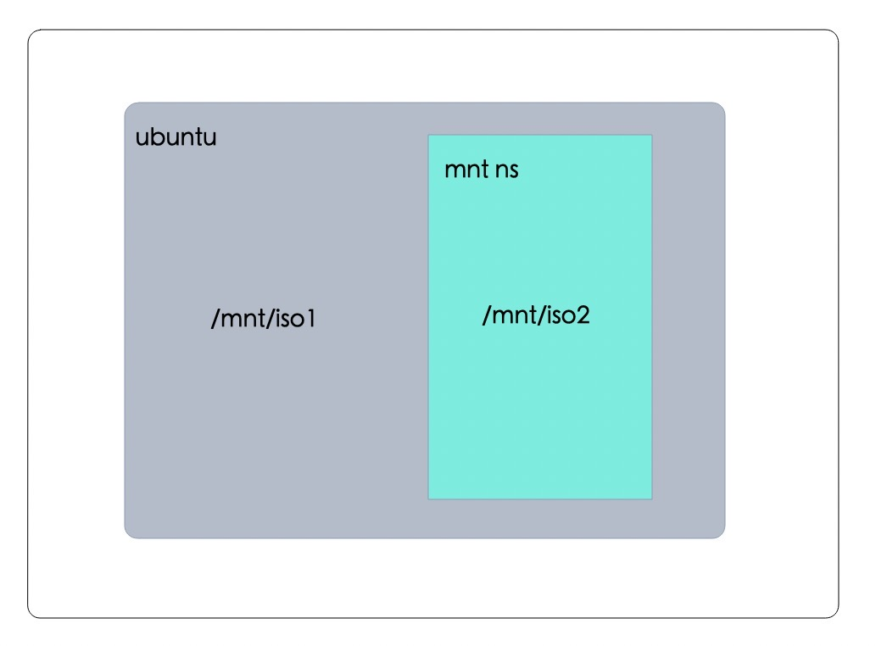

## mnt namespace

mount namespace可隔离出一个具有独立挂载点信息的运行环境，内核知道如何去维护每个namespace的挂载点列表。

即每个namespace之间的挂载点列表是独立的，各自挂载互不影响。(用户通常使用mount命令来挂载普通文件系统，但实际上mount能挂载的东西非常多，甚至连现在功能完善的Linux系统，其内核的正常运行也都依赖于挂载功能，比如挂载根文件系统/。其实所有的挂载功能和挂载信息都由内核负责提供和维护，mount命令只是发起了mount()系统调用去请求内核。)

内核将每个进程的挂载点信息保存在`/proc/<pid>/{mountinfo,mounts,mountstats}`三个文件中:

```shell
root@ubuntu-server:~# ls -l -h /proc/148/mount*
-r--r--r-- 1 root root 0 Jan 16 10:47 /proc/148/mountinfo
-r--r--r-- 1 root root 0 Jan 16 10:47 /proc/148/mounts
-r-------- 1 root root 0 Jan 16 10:47 /proc/148/mountstats
```




> 生成iso文件

```shell
root@ubuntu-server:# pwd
/root
root@ubuntu-server:# mkisofs -o 1.iso ./ && mkisofs -o 2.iso ./
root@ubuntu-server:~# ls
1.iso  2.iso
```

> 挂载1.iso 到/mnt/iso1目录(此时是在root下,不是在namespace里)

```shell
root@ubuntu-server:# mkdir /mnt/iso1/ /mnt/iso2
root@ubuntu-server:# mount 1.iso /mnt/iso1/
root@ubuntu-server:~# df -h|grep mnt
/dev/loop7       28M   28M     0 100% /mnt/iso1
```

> 创建mount+uts namespace,并在mnt ns里挂载iso2&#x20;

```shell
#创建mount+uts namespace
root@ubuntu-server:~# unshare -m -u /bin/bash

#在mnt namespace 挂在iso2
root@ubuntu-server:~# mount 2.iso /mnt/iso2/

#此时mnt namespace有2个目录(因为继承了父ns的mnt)
root@ubuntu-server:~# df -h |grep mnt
/dev/loop7       28M   28M     0 100% /mnt/iso1
/dev/loop8       56M   56M     0 100% /mnt/iso2

#卸载iso1后,即在这个mnt namespace当前只有一个iso的挂载
root@ubuntu-server:#  umount /mnt/iso1/
root@ubuntu-server:#  df -h |grep mnt
/dev/loop8       56M   56M     0 100% /mnt/iso2
```


> 新开一个终端,只有iso1,看不到mnt ns中的iso2

```shell
root@ubuntu-server:~# df -h|grep iso /dev/loop7       28M   28M     0 100% /mnt/iso1
```

通过这个小实验我们能看到linux也支持挂载点的隔离，那不同的容器挂载不同的mnt namespace，这样每个小盒子里大家看到的都是自己“私密”的东西了～