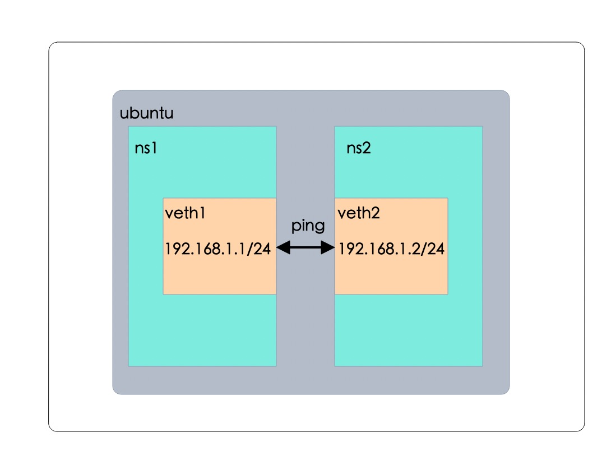

## net namespace

network namespace用来隔离网络环境，在network namespace中，网络设备、端口、套接字、网络协议栈、路由表、防火墙规则等都是独立的。
因为network namespace中具有独立的网络协议栈，因此每个network namespace中都有一个lo接口，但lo接口默认未启动，需要手动启动起来。

让某个network namespace和root network namespace或其他network namespace之间保持通信是一个非常常见的需求， 这一般通过veth虚拟设备实现。

veth类型的虚拟设备由一对虚拟的eth网卡设备组成，像管道一样，一端写入的数据总会从另一端流出， 从一端读取的数据一定来自另一端。
用户可以将veth的其中一端放在某个network namespace中，另一端保留在root network namespace中。 这样就可以让用户创建的network namespace和宿主机通信。

我们来尝试一下如何让2个net namespace进行连接。如下图：



> 创建2个net namespace
```shell
root@ubuntu-server:#ip netns add ns1
root@ubuntu-server:#ip netns add ns2
root@ubuntu-server:~# ip netns ls
ns2
ns1
```

> 创建veth pair
```shell
root@ubuntu-server:#ip link add veth-ns1 type veth peer name veth-ns2
root@ubuntu-server:# ip link show
......
18: veth-ns2@veth-ns1: <BROADCAST,MULTICAST,M-DOWN> mtu 1500 qdisc noop state DOWN mode DEFAULT group default qlen 1000
link/ether ea:df:70:39:f8:84 brd ff:ff:ff:ff:ff:ff
19: veth-ns1@veth-ns2: <BROADCAST,MULTICAST,M-DOWN> mtu 1500 qdisc noop state DOWN mode DEFAULT group default qlen 1000
link/ether 96:8f:fb:a7:29:e0 brd ff:ff:ff:ff:ff:ff
```

> 将veth pair一端的虚拟网卡放入ns1，另一端放入ns2，这样就相当于采用网线将两个network namespace连接起来了。

```shell
root@ubuntu-server:#ip link set veth-ns1 netns ns1
root@ubuntu-server:#ip link set veth-ns2 netns ns2
```

> 可以看到2个net namespace里面分别有一个lo还有veth的网卡

```shell
root@ubuntu-server:# ip netns exec ns1 ip a
1: lo:  mtu 65536 qdisc noop state DOWN group default qlen 1000
link/loopback 00:00:00:00:00:00 brd 00:00:00:00:00:00
19: veth-ns1@if18: <BROADCAST,MULTICAST> mtu 1500 qdisc noop state DOWN group default qlen 1000
link/ether 96:8f:fb:a7:29:e0 brd ff:ff:ff:ff:ff:ff link-netns ns2

root@ubuntu-server:# ip netns exec ns2 ip a
1: lo:  mtu 65536 qdisc noop state DOWN group default qlen 1000
link/loopback 00:00:00:00:00:00 brd 00:00:00:00:00:00
18: veth-ns2@if19: <BROADCAST,MULTICAST> mtu 1500 qdisc noop state DOWN group default qlen 1000
link/ether ea:df:70:39:f8:84 brd ff:ff:ff:ff:ff:ff link-netns ns1
```

> 为两个网卡分别设置IP地址，这两个网卡的地址位于同一个子网192.168.1.0/24中。

```shell
root@ubuntu-server:# ip -n ns1 addr add 192.168.1.1/24 dev veth-ns1
root@ubuntu-server:# ip -n ns2 addr add 192.168.1.2/24 dev veth-ns2
```

> 使用ip link命令设置两张虚拟网卡状态为up。

```shell
root@ubuntu-server:#ip -n ns1 link set veth-ns1 up
root@ubuntu-server:#ip -n ns2 link set veth-ns2 up
```

> 从ns1,ns2两个net namespace中互相ping，互通了

```shell
root@ubuntu-server:~# ip netns exec ns1 ping 192.168.1.2
PING 192.168.1.2 (192.168.1.2) 56(84) bytes of data.
64 bytes from 192.168.1.2: icmp_seq=1 ttl=64 time=0.039 ms
64 bytes from 192.168.1.2: icmp_seq=2 ttl=64 time=0.029 ms
^C
--- 192.168.1.2 ping statistics ---
2 packets transmitted, 2 received, 0% packet loss, time 1014ms
rtt min/avg/max/mdev = 0.029/0.034/0.039/0.005 ms

root@ubuntu-server:~# ip netns exec ns2 ping 192.168.1.1
PING 192.168.1.1 (192.168.1.1) 56(84) bytes of data.
64 bytes from 192.168.1.1: icmp_seq=1 ttl=64 time=0.025 ms
64 bytes from 192.168.1.1: icmp_seq=2 ttl=64 time=0.011 ms
^C
--- 192.168.1.1 ping statistics ---
2 packets transmitted, 2 received, 0% packet loss, time 1001ms
rtt min/avg/max/mdev = 0.011/0.018/0.025/0.007 ms
```

我们在这里通过一个简单的例子来熟悉了一下net namespace是如何通信的，在后面章节中，
我们在具体聊聊docker和k8s中是如何处理网络的，这里先有个大概的认知即可。