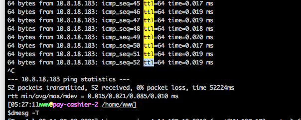
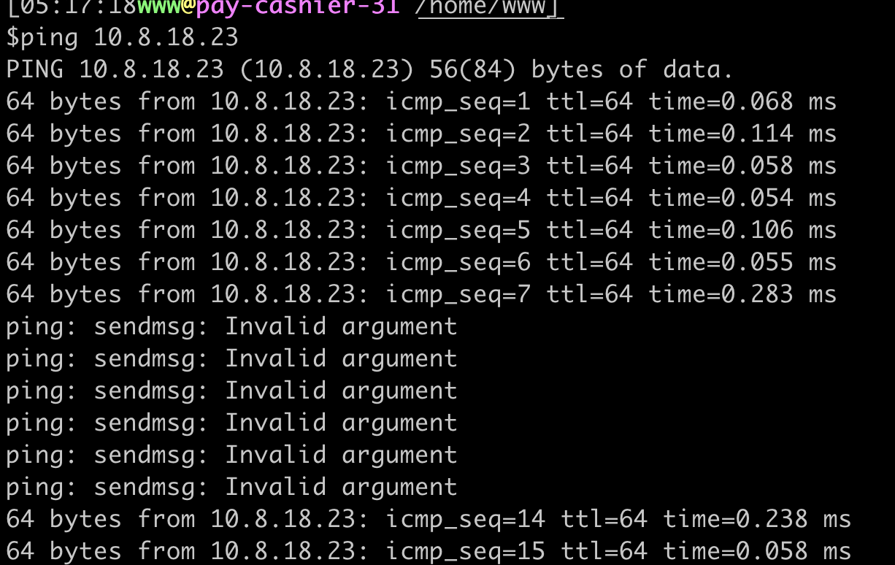
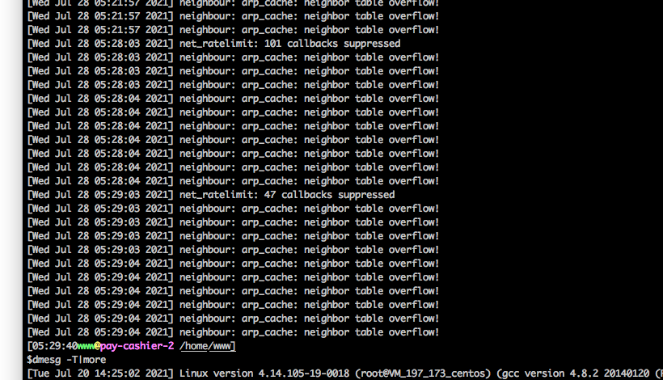
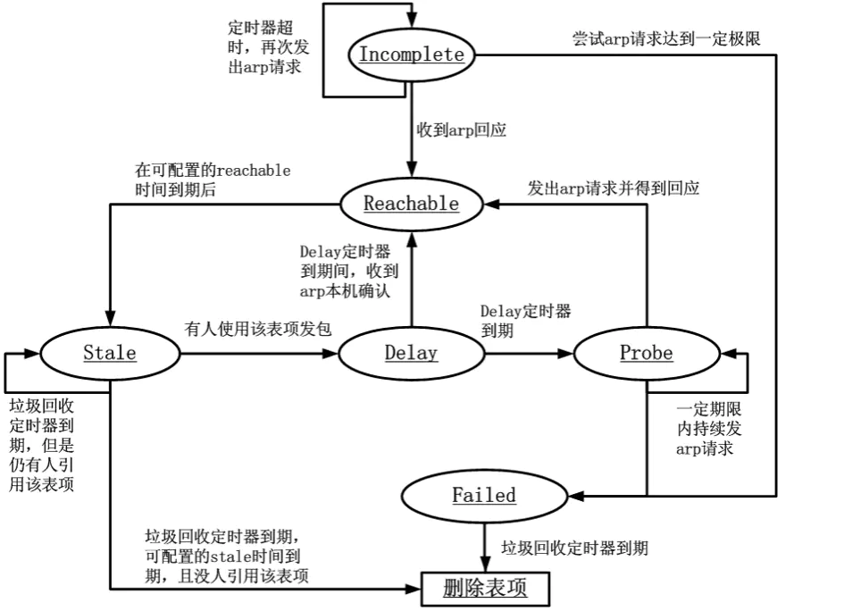
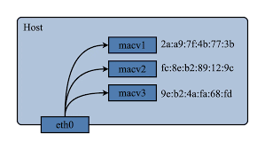

## 现象

线上业务大规模超时,都是支付业务的应用,并且集中在某个mdu(多个机柜组成一个mdu)

## 问题排查

因为支付因为合规问题,专门放在几个独立mdu,但是当时出问题的ip集中在某个mdu,当时怀疑是机柜的交换机什么的有问题就让网络同学一起排查。
我这边因为刚将支付业务改造成k8s,就继续往这个方向排查

开始通过内部的trace系统发现超时的trace都是网络超时，然后尝试在超时的节点去ping了一下:
并没有什么异常:



有问题时候业务ping的截图



发现就是丢包了，于是想着是不是物理机器上的容器配置有什么特殊的地方。

于是去物理机看了下日志:



于是我们立刻将这个mdu的所有k8s节点的内核参数统一进行了修改

```shell
net.ipv4.neigh.default.gc_thresh1 =80000 //默认128
net.ipv4.neigh.default.gc_thresh2 =90000 //默认512
net.ipv4.neigh.default.gc_thresh3 =100000 //默认1024
```

更新后问题解决。


## 问题分析

从如上报错信息可知，这个问题的基本原因在于 ARP 缓存表打满了。这里涉及到内核的 ARP 缓存垃圾回收机制。当 ARP 表项太多且又没有可回收的表项的时候，新表项就会无法插入。
这就导致网络包发送时无法找到对应的硬件地址(MAC)。使得网络包不能发送。
那么具体什么情况会导致新表项无法插入呢？回答这个问题，我们需要先深入了解一下 ARP 缓存老化及垃圾回收机制。



如上图，是整个 ARP 表项的生命周期及其状态机。

我们知道，对于 TCP/IP 网络包发送时，网络栈需要对端的 MAC 地址才能让网络包转换成二层的数据结构——帧，从而在网络中传输。而对于不同广播域的 IP 地址，其对端 MAC 地址为网关，发送端会将网络包发给网关让其转发，而对于同广播域中的 IP 地址，其对端 MAC 地址即与 IP 地址对应。
而通过 IP 地址找到 MAC 地址就是 ARP 协议的主要工作内容。ARP 协议的工作过程此处不再赘述，而通过 ARP 协议找到 IP 地址对应的 MAC 地址后，会将该对应关系存储在本机上一段时间，以减少 ARP 协议的通信频率，加快网络包的发送。该对应关系，即 ARP 缓存表项，其状态机或整个生命周期可描述如下：

- 1.初始时，对于任何网络包发送时，内核协议栈需要找到目的 IP 地址对应的对端 MAC 地址，如果这时 ARP 缓存中没有命中，则会新插入一条状态为 Incomplete 的表项。Incomplete 状态会尝试发送 ARP 包，请求某 IP 地址对应的 MAC 地址。
- 2.若收到 ARP 回应的，表项状态就变为 Reachable。
- 3.若尝试了一定次数后没收到响应，表项即变为 Failed。
- 4.Reachable 表项在到达超时时间后，会变成 Stale 状态，Stale 状态的表项已不可再使用。
- 5.Stale 的表项若有被引用来发包，则表项会变为 Delay 状态。
- 6.Delay 状态的表项也不可使用来发包，但在 Delay 状态到期前，收到 ARP 的本机确认，则重新转为 Reachable 状态。
- 7.Delay 状态到期，表项变为 Probe 状态，该状态与 Incomplete 状态类似。
- 8.Stale 状态到期后，会被启动的垃圾回收起回收删除。

通过以下命令可查看当前网络命名空间（network namespace） 中 arp 表项及其状态：

```shell
ip neigh
10.37.41.43 dev mac0 lladdr a2:15:37:cd:00:03 STALE
10.37.41.35 dev mac0 lladdr 1e:31:6b:b7:76:ec STALE
10.37.32.1 dev mac0 lladdr 00:00:0c:9f:f5:df REACHABLE
10.37.41.51 dev mac0 lladdr 2e:57:e9:ea:1b:96 STALE
10.37.41.46 dev mac0  FAILED
10.37.41.38 dev mac0 lladdr 32:fa:d0:42:47:ba STALE
10.37.41.19 dev mac0 lladdr 0a:0c:7d:2f:b8:34 STALE
10.37.41.41 dev mac0 lladdr 0e:87:c6:77:12:45 STALE
10.37.41.33 dev mac0 lladdr 42:6b:7c:e5:b3:91 STALE
10.37.43.73 dev bond0 lladdr 1a:1b:0a:25:2b:49 STALE
10.37.41.30 dev mac0 lladdr 7e:58:8b:4c:c5:1c STALE
```

### 涉及到的内核参数

以下列出了该机制中主要涉及的内核参数：

|参数	|含义	| 默认值  |
|---|---|------|
|/proc/sys/net/ipv4/neigh/default/base_reachable_time	|Reachable 状态基础过期时间，每个表项过期时间是在[1/2base_reachable_time，3/2base_reachable_time]之间	| 30秒  |
|/proc/sys/net/ipv4/neigh/default/base_reachable_time_ms	|Reachable 状态基础过期时间，毫秒表示	| 30秒  |
|/proc/sys/net/ipv4/neigh/default/gc_stale_time	|Stale 状态过期时间	| 60秒  |
|/proc/sys/net/ipv4/neigh/default/delay_first_probe_time	|delay 状态过期到 Probe 的时间	| 5秒   |
|/proc/sys/net/ipv4/neigh/default/gc_interval	|gc 启动的周期时间	| 30秒  |
|/proc/sys/net/ipv4/neigh/default/gc_thresh1	|少于这个值，gc 不会启动	| 2048 |
|/proc/sys/net/ipv4/neigh/default/gc_thresh2	|ARP表的最多纪录的软限制，允许超过该数字5秒	|  4096    |
|/proc/sys/net/ipv4/neigh/default/gc_thresh3	|ARP表的最多纪录的硬限制，大于该数目，gc立即启动，并强制回收	|  8192    |

其中，gc 相关的内核参数是对所有网卡（interface）生效的。但是各种到期时间的设置是仅对单独网卡（interface）生效的，default 值仅对新增接口设备生效。

### ARP 缓存垃圾回收机制

由其缓存表项的状态机我们知道，不是所有的表项都会被回收，只有 Stale 状态过期后，Failed 的表项可能会被回收。另外，ARP 缓存表项的垃圾回收是触发式的，需要回收的表项不一定立刻会被回收，ARP 缓存表项的垃圾回收有四种启动逻辑：

- 1.arp 表项数量 < gc_thresh1，不启动。 
- 2.gc_thresh1 =< arp 表项数量 <= gc_thresh2，按照 gc_interval 定期启动 
- 3.gc_thresh2 < arp 表项数量 <= gc_thresh3，5秒后启动 
- 4.arp 表项数量 > gc_thresh3，立即启动

对于不可回收的表项，垃圾回收即便启动了也不会对其进行回收。因此当不可回收的表项数量大于 gc_thresh3 的时候，垃圾回收也无能为力了。

### 为什么业务迁移到容器之后会有这个问题?

之前我们的业务都是运行在kvm上的，物理机都是32C的机器，迁移k8s后我们的物理机都换成了96C，单个节点的pod数从几个变成几十个。
而gc 相关的内核参数是对所有网卡（interface）生效的，也就是说一个物理机，他最大的arp条数就是/proc/sys/net/ipv4/neigh/default/gc_thresh3=1024(我们宿主机的配置),

我们的k8s集群网络采用的是macvlan，他的效果类似就是一个物理网卡，然后下面挂多个子网卡：



该网络模式下，每个节点会根据物理网卡创建出来一个子网卡，节点上的每个Pod都会挂载一个子网卡，我们的物理机子网是/20，那么在2层arp理论上最大是16*254=4096个ip，
所以单机的arp数量最高可能会到节点4096。也就触发了这个问题

### 总结

ARP 缓存打满之后，Pod 就会网络不通。如果不是看了内核日志可能还是怀疑网络的问题，而查到了是arp gc问题，也需要深入linux原理，详细去了解他背后的知识，而不是问题解决就完了


参考：
- https://www.cnblogs.com/tencent-cloud-native/p/14481570.html