## 一、现象

线上redis是主从模式,在凌晨的时候突然redis主节点的内存条坏了,redis自动进行了主从切换,但是使用了redis客户端的业务并没有恢复正常,还是连的老的redis节点。
过了10m+,业务才切换到了新的主节点上面。

## 二、问题排查

那这个问题就很奇怪了,正常情况下redis切换后,redis-client也会进行主从切换,为什么这次内存故障后就没切换了呢？

中间件同学梳理了一下redis-cli的版本:

```java
redisCli: redisCli-xxx.jar(基于lettuce内部封装的redis-client)
lettuce: lettuce-core-5.1.0.M1.jar
netty: 
netty-all-4.1.25.Final.jar netty-buffer-4.1.31.Final.jar netty-codec-4.1.31.Final.jar netty-common-4.1.24.Final.jar netty-handler-4.1.31.Final.jar netty-resolver-4.1.24.Final.jar netty-tcnative-boringssl-static-1.1.33.Fork26.jar netty-transport-4.1.24.Final.jar
```

### 2.1 问题复现

#### 复现流程:

- 1.启动复现程序(一直往redis master节点去set新的key)
- 2.执行抓包脚本：
```shell
tcpdump tcp -i eth0 -s0 and host redisIp and port 6379 -w ./target.cap
```
- 3.将 redis主 物理机断电
- 4.观察 redis 相关日志

#### 复现结果:

|| 时间       | 事件                            |备注|
|---|----------|-------------------------------|---|
|2024-08-06 15:21:58| redis主断电 |                               |
|2024-08-06 15:21:58| redis-client 超时TimeoutException | 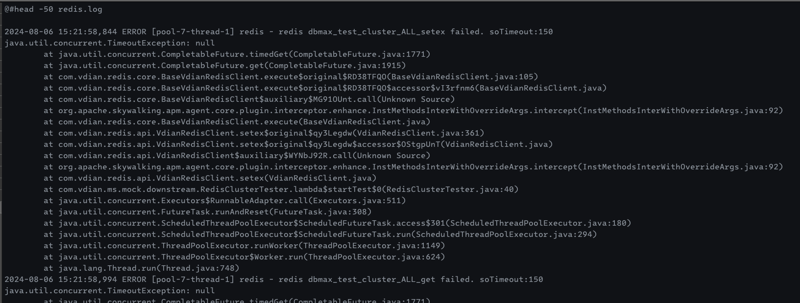 |
|2024-08-06 15:22:35| redis-server 主备切换 | 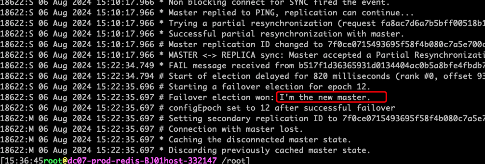 |
|2024-08-06 15:37:36| redis-client 感知到 channelInactive 事件 | 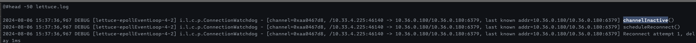 |
|2024-08-06 15:37:37| redis-client 感知到新的拓扑关系 |  |
|2024-08-06 15:37:38| redis-client 恢复正常 | 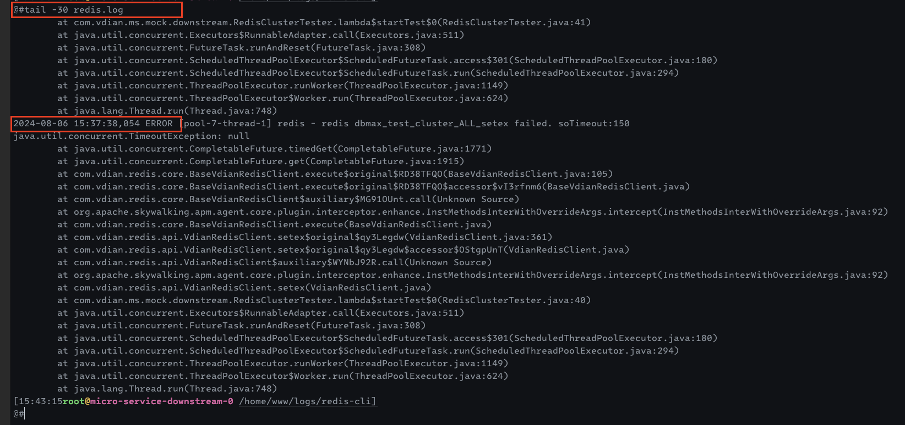 |

根据时间线发现：redis-client 异常持续约 15 分钟

本次复现根据抓包看出来在断电后，tcp 包进行了 15 次重传后，才断开的连接。每次重传的间隔时间，都是上次间隔时间的两倍，但最大间隔是 120 秒，重传总时长约 15 分钟。

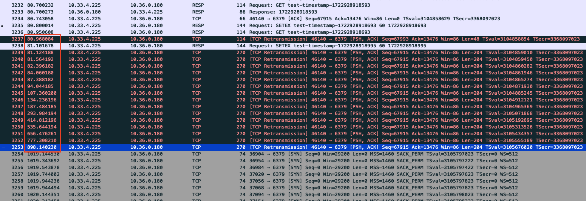 

内核参数里，tcp 重传次数是 15 次，那么算出来的重传最大 RTO 就是 924.6s 约 15 分钟

```shell
cat /proc/sys/net/ipv4/tcp_retries2
15
```

https://www.kernel.org/doc/Documentation/networking/ip-sysctl.txt

```shell
tcp_retries2 - INTEGER
	This value influences the timeout of an alive TCP connection,
	when RTO retransmissions remain unacknowledged.
	Given a value of N, a hypothetical TCP connection following
	exponential backoff with an initial RTO of TCP_RTO_MIN would
	retransmit N times before killing the connection at the (N+1)th RTO.

	The default value of 15 yields a hypothetical timeout of 924.6
	seconds and is a lower bound for the effective timeout.
	TCP will effectively time out at the first RTO which exceeds the
	hypothetical timeout.

	RFC 1122 recommends at least 100 seconds for the timeout,
	which corresponds to a value of at least 8.
```

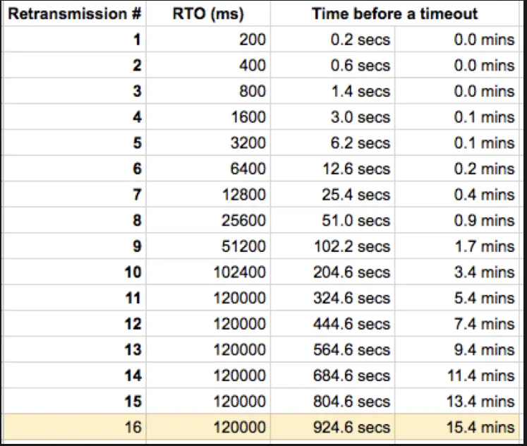

由于本次复现第一轮tcp 包重传的 RTO 约为 17.4 ms

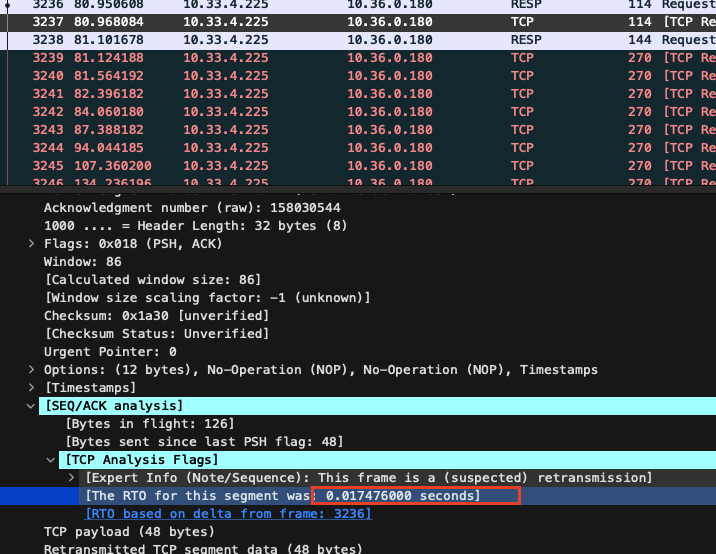

这个值在经过 15 次重传翻倍后，仍旧小于最大 RTO。所以能够重传满 15 次（重传满 15 次的总时间约为 15 分钟，和本次复现中的redis-client 的恢复时间基本一致）
猜测当时故障时，redis-client 的第一次tcp 包重传的 RTO 较大，经过几次重传后，很快就超过了最大 RTO，然后就退出重传，将 tcp 连接断开。所以总的恢复时间反而会小一些，当时是大概发生故障 11 分钟后恢复的
这个问题 lettuce 官方有相关 issue，本质上是通过配置 tcpUserTimeout 解决该问题。

https://github.com/redis/lettuce/issues/2082


#### 升级 lettuce 6.3.x 验证

- 1.升级 lettuce 最新版 6.4.0.RELEASE 
- 2.配置 tcpUserTimeout


- 3.升级 netty 至 4.1.107.Final

>- 复现步骤同上

事件时间线:

|| 时间       | 事件                             |备注|
|---|----------|--------------------------------|---|
|2024-08-07 10:54:36,711	| redis主断电 |                                |
|2024-08-07 10:54:36,711	| redis-client 超时TimeoutException | 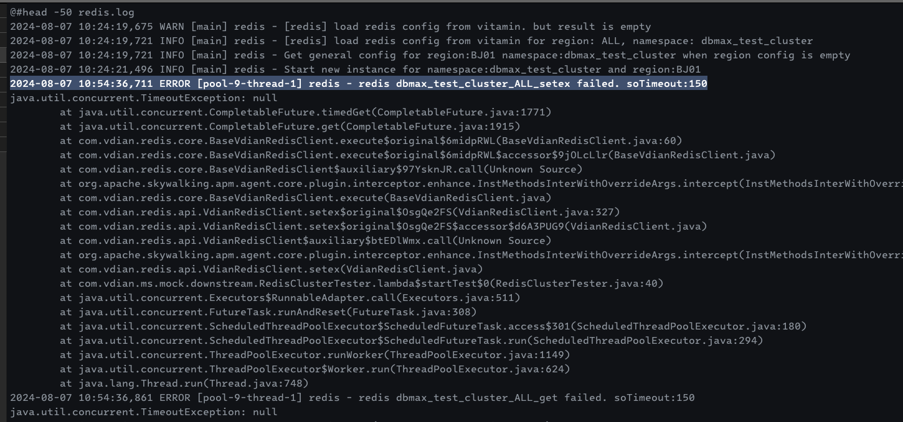 |
|2024-08-07 10:54:49,959	| redis-client 收到 channelInactive 事件	 | 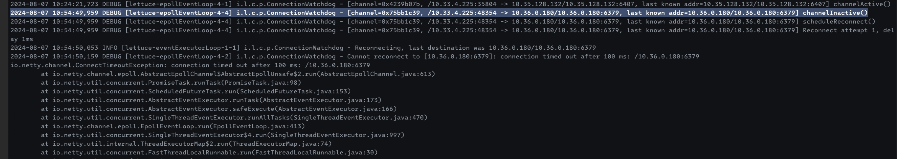 |
|2024-08-07 10:55:15,314	| redis-server 主备切换	| 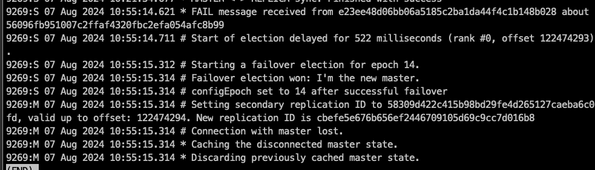 |
|2024-08-07 10:55:25,161	| redis-client 刷新拓扑	 | 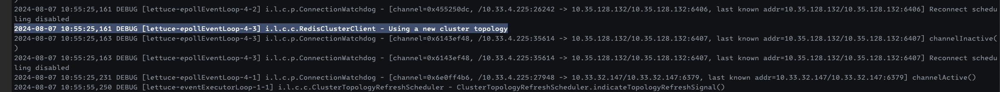 |
|2024-08-07 10:55:25,228	| redis-client 恢复正常 | 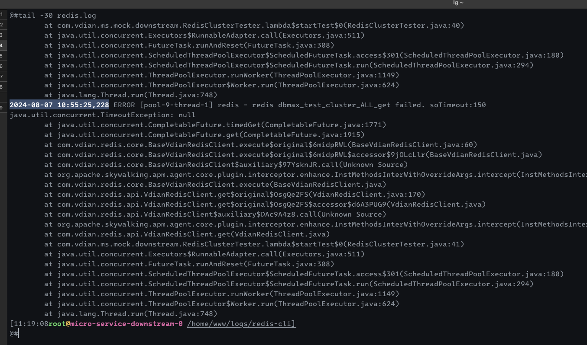 |

故障持续约 49 秒，说明配置 tcpUserTimeout 确实解决了这个问题，验证通过

根据抓包分析发现：

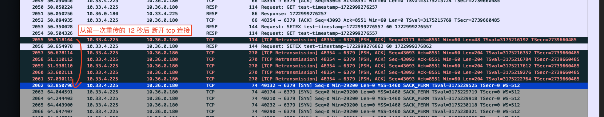

在第一次重传的 12 秒后，tcp 连接断开，和时间线对应的上。12 秒即配置的 tcpUserTimeout：

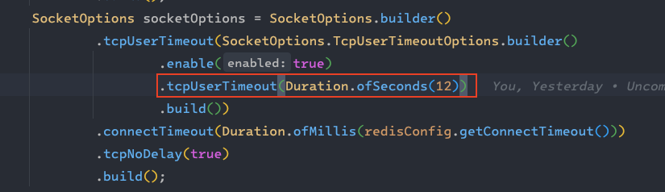

### 结论

#### 根本原因
当 redis 服务器故障后，redisCli 不会立刻断开与 redis-server 之间的 tcp 连接。
client 侧会进行 tcp 包重传，重传默认进行 15 次，重传间隔时间会随着重传的次数翻倍递增，但最大重传间隔为 120 秒。
重传次数会受到第一次 tcp 包重传 RTO 值的影响，最终重传的总时长 <= 924.6s（15m24s）。

#### 解决方式

- 方式一：优化内核参数 tcp_retries2，将该值降低至 5，最大重传总时长为 12 秒。
- 方式二：配置定时刷新拓扑，不关心底层 tcp 连接。

但是该方式是以以更高的频率，更高的性能代价，在发生故障的时候能够failfast

lettuce 官方 issue 中有较多关于定时刷新拓扑的问题：

- 拓扑刷新时获取集群拓扑命令激增，可能导致更高的延迟：https://github.com/redis/lettuce/issues/2468
- 周期刷新拓扑会导致 jvm 堆内存持续增加：https://github.com/redis/lettuce/issues/2347
- 官方建议 30 分钟定期刷新一次拓扑：https://github.com/redis/lettuce/issues/2333
- 周期刷新在 client 数量多的情况下，将导致 redis-serve cpu 使用率提升：https://github.com/redis/lettuce/issues/1857
- 刷新集群拓扑在 lettuce 6 以下的版本将会阻塞工作线程：https://github.com/redis/lettuce/issues/1394

并且在 redisCli 的迭代中，以 buf fix 的形式关闭了定时刷新，如果开启，可能会再次触发当初的 bug。

- 方式三：通过配置 tcpUserTimeout（比如 12 秒），当发生第一次 tcp 包重传的 12 秒后，会强制断开 tcp 连接，从而触发 redisCli 刷新拓扑动作。
需要注意的是，开启 tcpUserTimeout 后要同步开启 tcp keepalived 否则对于 pub/sub 场景可能会导致连接被断开（比如超过 tcpUserTimeout 仍未有数据包传递）。

lettuce 6.3.x：


lettuce 5.x：

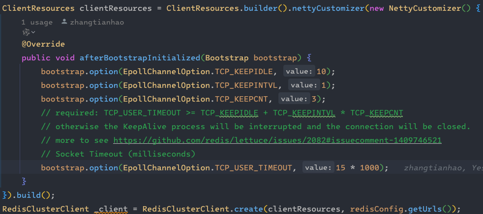


参考文档：
- https://cloud.tencent.com/developer/article/1893375
- https://blog.cloudflare.com/when-tcp-sockets-refuse-to-die/